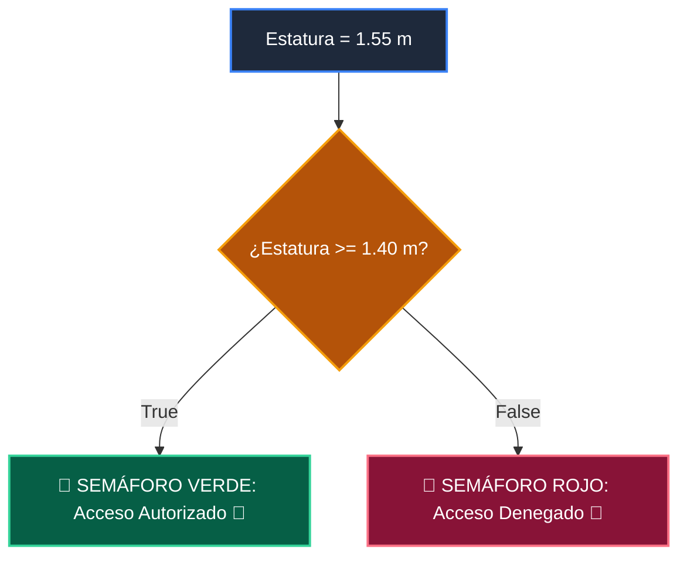

# 📖 02 Cola Fifo Deque

> **Clase:** Clase 02: Pilas (Stacks) y Colas (Queues) con collections.deque  
> **Script:** [`main.py`](main.py)  

Cola (FIFO) con collections.deque.

---

## 🗺️ Flujo de Ejecución del Ejemplo



---

## 💻 Ejecución desde Terminal

```bash
python 02-algoritmos-estructuras/clase-02-pilas-y-colas/ejemplos/ejemplo_02_cola_fifo_deque/main.py
```
