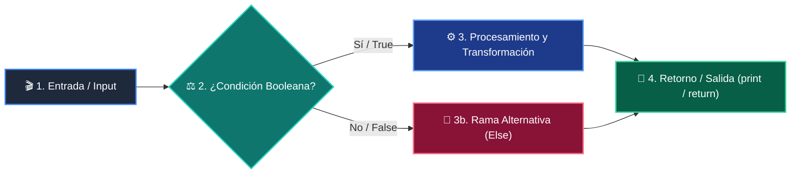

# 📚 Clase 03: Tablas Hash y Conjuntos (Sets) para Búsqueda O(1)

> **Programa:** Curso 2: Algoritmos Avanzados y Estructuras de Datos  
> **Nivel:** Nivel 2 - Intermedio  
> **Metáfora Central:** *«Tablas Hash como un Fichero con Índice Alfabético Instantáneo»*  
> **Documento Oficial PDF:** [clase-03-tablas-hash-y-sets.pdf](clase-03-tablas-hash-y-sets.pdf)  
> **Instructor:** **William Rodríguez (Wisrovi)** (AI Solutions Architect & Principal Software Engineer)  

---

## 👤 Perfil del Autor y Mentor

### **William Rodríguez (Wisrovi)**
*AI Solutions Architect & Principal Software Engineer &bull; Badajoz, España*

Ingeniero y arquitecto de software especializado en Inteligencia Artificial Generativa, sistemas multi-agente, Visión por Computador e infraestructuras MLOps de alta disponibilidad. Creador y mantenedor de la suite de software libre wisrovi SUITE en PyPI con más de 26 bibliotecas enfocadas en orquestación de pipelines, caching distribuido y optimización de bases de datos.

*   🐙 **GitHub:** [github.com/wisrovi](https://github.com/wisrovi)
*   💼 **LinkedIn:** [www.linkedin.com/in/wisrovi-rodriguez/](https://www.linkedin.com/in/wisrovi-rodriguez/)
*   🐳 **DockerHub:** [hub.docker.com/u/wisrovi](https://hub.docker.com/u/wisrovi)
*   🌐 **Website:** [wisrovi.dev](https://wisrovi.dev)
*   📦 **PyPI:** [pypi.org/user/wisrovi/](https://pypi.org/user/wisrovi/)

---

### 🚲 La Regla de la Bicicleta

> *"Nadie aprende a montar en bicicleta viendo tutoriales. El verdadero dominio de la programación surge cuando abres tu editor, escribes código con tus propias manos, resuelves errores y construyes proyectos reales."*

---

## 📑 Tabla de Contenidos de la Sesión

1. [💡 Fundamentación Teórica y Modelo Mental](#1--fundamentación-teórica-y-modelo-mental)
2. [🗺️ Arquitectura y Diagrama de Flujo](#2-️-arquitectura-y-diagrama-de-flujo)
3. [💻 Implementación en Python 3.10+](#3--implementación-en-python-310)
4. [🛡️ Buenas Prácticas y Trampas Frecuentes](#4-️-buenas-prácticas-y-trampas-frecuentes)
5. [🏋️ Desafío de Práctica](#5-️-desafío-de-práctica)
6. [📚 Bibliografía y Enlaces Canónicos](#6--bibliografía-y-enlaces-canónicos)

---

## 1. 💡 Fundamentación Teórica y Modelo Mental

Las tablas hash convierten una clave arbitraria en un índice numérico mediante una función matemática de hashing.

> [!NOTE]
> **🌟 Metáfora Didáctica:** Es como un conserje de hotel que sabe instantáneamente el casillero de cada huésped con solo mirar su apellido.

### Principios Fundamentales

Las colisiones ocurren cuando dos claves distintas generan el mismo hash; CPython usa open addressing con perturbación.

Las operaciones de inserción, búsqueda y eliminación en sets y dicts tienen complejidad temporal promedio O(1).

> [!IMPORTANT]
> **⚡ Regla de Oro en Python:** Cualquier objeto que uses como clave de diccionario o elemento de set debe implementar __hash__ e inmutabilidad.

---

## 2. 🗺️ Arquitectura y Diagrama de Flujo

Proceso de hashing, resolución de buckets y deduplicación.



### Desglose Paso a Paso del Flujo

| Fase | Acción del Intérprete | Estado en Memoria |
| :--- | :--- | :--- |
| **1. Inicialización** | Invocación de hash(objeto). | `Firma hash de 64 bits.` |
| **2. Evaluación** | Mapeo al índice del arreglo de buckets. | `Posición en tabla calculada.` |
| **3. Transformación** | Verificación de igualdad (==) para resolver colisiones. | `Elemento exacto encontrado.` |
| **4. Retorno / Salida** | Inserción o retorno del valor. | `Estado de tabla actualizado.` |

> [!TIP]
> **🔍 Visualización Mental:** Un set es simplemente un diccionario que no almacena valores, solo claves.

---

## 3. 💻 Implementación en Python 3.10+

```python
# CLASE 03 - Código de Demostración
def two_sum(nums: list[int], target: int) -> tuple[int, int]:
    vistos = {}  # mapa: valor -> indice
    for i, num in enumerate(nums):
        complemento = target - num
        if complemento in vistos:
            return (vistos[complemento], i)
        vistos[num] = i
    return (-1, -1)

indices = two_sum([2, 7, 11, 15], 9)
print("Índices que suman 9:", indices)  # (0, 1)
```

*Uso de un diccionario como tabla hash para reducir una búsqueda O(n^2) a un recorrido lineal O(n).*

---

## 4. 🛡️ Buenas Prácticas y Trampas Frecuentes

> [!WARNING]
> **⚠️ Gotcha Frecuente (Trampa de Principiante):** Intentar usar una lista mutable como clave de diccionario o elemento de set genera TypeError: unhashable type.

*   **❌ Antipatrón:**
    ```python
mi_dict = {}
mi_dict[[1, 2]] = 'valor'  # ❌ TypeError: unhashable type: 'list'
    ```

*   **✅ Patrón Correcto:**
    ```python
mi_dict = {}
mi_dict[(1, 2)] = 'valor'  # ✅ Tupla inmutable hashable
    ```

> [!TIP]
> **💡 Consejo Profesional:** Para agrupar elementos por propiedades, usa collections.defaultdict(list).

---

## 5. 🏋️ Desafío de Práctica

> **Desafío:** Implementa una función que encuentre el primer carácter no repetido en una cadena en tiempo O(n).

Para ejecutar la verificación automática con pytest:
```bash
pytest ejercicios/
```

---

## 6. 📚 Bibliografía y Enlaces Canónicos

| Fuente / Recurso | Descripción | Enlace |
| :--- | :--- | :--- |
| **Documentación Oficial de Python** | Especificación y biblioteca estándar | [docs.python.org/3/](https://docs.python.org/3/) |
| **PEP 8 — Style Guide for Python** | Estándar oficial de formateo y estilo | [peps.python.org/pep-0008/](https://peps.python.org/pep-0008/) |
| **Real Python Tutorials** | Patrones de ingeniería y desarrollo | [realpython.com](https://realpython.com/) |
| **Suite Open Source wisrovi** | Librerías de alto rendimiento | [github.com/wisrovi](https://github.com/wisrovi) |
