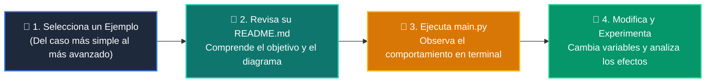

# 💻 Catálogo de Ejemplos Prácticos: Clase 03: Tablas Hash y Conjuntos (Sets) para Búsqueda O(1)

> **Ubicación:** `curso/clase-03-tablas-hash-y-sets/ejemplos`  
> **Filosofía:** *Aprender programando mediante casos de uso aislados, legibles y comentados.*

---

## 🗺️ Flujo de Estudio Recomendado



---

## 📑 Ejemplos Disponibles en esta Clase

| Directorio | Caso de Uso Demostrado | Script Principal |
| :--- | :--- | :---: |
| [`ejemplo_01_exploracion_hash/`](ejemplo_01_exploracion_hash/) | 01 Exploracion Hash | [`main.py`](ejemplo_01_exploracion_hash/main.py) |
| [`ejemplo_02_two_sum_hashmap/`](ejemplo_02_two_sum_hashmap/) | 02 Two Sum Hashmap | [`main.py`](ejemplo_02_two_sum_hashmap/main.py) |
| [`ejemplo_03_deduplicacion_sets/`](ejemplo_03_deduplicacion_sets/) | 03 Deduplicacion Sets | [`main.py`](ejemplo_03_deduplicacion_sets/main.py) |
| [`ejemplo_04_defaultdict_agrupacion/`](ejemplo_04_defaultdict_agrupacion/) | 04 Defaultdict Agrupacion | [`main.py`](ejemplo_04_defaultdict_agrupacion/main.py) |


---

## 🚀 Cómo Ejecutar Cualquier Ejemplo
Abre tu terminal en la raíz del repositorio y ejecuta:
```bash
python 01-fundamentos-python/clase-03-tablas-hash-y-sets/ejemplos/<nombre_del_ejemplo>/main.py
```
