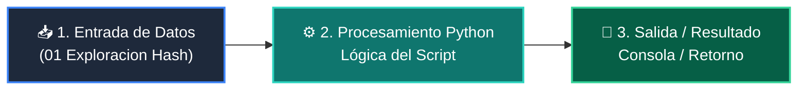

# 📖 01 Exploracion Hash

> **Clase:** Clase 03: Tablas Hash y Conjuntos (Sets) para Búsqueda O(1)  
> **Script:** [`main.py`](main.py)  

Exploración de la función hash().

---

## 🗺️ Flujo de Ejecución del Ejemplo



---

## 💻 Ejecución desde Terminal

```bash
python 02-algoritmos-estructuras/clase-03-tablas-hash-y-sets/ejemplos/ejemplo_01_exploracion_hash/main.py
```
