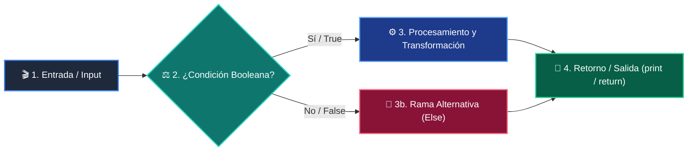

# 📚 Clase 04: Algoritmos de Búsqueda: Lineal vs Binaria O(log n)

> **Programa:** Curso 2: Algoritmos Avanzados y Estructuras de Datos  
> **Nivel:** Nivel 2 - Intermedio  
> **Metáfora Central:** *«Búsqueda Binaria como Buscar una Palabra en el Diccionario Dividiendo a la Mitad»*  
> **Documento Oficial PDF:** [clase-04-algoritmos-busqueda.pdf](clase-04-algoritmos-busqueda.pdf)  
> **Instructor:** **William Rodríguez (Wisrovi)** (AI Solutions Architect & Principal Software Engineer)  

---

## 👤 Perfil del Autor y Mentor

### **William Rodríguez (Wisrovi)**
*AI Solutions Architect & Principal Software Engineer &bull; Badajoz, España*

Ingeniero y arquitecto de software especializado en Inteligencia Artificial Generativa, sistemas multi-agente, Visión por Computador e infraestructuras MLOps de alta disponibilidad. Creador y mantenedor de la suite de software libre wisrovi SUITE en PyPI con más de 26 bibliotecas enfocadas en orquestación de pipelines, caching distribuido y optimización de bases de datos.

*   🐙 **GitHub:** [github.com/wisrovi](https://github.com/wisrovi)
*   💼 **LinkedIn:** [www.linkedin.com/in/wisrovi-rodriguez/](https://www.linkedin.com/in/wisrovi-rodriguez/)
*   🐳 **DockerHub:** [hub.docker.com/u/wisrovi](https://hub.docker.com/u/wisrovi)
*   🌐 **Website:** [wisrovi.dev](https://wisrovi.dev)
*   📦 **PyPI:** [pypi.org/user/wisrovi/](https://pypi.org/user/wisrovi/)

---

### 🚲 La Regla de la Bicicleta

> *"Nadie aprende a montar en bicicleta viendo tutoriales. El verdadero dominio de la programación surge cuando abres tu editor, escribes código con tus propias manos, resuelves errores y construyes proyectos reales."*

---

## 📑 Tabla de Contenidos de la Sesión

1. [💡 Fundamentación Teórica y Modelo Mental](#1--fundamentación-teórica-y-modelo-mental)
2. [🗺️ Arquitectura y Diagrama de Flujo](#2-️-arquitectura-y-diagrama-de-flujo)
3. [💻 Implementación en Python 3.10+](#3--implementación-en-python-310)
4. [🛡️ Buenas Prácticas y Trampas Frecuentes](#4-️-buenas-prácticas-y-trampas-frecuentes)
5. [🏋️ Desafío de Práctica](#5-️-desafío-de-práctica)
6. [📚 Bibliografía y Enlaces Canónicos](#6--bibliografía-y-enlaces-canónicos)

---

## 1. 💡 Fundamentación Teórica y Modelo Mental

Buscar elementos en grandes volúmenes de datos requiere algoritmos más inteligentes que la simple inspección secuencial.

> [!NOTE]
> **🌟 Metáfora Didáctica:** Para encontrar la página 500 de un libro de 1000 páginas, lo abres a la mitad exacta y descartas 500 páginas de golpe.

### Principios Fundamentales

Búsqueda Lineal O(n): Inspecciona uno a uno. Funciona en listas desordenadas.

Búsqueda Binaria O(log n): Requiere que la lista esté estrictamente ordenada. En 1 millón de elementos tarda máximo 20 pasos.

> [!IMPORTANT]
> **⚡ Regla de Oro en Python:** La búsqueda binaria solo es válida sobre arreglos previamente ordenados.

---

## 2. 🗺️ Arquitectura y Diagrama de Flujo

Reducción del espacio de búsqueda mediante punteros left, right y mid.



### Desglose Paso a Paso del Flujo

| Fase | Acción del Intérprete | Estado en Memoria |
| :--- | :--- | :--- |
| **1. Inicialización** | Inicialización de punteros: left = 0, right = len - 1. | `Ventana completa activa.` |
| **2. Evaluación** | Cálculo del punto medio: mid = (left + right) // 2. | `Puntero mid evaluado.` |
| **3. Transformación** | Comparación: arr[mid] vs target. | `Descarte de la mitad izquierda o derecha.` |
| **4. Retorno / Salida** | Ajuste de límites o retorno del índice. | `Elemento encontrado o -1.` |

> [!TIP]
> **🔍 Visualización Mental:** Cada paso divide el problema exactamente por 2.

---

## 3. 💻 Implementación en Python 3.10+

```python
# CLASE 04 - Código de Demostración
import bisect

def busqueda_binaria(arr: list[int], target: int) -> int:
    left, right = 0, len(arr) - 1
    while left <= right:
        mid = (left + right) // 2
        if arr[mid] == target:
            return mid
        elif arr[mid] < target:
            left = mid + 1
        else:
            right = mid - 1
    return -1

datos = [10, 20, 30, 40, 50, 60, 70, 80]
idx = busqueda_binaria(datos, 60)
print("Índice de 60:", idx)  # 5
print("Índice con bisect_left:", bisect.bisect_left(datos, 60))
```

*Punteros enteros ajustados en cada iteración garantizando terminación en O(log n).*

---

## 4. 🛡️ Buenas Prácticas y Trampas Frecuentes

> [!WARNING]
> **⚠️ Gotcha Frecuente (Trampa de Principiante):** Escribir while left < right en lugar de left <= right omite evaluar el último elemento restante.

*   **❌ Antipatrón:**
    ```python
while left < right:  # ❌ Puede fallar si el target está en el último elemento
    ```

*   **✅ Patrón Correcto:**
    ```python
while left <= right:  # ✅ Evalúa todos los casos correctamente
    ```

> [!TIP]
> **💡 Consejo Profesional:** Usa bisect.insort para insertar elementos manteniendo siempre la lista ordenada.

---

## 5. 🏋️ Desafío de Práctica

> **Desafío:** Modifica la búsqueda binaria para encontrar la primera y última posición de un elemento repetido.

Para ejecutar la verificación automática con pytest:
```bash
pytest ejercicios/
```

---

## 6. 📚 Bibliografía y Enlaces Canónicos

| Fuente / Recurso | Descripción | Enlace |
| :--- | :--- | :--- |
| **Documentación Oficial de Python** | Especificación y biblioteca estándar | [docs.python.org/3/](https://docs.python.org/3/) |
| **PEP 8 — Style Guide for Python** | Estándar oficial de formateo y estilo | [peps.python.org/pep-0008/](https://peps.python.org/pep-0008/) |
| **Real Python Tutorials** | Patrones de ingeniería y desarrollo | [realpython.com](https://realpython.com/) |
| **Suite Open Source wisrovi** | Librerías de alto rendimiento | [github.com/wisrovi](https://github.com/wisrovi) |
