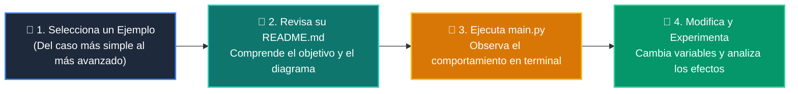

# 💻 Catálogo de Ejemplos Prácticos: Clase 04: Algoritmos de Búsqueda: Lineal vs Binaria O(log n)

> **Ubicación:** `curso/clase-04-algoritmos-busqueda/ejemplos`  
> **Filosofía:** *Aprender programando mediante casos de uso aislados, legibles y comentados.*

---

## 🗺️ Flujo de Estudio Recomendado



---

## 📑 Ejemplos Disponibles en esta Clase

| Directorio | Caso de Uso Demostrado | Script Principal |
| :--- | :--- | :---: |
| [`ejemplo_01_busqueda_lineal/`](ejemplo_01_busqueda_lineal/) | 01 Busqueda Lineal | [`main.py`](ejemplo_01_busqueda_lineal/main.py) |
| [`ejemplo_02_busqueda_binaria_pura/`](ejemplo_02_busqueda_binaria_pura/) | 02 Busqueda Binaria Pura | [`main.py`](ejemplo_02_busqueda_binaria_pura/main.py) |
| [`ejemplo_03_modulo_bisect/`](ejemplo_03_modulo_bisect/) | 03 Modulo Bisect | [`main.py`](ejemplo_03_modulo_bisect/main.py) |
| [`ejemplo_04_busqueda_rotada/`](ejemplo_04_busqueda_rotada/) | 04 Busqueda Rotada | [`main.py`](ejemplo_04_busqueda_rotada/main.py) |


---

## 🚀 Cómo Ejecutar Cualquier Ejemplo
Abre tu terminal en la raíz del repositorio y ejecuta:
```bash
python 01-fundamentos-python/clase-04-algoritmos-busqueda/ejemplos/<nombre_del_ejemplo>/main.py
```
