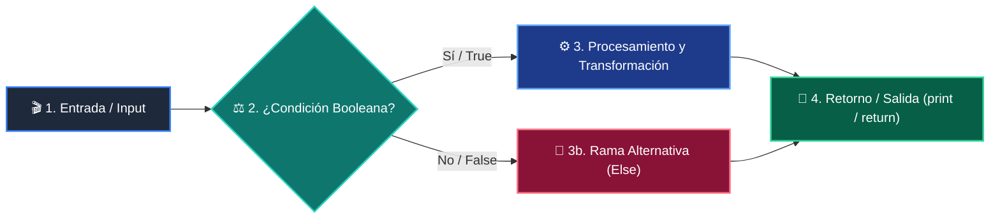

# 📚 Clase 05: Algoritmos de Ordenamiento: QuickSort y MergeSort

> **Programa:** Curso 2: Algoritmos Avanzados y Estructuras de Datos  
> **Nivel:** Nivel 2 - Intermedio  
> **Metáfora Central:** *«Ordenar Barajas de Cartas con Divide y Vencerás»*  
> **Documento Oficial PDF:** [clase-05-algoritmos-ordenamiento.pdf](clase-05-algoritmos-ordenamiento.pdf)  
> **Instructor:** **William Rodríguez (Wisrovi)** (AI Solutions Architect & Principal Software Engineer)  

---

## 👤 Perfil del Autor y Mentor

### **William Rodríguez (Wisrovi)**
*AI Solutions Architect & Principal Software Engineer &bull; Badajoz, España*

Ingeniero y arquitecto de software especializado en Inteligencia Artificial Generativa, sistemas multi-agente, Visión por Computador e infraestructuras MLOps de alta disponibilidad. Creador y mantenedor de la suite de software libre wisrovi SUITE en PyPI con más de 26 bibliotecas enfocadas en orquestación de pipelines, caching distribuido y optimización de bases de datos.

*   🐙 **GitHub:** [github.com/wisrovi](https://github.com/wisrovi)
*   💼 **LinkedIn:** [www.linkedin.com/in/wisrovi-rodriguez/](https://www.linkedin.com/in/wisrovi-rodriguez/)
*   🐳 **DockerHub:** [hub.docker.com/u/wisrovi](https://hub.docker.com/u/wisrovi)
*   🌐 **Website:** [wisrovi.dev](https://wisrovi.dev)
*   📦 **PyPI:** [pypi.org/user/wisrovi/](https://pypi.org/user/wisrovi/)

---

### 🚲 La Regla de la Bicicleta

> *"Nadie aprende a montar en bicicleta viendo tutoriales. El verdadero dominio de la programación surge cuando abres tu editor, escribes código con tus propias manos, resuelves errores y construyes proyectos reales."*

---

## 📑 Tabla de Contenidos de la Sesión

1. [💡 Fundamentación Teórica y Modelo Mental](#1--fundamentación-teórica-y-modelo-mental)
2. [🗺️ Arquitectura y Diagrama de Flujo](#2-️-arquitectura-y-diagrama-de-flujo)
3. [💻 Implementación en Python 3.10+](#3--implementación-en-python-310)
4. [🛡️ Buenas Prácticas y Trampas Frecuentes](#4-️-buenas-prácticas-y-trampas-frecuentes)
5. [🏋️ Desafío de Práctica](#5-️-desafío-de-práctica)
6. [📚 Bibliografía y Enlaces Canónicos](#6--bibliografía-y-enlaces-canónicos)

---

## 1. 💡 Fundamentación Teórica y Modelo Mental

El ordenamiento es la base de la optimización en ciencias de la computación.

> [!NOTE]
> **🌟 Metáfora Didáctica:** QuickSort elige un elemento pivote y separa las cartas en dos montones: menores a la izquierda, mayores a la derecha.

### Principios Fundamentales

Algoritmos cuadráticos O(n^2) como Bubble o Insertion Sort son lentos para grandes volúmenes.

QuickSort y MergeSort tienen complejidad promedio O(n log n).

> [!IMPORTANT]
> **⚡ Regla de Oro en Python:** En producción, usa siempre el método .sort() de Python, que implementa Timsort (híbrido optimizado en C).

---

## 2. 🗺️ Arquitectura y Diagrama de Flujo

Particionamiento recursivo alrededor de un pivote.



### Desglose Paso a Paso del Flujo

| Fase | Acción del Intérprete | Estado en Memoria |
| :--- | :--- | :--- |
| **1. Inicialización** | Caso base: len(arr) <= 1 retorna arr. | `Sublista trivial.` |
| **2. Evaluación** | Elección de pivote (elemento central). | `Pivote seleccionado.` |
| **3. Transformación** | Partición: sublistas menores, iguales y mayores. | `Tres arreglos en memoria.` |
| **4. Retorno / Salida** | Llamadas recursivas y concatenación. | `Lista combinada ordenada.` |

> [!TIP]
> **🔍 Visualización Mental:** Imagina partir un mazo de cartas por el centro hasta tener cartas individuales.

---

## 3. 💻 Implementación en Python 3.10+

```python
# CLASE 05 - Código de Demostración
def quicksort(arr: list[int]) -> list[int]:
    if len(arr) <= 1:
        return arr
    pivote = arr[len(arr) // 2]
    menores = [x for x in arr if x < pivote]
    iguales = [x for x in arr if x == pivote]
    mayores = [x for x in arr if x > pivote]
    return quicksort(menores) + iguales + quicksort(mayores)

desordenados = [38, 27, 43, 3, 9, 82, 10]
print("Ordenados:", quicksort(desordenados))
```

*Recursión divide y vencerás con list comprehensions para particionado legible.*

---

## 4. 🛡️ Buenas Prácticas y Trampas Frecuentes

> [!WARNING]
> **⚠️ Gotcha Frecuente (Trampa de Principiante):** Elegir siempre el primer elemento como pivote en una lista que ya está ordenada genera O(n^2).

*   **❌ Antipatrón:**
    ```python
pivote = arr[0]  # ❌ Degrada a O(n^2) si la lista ya viene ordenada
    ```

*   **✅ Patrón Correcto:**
    ```python
pivote = arr[len(arr) // 2]  # ✅ Pivote central o aleatorio
    ```

> [!TIP]
> **💡 Consejo Profesional:** sorted(iterable, key=lambda x: x.propiedad) permite ordenar por cualquier criterio.

---

## 5. 🏋️ Desafío de Práctica

> **Desafío:** Implementa MergeSort y compara el número de comparaciones frente a QuickSort.

Para ejecutar la verificación automática con pytest:
```bash
pytest ejercicios/
```

---

## 6. 📚 Bibliografía y Enlaces Canónicos

| Fuente / Recurso | Descripción | Enlace |
| :--- | :--- | :--- |
| **Documentación Oficial de Python** | Especificación y biblioteca estándar | [docs.python.org/3/](https://docs.python.org/3/) |
| **PEP 8 — Style Guide for Python** | Estándar oficial de formateo y estilo | [peps.python.org/pep-0008/](https://peps.python.org/pep-0008/) |
| **Real Python Tutorials** | Patrones de ingeniería y desarrollo | [realpython.com](https://realpython.com/) |
| **Suite Open Source wisrovi** | Librerías de alto rendimiento | [github.com/wisrovi](https://github.com/wisrovi) |
