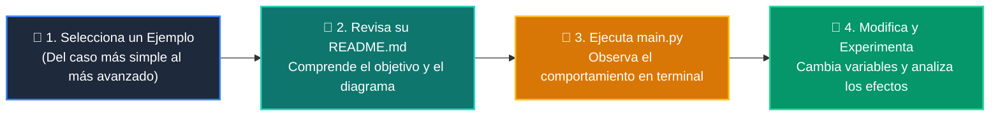

# 💻 Catálogo de Ejemplos Prácticos: Clase 05: Algoritmos de Ordenamiento: QuickSort y MergeSort

> **Ubicación:** `curso/clase-05-algoritmos-ordenamiento/ejemplos`  
> **Filosofía:** *Aprender programando mediante casos de uso aislados, legibles y comentados.*

---

## 🗺️ Flujo de Estudio Recomendado



---

## 📑 Ejemplos Disponibles en esta Clase

| Directorio | Caso de Uso Demostrado | Script Principal |
| :--- | :--- | :---: |
| [`ejemplo_01_bubble_sort/`](ejemplo_01_bubble_sort/) | 01 Bubble Sort | [`main.py`](ejemplo_01_bubble_sort/main.py) |
| [`ejemplo_02_quicksort_recursivo/`](ejemplo_02_quicksort_recursivo/) | 02 Quicksort Recursivo | [`main.py`](ejemplo_02_quicksort_recursivo/main.py) |
| [`ejemplo_03_mergesort_divide/`](ejemplo_03_mergesort_divide/) | 03 Mergesort Divide | [`main.py`](ejemplo_03_mergesort_divide/main.py) |
| [`ejemplo_04_timsort_custom_key/`](ejemplo_04_timsort_custom_key/) | 04 Timsort Custom Key | [`main.py`](ejemplo_04_timsort_custom_key/main.py) |


---

## 🚀 Cómo Ejecutar Cualquier Ejemplo
Abre tu terminal en la raíz del repositorio y ejecuta:
```bash
python 01-fundamentos-python/clase-05-algoritmos-ordenamiento/ejemplos/<nombre_del_ejemplo>/main.py
```
