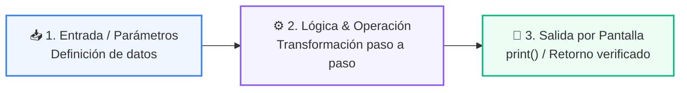

# 📖 03 Mergesort Divide

> **Clase:** Clase 05: Algoritmos de Ordenamiento: QuickSort y MergeSort  
> **Ubicación:** `02-algoritmos-estructuras/clase-05-algoritmos-ordenamiento/ejemplos/ejemplo_03_mergesort_divide`  

---

## 🌀 Modelo de Aprendizaje Activo

Este ejemplo demuestra de forma práctica, directa y aislada un principio fundamental de la clase:



---

## 💻 Cómo Ejecutar este Ejemplo

Abre la terminal en la raíz del repositorio y ejecuta:

```bash
python 02-algoritmos-estructuras/clase-05-algoritmos-ordenamiento/ejemplos/ejemplo_03_mergesort_divide/main.py
```

---

## 🔍 Código Fuente
Examina el archivo [`main.py`](main.py) en esta misma carpeta para revisar la sintaxis comentada y experimentar modificando los valores.
