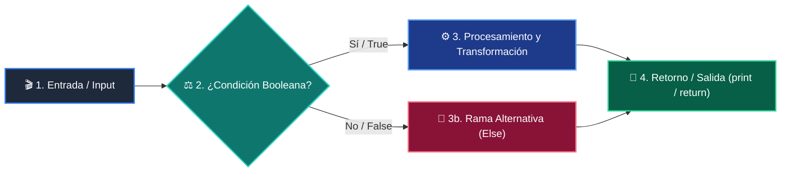

# 📚 Clase 06: Árboles Binarios de Búsqueda (BST) y Recorridos

> **Programa:** Curso 2: Algoritmos Avanzados y Estructuras de Datos  
> **Nivel:** Nivel 2 - Intermedio  
> **Metáfora Central:** *«Árboles como Organigramas Jerárquicos con Ramas Izquierda y Derecha»*  
> **Documento Oficial PDF:** [clase-06-arboles-binarios-busqueda.pdf](clase-06-arboles-binarios-busqueda.pdf)  
> **Instructor:** **William Rodríguez (Wisrovi)** (AI Solutions Architect & Principal Software Engineer)  

---

## 👤 Perfil del Autor y Mentor

### **William Rodríguez (Wisrovi)**
*AI Solutions Architect & Principal Software Engineer &bull; Badajoz, España*

Ingeniero y arquitecto de software especializado en Inteligencia Artificial Generativa, sistemas multi-agente, Visión por Computador e infraestructuras MLOps de alta disponibilidad. Creador y mantenedor de la suite de software libre wisrovi SUITE en PyPI con más de 26 bibliotecas enfocadas en orquestación de pipelines, caching distribuido y optimización de bases de datos.

*   🐙 **GitHub:** [github.com/wisrovi](https://github.com/wisrovi)
*   💼 **LinkedIn:** [www.linkedin.com/in/wisrovi-rodriguez/](https://www.linkedin.com/in/wisrovi-rodriguez/)
*   🐳 **DockerHub:** [hub.docker.com/u/wisrovi](https://hub.docker.com/u/wisrovi)
*   🌐 **Website:** [wisrovi.dev](https://wisrovi.dev)
*   📦 **PyPI:** [pypi.org/user/wisrovi/](https://pypi.org/user/wisrovi/)

---

### 🚲 La Regla de la Bicicleta

> *"Nadie aprende a montar en bicicleta viendo tutoriales. El verdadero dominio de la programación surge cuando abres tu editor, escribes código con tus propias manos, resuelves errores y construyes proyectos reales."*

---

## 📑 Tabla de Contenidos de la Sesión

1. [💡 Fundamentación Teórica y Modelo Mental](#1--fundamentación-teórica-y-modelo-mental)
2. [🗺️ Arquitectura y Diagrama de Flujo](#2-️-arquitectura-y-diagrama-de-flujo)
3. [💻 Implementación en Python 3.10+](#3--implementación-en-python-310)
4. [🛡️ Buenas Prácticas y Trampas Frecuentes](#4-️-buenas-prácticas-y-trampas-frecuentes)
5. [🏋️ Desafío de Práctica](#5-️-desafío-de-práctica)
6. [📚 Bibliografía y Enlaces Canónicos](#6--bibliografía-y-enlaces-canónicos)

---

## 1. 💡 Fundamentación Teórica y Modelo Mental

Los árboles binarios organizan la información de manera jerárquica para permitir búsquedas e inserciones rápidas.

> [!NOTE]
> **🌟 Metáfora Didáctica:** Un árbol BST es como un árbol genealógico donde a la izquierda van los números menores y a la derecha los mayores.

### Principios Fundamentales

Propiedad BST: Para cada nodo, todo valor en su subárbol izquierdo es menor, y en su subárbol derecho es mayor.

El recorrido in-order (Izquierda -> Raíz -> Derecha) extrae los elementos ordenados de menor a mayor.

> [!IMPORTANT]
> **⚡ Regla de Oro en Python:** Un árbol desbalanceado degenera en una lista enlazada O(n); los árboles balanceados mantienen O(log n).

---

## 2. 🗺️ Arquitectura y Diagrama de Flujo

Estructura de nodos en memoria y bifurcación izquierda/derecha.



### Desglose Paso a Paso del Flujo

| Fase | Acción del Intérprete | Estado en Memoria |
| :--- | :--- | :--- |
| **1. Inicialización** | Creación del nodo raíz con valor y punteros None. | `Raíz instanciada.` |
| **2. Evaluación** | Inserción recursiva comparando valor < nodo.val. | `Navegación al hijo izquierdo.` |
| **3. Transformación** | Inserción recursiva comparando valor > nodo.val. | `Navegación al hijo derecho.` |
| **4. Retorno / Salida** | Recorrido in-order para lectura ordenada. | `Lista ordenada generada.` |

> [!TIP]
> **🔍 Visualización Mental:** Cada nodo es la raíz de su propio subárbol.

---

## 3. 💻 Implementación en Python 3.10+

```python
# CLASE 06 - Código de Demostración
class Nodo:
    def __init__(self, val: int):
        self.val = val
        self.izq = None
        self.der = None

def insertar(raiz: Nodo, val: int) -> Nodo:
    if not raiz: return Nodo(val)
    if val < raiz.val: raiz.izq = insertar(raiz.izq, val)
    else: raiz.der = insertar(raiz.der, val)
    return raiz

def in_order(raiz: Nodo, res: list):
    if raiz:
        in_order(raiz.izq, res)
        res.append(raiz.val)
        in_order(raiz.der, res)

raiz = None
for num in [50, 30, 70, 20, 40, 60, 80]:
    raiz = insertar(raiz, num)

elementos = []
in_order(raiz, elementos)
print("Recorrido In-Order:", elementos)
```

*Clase Nodo con referencias recursivas y recorrido in-order que garantiza orden ascendente.*

---

## 4. 🛡️ Buenas Prácticas y Trampas Frecuentes

> [!WARNING]
> **⚠️ Gotcha Frecuente (Trampa de Principiante):** Olvidar validar if not nodo antes de acceder a nodo.izq produce AttributeError: 'NoneType' object has no attribute.

*   **❌ Antipatrón:**
    ```python
def buscar(nodo, val):
    if nodo.val == val: return True  # ❌ Falla si nodo es None
    ```

*   **✅ Patrón Correcto:**
    ```python
def buscar(nodo, val):
    if not nodo: return False       # ✅ Caso base de seguridad
    if nodo.val == val: return True
    ```

> [!TIP]
> **💡 Consejo Profesional:** Los árboles son la base de los índices en bases de datos (B-Trees).

---

## 5. 🏋️ Desafío de Práctica

> **Desafío:** Escribe una función que calcule la altura máxima (profundidad) de un árbol binario.

Para ejecutar la verificación automática con pytest:
```bash
pytest ejercicios/
```

---

## 6. 📚 Bibliografía y Enlaces Canónicos

| Fuente / Recurso | Descripción | Enlace |
| :--- | :--- | :--- |
| **Documentación Oficial de Python** | Especificación y biblioteca estándar | [docs.python.org/3/](https://docs.python.org/3/) |
| **PEP 8 — Style Guide for Python** | Estándar oficial de formateo y estilo | [peps.python.org/pep-0008/](https://peps.python.org/pep-0008/) |
| **Real Python Tutorials** | Patrones de ingeniería y desarrollo | [realpython.com](https://realpython.com/) |
| **Suite Open Source wisrovi** | Librerías de alto rendimiento | [github.com/wisrovi](https://github.com/wisrovi) |
