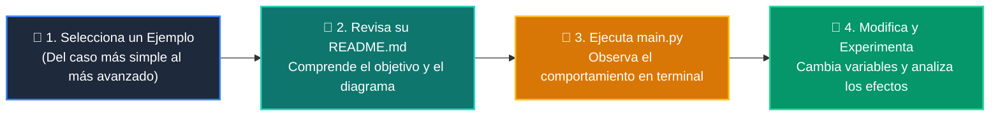

# 💻 Catálogo de Ejemplos Prácticos: Clase 06: Árboles Binarios de Búsqueda (BST) y Recorridos

> **Ubicación:** `curso/clase-06-arboles-binarios-busqueda/ejemplos`  
> **Filosofía:** *Aprender programando mediante casos de uso aislados, legibles y comentados.*

---

## 🗺️ Flujo de Estudio Recomendado



---

## 📑 Ejemplos Disponibles en esta Clase

| Directorio | Caso de Uso Demostrado | Script Principal |
| :--- | :--- | :---: |
| [`ejemplo_01_clase_nodo/`](ejemplo_01_clase_nodo/) | 01 Clase Nodo | [`main.py`](ejemplo_01_clase_nodo/main.py) |
| [`ejemplo_02_insercion_bst/`](ejemplo_02_insercion_bst/) | 02 Insercion Bst | [`main.py`](ejemplo_02_insercion_bst/main.py) |
| [`ejemplo_03_recorrido_inorder/`](ejemplo_03_recorrido_inorder/) | 03 Recorrido Inorder | [`main.py`](ejemplo_03_recorrido_inorder/main.py) |
| [`ejemplo_04_altura_maxima_arbol/`](ejemplo_04_altura_maxima_arbol/) | 04 Altura Maxima Arbol | [`main.py`](ejemplo_04_altura_maxima_arbol/main.py) |


---

## 🚀 Cómo Ejecutar Cualquier Ejemplo
Abre tu terminal en la raíz del repositorio y ejecuta:
```bash
python 01-fundamentos-python/clase-06-arboles-binarios-busqueda/ejemplos/<nombre_del_ejemplo>/main.py
```
