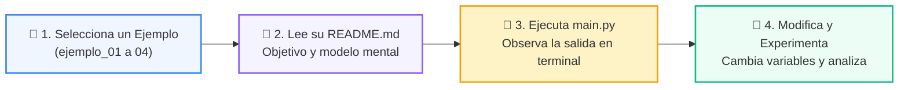

# 💻 Catálogo de Ejemplos Prácticos: Clase 06: Árboles Binarios de Búsqueda (BST) y Recorridos

> **Ubicación:** `02-algoritmos-estructuras/clase-06-arboles-binarios-busqueda/ejemplos`  
> **Metodología:** *La Regla de la Bicicleta (Pedaleo en VS Code)*  

Esta carpeta contiene los ejemplos de código interactivos y comentados diseñados para ver la teoría en acción.

---

## 🌀 Flujo de Experimentación y Pedaleo



---

## 📑 Ejemplos Disponibles

| Subcarpeta | Tipo de Demostración | Archivo de Código |
| :--- | :--- | :---: |
| [`ejemplo_01_clase_nodo/`](ejemplo_01_clase_nodo/) | Demostración paso a paso | [`main.py`](ejemplo_01_clase_nodo/main.py) |
| [`ejemplo_02_insercion_bst/`](ejemplo_02_insercion_bst/) | Demostración paso a paso | [`main.py`](ejemplo_02_insercion_bst/main.py) |
| [`ejemplo_03_recorrido_inorder/`](ejemplo_03_recorrido_inorder/) | Demostración paso a paso | [`main.py`](ejemplo_03_recorrido_inorder/main.py) |
| [`ejemplo_04_altura_maxima_arbol/`](ejemplo_04_altura_maxima_arbol/) | Demostración paso a paso | [`main.py`](ejemplo_04_altura_maxima_arbol/main.py) |


---

## 🚀 Cómo Ejecutar los Ejemplos
Desde la terminal en la raíz del repositorio:
```bash
python 02-algoritmos-estructuras/clase-06-arboles-binarios-busqueda/ejemplos/<carpeta_ejemplo>/main.py
```
