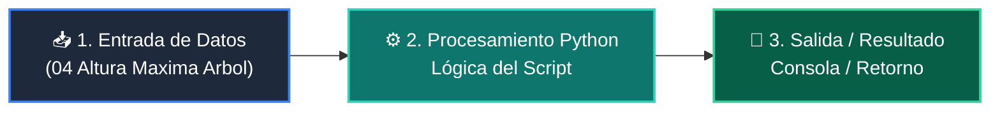

# 📖 04 Altura Maxima Arbol

> **Clase:** Clase 06: Árboles Binarios de Búsqueda (BST) y Recorridos  
> **Script:** [`main.py`](main.py)  

Cálculo de Altura del Árbol.

---

## 🗺️ Flujo de Ejecución del Ejemplo



---

## 💻 Ejecución desde Terminal

```bash
python 02-algoritmos-estructuras/clase-06-arboles-binarios-busqueda/ejemplos/ejemplo_04_altura_maxima_arbol/main.py
```
