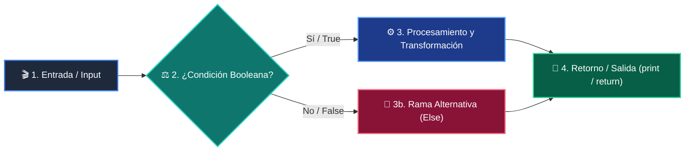

# 📚 Clase 07: Grafos, Matrices de Adyacencia y Recorridos BFS/DFS

> **Programa:** Curso 2: Algoritmos Avanzados y Estructuras de Datos  
> **Nivel:** Nivel 2 - Intermedio  
> **Metáfora Central:** *«Grafos como Redes de Ciudades y Rutas de Vuelo»*  
> **Documento Oficial PDF:** [clase-07-grafos-y-recorridos.pdf](clase-07-grafos-y-recorridos.pdf)  
> **Instructor:** **William Rodríguez (Wisrovi)** (AI Solutions Architect & Principal Software Engineer)  

---

## 👤 Perfil del Autor y Mentor

### **William Rodríguez (Wisrovi)**
*AI Solutions Architect & Principal Software Engineer &bull; Badajoz, España*

Ingeniero y arquitecto de software especializado en Inteligencia Artificial Generativa, sistemas multi-agente, Visión por Computador e infraestructuras MLOps de alta disponibilidad. Creador y mantenedor de la suite de software libre wisrovi SUITE en PyPI con más de 26 bibliotecas enfocadas en orquestación de pipelines, caching distribuido y optimización de bases de datos.

*   🐙 **GitHub:** [github.com/wisrovi](https://github.com/wisrovi)
*   💼 **LinkedIn:** [www.linkedin.com/in/wisrovi-rodriguez/](https://www.linkedin.com/in/wisrovi-rodriguez/)
*   🐳 **DockerHub:** [hub.docker.com/u/wisrovi](https://hub.docker.com/u/wisrovi)
*   🌐 **Website:** [wisrovi.dev](https://wisrovi.dev)
*   📦 **PyPI:** [pypi.org/user/wisrovi/](https://pypi.org/user/wisrovi/)

---

### 🚲 La Regla de la Bicicleta

> *"Nadie aprende a montar en bicicleta viendo tutoriales. El verdadero dominio de la programación surge cuando abres tu editor, escribes código con tus propias manos, resuelves errores y construyes proyectos reales."*

---

## 📑 Tabla de Contenidos de la Sesión

1. [💡 Fundamentación Teórica y Modelo Mental](#1--fundamentación-teórica-y-modelo-mental)
2. [🗺️ Arquitectura y Diagrama de Flujo](#2-️-arquitectura-y-diagrama-de-flujo)
3. [💻 Implementación en Python 3.10+](#3--implementación-en-python-310)
4. [🛡️ Buenas Prácticas y Trampas Frecuentes](#4-️-buenas-prácticas-y-trampas-frecuentes)
5. [🏋️ Desafío de Práctica](#5-️-desafío-de-práctica)
6. [📚 Bibliografía y Enlaces Canónicos](#6--bibliografía-y-enlaces-canónicos)

---

## 1. 💡 Fundamentación Teórica y Modelo Mental

Los grafos modelan relaciones complejas de red entre entidades (redes sociales, mapas, dependencias).

> [!NOTE]
> **🌟 Metáfora Didáctica:** Un grafo es un mapa de aeropuertos (nodos) conectados por vuelos (aristas).

### Principios Fundamentales

BFS (Breadth-First Search) explora por capas concéntricas usando una Cola FIFO; encuentra el camino más corto.

DFS (Depth-First Search) explora hasta el fondo de cada rama usando una Pila o recursión.

> [!IMPORTANT]
> **⚡ Regla de Oro en Python:** En grafos con ciclos, mantén siempre un conjunto 'visitados = set()' para evitar bucles infinitos.

---

## 2. 🗺️ Arquitectura y Diagrama de Flujo

Exploración por niveles con BFS vs exploración profunda con DFS.



### Desglose Paso a Paso del Flujo

| Fase | Acción del Intérprete | Estado en Memoria |
| :--- | :--- | :--- |
| **1. Inicialización** | Representación del grafo como lista de adyacencia (dict). | `Grafo en memoria.` |
| **2. Evaluación** | Inicialización de cola FIFO con el nodo de origen. | `Cola = [inicio], visitados = {inicio}.` |
| **3. Transformación** | Extracción del nodo y visita a vecinos no explorados. | `Vecinos encolados.` |
| **4. Retorno / Salida** | Fin de exploración tras vaciar la cola. | `Árbol de expansión BFS obtenido.` |

> [!TIP]
> **🔍 Visualización Mental:** BFS es como una onda en el agua que se expande en círculos; DFS es como entrar a un laberinto siempre hacia adelante.

---

## 3. 💻 Implementación en Python 3.10+

```python
# CLASE 07 - Código de Demostración
from collections import deque

grafo = {
    "A": ["B", "C"],
    "B": ["A", "D", "E"],
    "C": ["A", "F"],
    "D": ["B"],
    "E": ["B", "F"],
    "F": ["C", "E"]
}

def bfs(grafo: dict, inicio: str) -> list[str]:
    visitados = {inicio}
    cola = deque([inicio])
    recorrido = []
    while cola:
        nodo = cola.popleft()
        recorrido.append(nodo)
        for vecino in grafo.get(nodo, []):
            if vecino not in visitados:
                visitados.add(vecino)
                cola.append(vecino)
    return recorrido

print("Recorrido BFS:", bfs(grafo, "A"))
```

*Uso de collections.deque y conjunto visitados para garantizar tiempo O(V + E).*

---

## 4. 🛡️ Buenas Prácticas y Trampas Frecuentes

> [!WARNING]
> **⚠️ Gotcha Frecuente (Trampa de Principiante):** No registrar los nodos en visitados provoca un RecursionError o bucle infinito.

*   **❌ Antipatrón:**
    ```python
def dfs(nodo):
    for v in grafo[nodo]: dfs(v)  # ❌ Sin control de visitados en grafo cíclico
    ```

*   **✅ Patrón Correcto:**
    ```python
def dfs(nodo, visitados=None):
    if visitados is None: visitados = set()
    visitados.add(nodo)
    for v in grafo[nodo]:
        if v not in visitados: dfs(v, visitados)  # ✅ Seguro
    ```

> [!TIP]
> **💡 Consejo Profesional:** Para grafos con pesos en las aristas, usa el algoritmo de Dijkstra con heapq.

---

## 5. 🏋️ Desafío de Práctica

> **Desafío:** Implementa una función que determine si existe un camino entre dos nodos dados en un grafo.

Para ejecutar la verificación automática con pytest:
```bash
pytest ejercicios/
```

---

## 6. 📚 Bibliografía y Enlaces Canónicos

| Fuente / Recurso | Descripción | Enlace |
| :--- | :--- | :--- |
| **Documentación Oficial de Python** | Especificación y biblioteca estándar | [docs.python.org/3/](https://docs.python.org/3/) |
| **PEP 8 — Style Guide for Python** | Estándar oficial de formateo y estilo | [peps.python.org/pep-0008/](https://peps.python.org/pep-0008/) |
| **Real Python Tutorials** | Patrones de ingeniería y desarrollo | [realpython.com](https://realpython.com/) |
| **Suite Open Source wisrovi** | Librerías de alto rendimiento | [github.com/wisrovi](https://github.com/wisrovi) |
