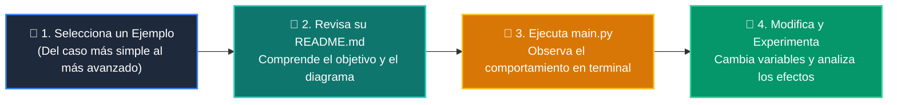

# 💻 Catálogo de Ejemplos Prácticos: Clase 07: Grafos, Matrices de Adyacencia y Recorridos BFS/DFS

> **Ubicación:** `curso/clase-07-grafos-y-recorridos/ejemplos`  
> **Filosofía:** *Aprender programando mediante casos de uso aislados, legibles y comentados.*

---

## 🗺️ Flujo de Estudio Recomendado



---

## 📑 Ejemplos Disponibles en esta Clase

| Directorio | Caso de Uso Demostrado | Script Principal |
| :--- | :--- | :---: |
| [`ejemplo_01_lista_adyacencia/`](ejemplo_01_lista_adyacencia/) | 01 Lista Adyacencia | [`main.py`](ejemplo_01_lista_adyacencia/main.py) |
| [`ejemplo_02_recorrido_bfs/`](ejemplo_02_recorrido_bfs/) | 02 Recorrido Bfs | [`main.py`](ejemplo_02_recorrido_bfs/main.py) |
| [`ejemplo_03_recorrido_dfs/`](ejemplo_03_recorrido_dfs/) | 03 Recorrido Dfs | [`main.py`](ejemplo_03_recorrido_dfs/main.py) |
| [`ejemplo_04_conectividad_camino/`](ejemplo_04_conectividad_camino/) | 04 Conectividad Camino | [`main.py`](ejemplo_04_conectividad_camino/main.py) |


---

## 🚀 Cómo Ejecutar Cualquier Ejemplo
Abre tu terminal en la raíz del repositorio y ejecuta:
```bash
python 01-fundamentos-python/clase-07-grafos-y-recorridos/ejemplos/<nombre_del_ejemplo>/main.py
```
