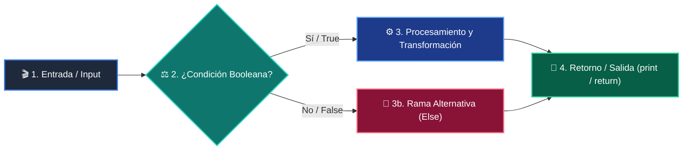

# 📚 Clase 08: Recursividad y Programación Dinámica con Memoización

> **Programa:** Curso 2: Algoritmos Avanzados y Estructuras de Datos  
> **Nivel:** Nivel 2 - Intermedio  
> **Metáfora Central:** *«Programación Dinámica como Recordar el Pasado para no Resolverlo Dos Veces»*  
> **Documento Oficial PDF:** [clase-08-recursividad-y-programacion-dinamica.pdf](clase-08-recursividad-y-programacion-dinamica.pdf)  
> **Instructor:** **William Rodríguez (Wisrovi)** (AI Solutions Architect & Principal Software Engineer)  

---

## 👤 Perfil del Autor y Mentor

### **William Rodríguez (Wisrovi)**
*AI Solutions Architect & Principal Software Engineer &bull; Badajoz, España*

Ingeniero y arquitecto de software especializado en Inteligencia Artificial Generativa, sistemas multi-agente, Visión por Computador e infraestructuras MLOps de alta disponibilidad. Creador y mantenedor de la suite de software libre wisrovi SUITE en PyPI con más de 26 bibliotecas enfocadas en orquestación de pipelines, caching distribuido y optimización de bases de datos.

*   🐙 **GitHub:** [github.com/wisrovi](https://github.com/wisrovi)
*   💼 **LinkedIn:** [www.linkedin.com/in/wisrovi-rodriguez/](https://www.linkedin.com/in/wisrovi-rodriguez/)
*   🐳 **DockerHub:** [hub.docker.com/u/wisrovi](https://hub.docker.com/u/wisrovi)
*   🌐 **Website:** [wisrovi.dev](https://wisrovi.dev)
*   📦 **PyPI:** [pypi.org/user/wisrovi/](https://pypi.org/user/wisrovi/)

---

### 🚲 La Regla de la Bicicleta

> *"Nadie aprende a montar en bicicleta viendo tutoriales. El verdadero dominio de la programación surge cuando abres tu editor, escribes código con tus propias manos, resuelves errores y construyes proyectos reales."*

---

## 📑 Tabla de Contenidos de la Sesión

1. [💡 Fundamentación Teórica y Modelo Mental](#1--fundamentación-teórica-y-modelo-mental)
2. [🗺️ Arquitectura y Diagrama de Flujo](#2-️-arquitectura-y-diagrama-de-flujo)
3. [💻 Implementación en Python 3.10+](#3--implementación-en-python-310)
4. [🛡️ Buenas Prácticas y Trampas Frecuentes](#4-️-buenas-prácticas-y-trampas-frecuentes)
5. [🏋️ Desafío de Práctica](#5-️-desafío-de-práctica)
6. [📚 Bibliografía y Enlaces Canónicos](#6--bibliografía-y-enlaces-canónicos)

---

## 1. 💡 Fundamentación Teórica y Modelo Mental

La programación dinámica es una técnica de optimización que almacena los resultados de subproblemas ya resueltos.

> [!NOTE]
> **🌟 Metáfora Didáctica:** Si te pregunto cuánto es 1+1+1+1, cuentas 4. Si añado otro +1, sabes que es 5 porque recordaste el 4 anterior.

### Principios Fundamentales

Recursión simple (Naive): Resuelve los mismos subproblemas miles de veces (explosión exponencial O(2^n)).

Memoización (Top-Down): Guarda en una tabla hash el resultado de cada llamada de función.

> [!IMPORTANT]
> **⚡ Regla de Oro en Python:** En Python, decora tus funciones recursivas puras con @functools.lru_cache(maxsize=None).

---

## 2. 🗺️ Arquitectura y Diagrama de Flujo

Poda del árbol de recursión mediante caché de resultados.



### Desglose Paso a Paso del Flujo

| Fase | Acción del Intérprete | Estado en Memoria |
| :--- | :--- | :--- |
| **1. Inicialización** | Llamada con argumentos n. | `Búsqueda en el diccionario de caché.` |
| **2. Evaluación** | Cache Hit: Retorno instantáneo O(1). | `Subárbol de cálculo omitido.` |
| **3. Transformación** | Cache Miss: Ejecución y cálculo del valor. | `Resultado computado.` |
| **4. Retorno / Salida** | Almacenamiento en caché y retorno. | `Caché actualizada.` |

> [!TIP]
> **🔍 Visualización Mental:** La memoización convierte un árbol exponencial en una línea recta.

---

## 3. 💻 Implementación en Python 3.10+

```python
# CLASE 08 - Código de Demostración
from functools import lru_cache
import time

@lru_cache(maxsize=None)
def fibonacci(n: int) -> int:
    if n <= 1:
        return n
    return fibonacci(n - 1) + fibonacci(n - 2)

t0 = time.perf_counter()
res = fibonacci(50)
t1 = time.perf_counter()

print(f"Fibonacci(50) = {res}")
print(f"Calculado en: {(t1 - t0)*1000:.4f} ms (Tiempo O(n))")
```

*Uso del decorador estándar lru_cache que almacena resultados en memoria C interna.*

---

## 4. 🛡️ Buenas Prácticas y Trampas Frecuentes

> [!WARNING]
> **⚠️ Gotcha Frecuente (Trampa de Principiante):** Recursiones muy profundas superan el límite de la pila de llamadas (por defecto 1000).

*   **❌ Antipatrón:**
    ```python
def contar(n):
    if n == 0: return 0
    return contar(n - 1)  # ❌ Falla con n > 1000 por RecursionError
    ```

*   **✅ Patrón Correcto:**
    ```python
# Enfoque iterativo (Bottom-Up) o sys.setrecursionlimit
def contar_iterativo(n):
    return sum(range(n))  # ✅ O(1) memoria
    ```

> [!TIP]
> **💡 Consejo Profesional:** Siempre que puedas, traduce algoritmos recursivos a tablas iterativas (Tabulación).

---

## 5. 🏋️ Desafío de Práctica

> **Desafío:** Resuelve el problema del cambio de monedas (mínimo número de monedas para formar un monto) usando DP.

Para ejecutar la verificación automática con pytest:
```bash
pytest ejercicios/
```

---

## 6. 📚 Bibliografía y Enlaces Canónicos

| Fuente / Recurso | Descripción | Enlace |
| :--- | :--- | :--- |
| **Documentación Oficial de Python** | Especificación y biblioteca estándar | [docs.python.org/3/](https://docs.python.org/3/) |
| **PEP 8 — Style Guide for Python** | Estándar oficial de formateo y estilo | [peps.python.org/pep-0008/](https://peps.python.org/pep-0008/) |
| **Real Python Tutorials** | Patrones de ingeniería y desarrollo | [realpython.com](https://realpython.com/) |
| **Suite Open Source wisrovi** | Librerías de alto rendimiento | [github.com/wisrovi](https://github.com/wisrovi) |
