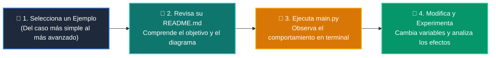

# 💻 Catálogo de Ejemplos Prácticos: Clase 08: Recursividad y Programación Dinámica con Memoización

> **Ubicación:** `curso/clase-08-recursividad-y-programacion-dinamica/ejemplos`  
> **Filosofía:** *Aprender programando mediante casos de uso aislados, legibles y comentados.*

---

## 🗺️ Flujo de Estudio Recomendado



---

## 📑 Ejemplos Disponibles en esta Clase

| Directorio | Caso de Uso Demostrado | Script Principal |
| :--- | :--- | :---: |
| [`ejemplo_01_factorial_recursivo/`](ejemplo_01_factorial_recursivo/) | 01 Factorial Recursivo | [`main.py`](ejemplo_01_factorial_recursivo/main.py) |
| [`ejemplo_02_fibonacci_naive/`](ejemplo_02_fibonacci_naive/) | 02 Fibonacci Naive | [`main.py`](ejemplo_02_fibonacci_naive/main.py) |
| [`ejemplo_03_memoizacion_lru_cache/`](ejemplo_03_memoizacion_lru_cache/) | 03 Memoizacion Lru Cache | [`main.py`](ejemplo_03_memoizacion_lru_cache/main.py) |
| [`ejemplo_04_cambio_monedas_dp/`](ejemplo_04_cambio_monedas_dp/) | 04 Cambio Monedas Dp | [`main.py`](ejemplo_04_cambio_monedas_dp/main.py) |


---

## 🚀 Cómo Ejecutar Cualquier Ejemplo
Abre tu terminal en la raíz del repositorio y ejecuta:
```bash
python 01-fundamentos-python/clase-08-recursividad-y-programacion-dinamica/ejemplos/<nombre_del_ejemplo>/main.py
```
