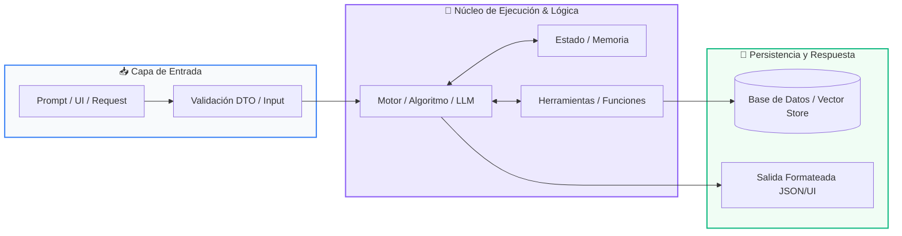

# 📖 Módulo 01: Fundamentos de IA Generativa y LLMs

> **Programa:** Curso 3: Creación y Desarrollo de Agentes de IA (Nivel 3 (Avanzado))  
> **Nivel de Dificultad:** Avanzado  
> **Metáfora Central:** *«El Cerebro Probabilístico y el Molde de Salida»*  
> **Python Version:** 3.10+ | **Licencia:** MIT  

---

## 👤 Acerca del Autor y Mentor

### **William Rodríguez (Wisrovi)**
**AI Solutions Architect & Principal Software Engineer** &bull; *Badajoz, España*

Ingeniero y arquitecto de software especializado en Inteligencia Artificial Generativa, sistemas multi-agente, Visión por Computador e infraestructuras MLOps de alta disponibilidad. Creador y mantenedor de la suite de software libre <strong>wisrovi SUITE</strong> en PyPI con más de 26 bibliotecas enfocadas en orquestación de pipelines, caching distribuido y optimización de bases de datos.

*   🐙 **GitHub:** [github.com/wisrovi](https://github.com/wisrovi)
*   💼 **LinkedIn:** [www.linkedin.com/in/wisrovi-rodriguez/](https://www.linkedin.com/in/wisrovi-rodriguez/)
*   🐳 **DockerHub:** [hub.docker.com/u/wisrovi](https://hub.docker.com/u/wisrovi)
*   🌐 **Website:** [wisrovi.dev](https://wisrovi.dev)
*   📦 **PyPI:** [pypi.org/user/wisrovi/](https://pypi.org/user/wisrovi/)

---

### 🚲 Metodología de Aprendizaje: La Regla de la Bicicleta

> *"Nadie aprende a montar en bicicleta viendo tutoriales. El verdadero dominio de la programación surge cuando abres tu editor, escribes código con tus propias manos, resuelves errores y construyes proyectos reales."*

> [!TIP]
> **El Compromiso Activo del Estudiante:** Abre Visual Studio Code en cada sesión. Escribe cada ejemplo con tus propias manos. Cambia los números, rompe el código deliberadamente para ver el mensaje de error de Python, y luego arréglalo.

---

## 📑 Tabla de Contenidos

| Capítulo | Tema | Enfoque Principal |
| :--- | :--- | :--- |
| **01** | **Fundamentos & Metáfora** | Arquitectura de Modelos de Lenguaje Grande (LLMs) |
| **02** | **Arquitectura de Flujo** | Pipeline de Inferencia y Validación Estructurada |
| **03** | **Implementación Práctica** | Extractor de Entidades con Pydantic y LLM |
| **04** | **Patrones & Debugging** | Gotchas en Integración con LLMs |
| **05** | **Conclusiones & Cierre** | Resumen ejecutivo, notas del mentor y agradecimiento |
| **06** | **Bibliografía & Recursos** | Fuentes oficiales y retos de autoestudio |

### 🎯 Objetivos de Aprendizaje

*   **Competencia Conceptual:** Comprender la naturaleza probabilística de los LLMs, el cálculo de tokens, la ventana de contexto y el control determinista de temperatura.
*   **Competencia Práctica:** Construir clientes robustos de IA en Python con validación estricta de esquemas de respuesta tipados.

---

## 1. 💡 Arquitectura de Modelos de Lenguaje Grande (LLMs)

Los LLMs no 'piensan' como los humanos; son gigantescas redes neuronales que predicen la siguiente palabra más probable dado un contexto.

> [!NOTE]
> ### 🌟 Metáfora Central: El Cerebro Probabilístico y el Molde de Salida
> Un LLM es como un erudito que ha leído toda la biblioteca de Alejandría: si le haces una pregunta abierta responderá con fluidez literaria, pero si le colocas un molde rígido (un esquema JSON con Pydantic), vertirá su conocimiento exclusivamente dentro de la forma exacta que necesitas.

### Principios Teóricos y Modelo Mental

Tokens y Contexto: Los textos se tokenizan en fragmentos sub-palabra; la ventana de contexto limita cuántos tokens puede procesar simultáneamente.

Parámetros Clave: Temperatura (0.0 para respuestas deterministas y código; 0.7+ para creatividad), Top-P y penalización de repetición.

> [!IMPORTANT]
> ### ⚡ Regla de Oro en Python
> En entornos de producción nunca uses texto libre del LLM; fuerza siempre salidas tipadas estructuradas validadas con Pydantic.

---

## 2. 🗺️ Pipeline de Inferencia y Validación Estructurada

Flujo desde la construcción del System Prompt hasta la validación del objeto de salida.

### Diagrama Visual del Flujo



### Desglose Paso a Paso del Flujo

| Fase del Flujo | Acción del Intérprete | Estado en Memoria |
| :--- | :--- | :--- |
| **1. Inicialización** | Construcción del System Prompt con instrucciones de rol y Few-Shot examples. | `Tokenización del prompt` |
| **2. Evaluación** | Envío a la API del modelo (Gemini / OpenAI / Ollama) con schema JSON. | `Inferencia en la GPU` |
| **3. Transformación** | El modelo genera un payload JSON estricto cumpliendo la especificación. | `Payload JSON crudo` |
| **4. Retorno / Salida** | Pydantic parsea y valida los tipos de datos en un objeto Python listo. | `Instancia BaseModel validada` |

> [!TIP]
> **Visualización Mental:** Trata al LLM como un microservicio no determinista: coloca siempre una capa de validación antes de entregar los datos a tu backend.

---

## 3. 💻 Extractor de Entidades con Pydantic y LLM

Esquema tipado para forzar respuestas deterministas en Python:

```python
# main.py - Python 3.10+ PEP 8 Compliant
from pydantic import BaseModel, Field
from typing import List

# Esquema de validación estricta
class AnalisisSentimiento(BaseModel):
    sentimiento: str = Field(description="POSITIVO, NEGATIVO o NEUTRO")
    puntuacion_confianza: float = Field(ge=0.0, le=1.0)
    temas_clave: List[str] = Field(default_factory=list)
    resumen_ejecutivo: str

# Simulación de respuesta parseada por el motor
payload_llm = '''{
    "sentimiento": "POSITIVO",
    "puntuacion_confianza": 0.96,
    "temas_clave": ["soporte rápido", "calidad software", "precio justo"],
    "resumen_ejecutivo": "El cliente expresa gran satisfacción con la atención recibida."
}'''

analisis = AnalisisSentimiento.model_validate_json(payload_llm)
print(f"Sentimiento: {analisis.sentimiento} ({analisis.puntuacion_confianza*100:.1f}%)")
print(f"Temas: {', '.join(analisis.temas_clave)}")
```

### Análisis del Código Fuente

Uso de Pydantic V2 para validación robusta con límites de rango numérico (ge, le) y serialización JSON directa.

---

## 4. 🛡️ Gotchas en Integración con LLMs

Errores frecuentes al conectar modelos de IA generativa a sistemas de software:

> [!WARNING]
> ### ⚠️ Gotcha Frecuente (Trampa de Principiante)
> Confiar ciegamente en que el LLM siempre responderá JSON válido sin capturar excepciones de parseo o alucinaciones.

### Comparativa: Antipatrón vs Patrón Recomendado

#### ❌ Antipatrón / Mal Código:
```python
data = json.loads(llm_response) # Fallará si el LLM incluye texto extra
```

#### ✅ Patrón Pythonic / Correcto:
```python
try:
    data = Model.model_validate_json(llm_response)
except ValidationError as e:
    # Estrategia de reintento / corrección
```

> [!TIP]
> **Consejo de Resiliencia en Producción:** Utiliza Temperature=0.0 para extracción de datos, clasificación y generación de código reproducible.

---

## 5. 🏆 Conclusiones y Resumen Ejecutivo

Comprendes los fundamentos de la IA generativa y sabes conectar modelos LLM con validación de esquemas tipados.

> [!NOTE]
> ### 🎖️ Logro Alcanzado
> Capacidad para construir tuberías de datos asistidas por IA que no fallen en producción.

### 📝 Notas del Instructor
En el siguiente módulo aprenderemos Tool Calling (Function Calling), Memoria y RAG con bases de datos vectoriales.

### 🤝 Mensaje de Agradecimiento
Muchas gracias por tu entusiasmo, disciplina y dedicación al participar en este programa formativo. La programación es un superpoder que transforma vidas cuando se ejerce con constancia y curiosidad. ¡Nos vemos en la próxima sesión para seguir construyendo juntos! 💻🚀

---

## 6. 📚 Bibliografía y Fuentes de Estudio

| Fuente / Recurso | Descripción Temática | Enlace Oficial |
| :--- | :--- | :--- |
| **Documentación Oficial de Python** | Referencia canónica del lenguaje y librería estándar | [docs.python.org/3/](https://docs.python.org/3/) |
| **PEP 8 — Style Guide for Python** | Guía oficial de estilo, formato e indentación | [peps.python.org/pep-0008/](https://peps.python.org/pep-0008/) |
| **Real Python Tutorials** | Artículos técnicos y patrones de desarrollo moderno | [realpython.com](https://realpython.com/) |
| **Python Type Checking (PEP 484)** | Anotaciones de tipo y análisis estático | [docs.python.org/typing](https://docs.python.org/3/library/typing.html) |
| **Suite Open Source wisrovi** | Paquetes Python para orquestación y rendimiento | [github.com/wisrovi](https://github.com/wisrovi) |

> [!TIP]
> ### 🏋️ Desafío de Autoestudio Recomendado
> Crea un script que consulte la API de Gemini u Ollama para resumir un artículo largo forzando salida en JSON con Pydantic.
