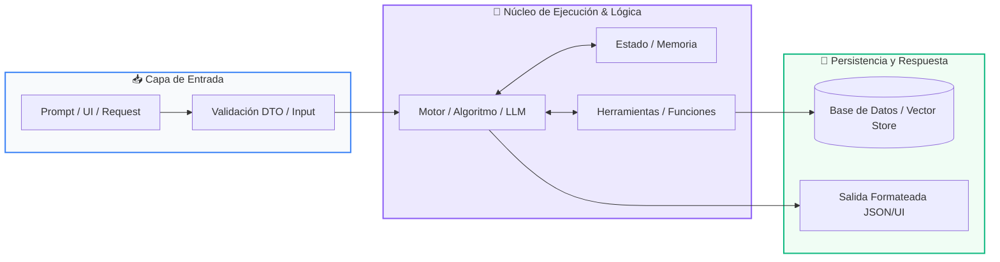

# 📖 Módulo 02: Herramientas, Memoria y RAG

> **Programa:** Curso 3: Creación y Desarrollo de Agentes de IA (Nivel 3 (Avanzado))  
> **Nivel de Dificultad:** Avanzado  
> **Metáfora Central:** *«La Caja de Herramientas y el Bibliotecario con Memoria»*  
> **Python Version:** 3.10+ | **Licencia:** MIT  

---

## 👤 Acerca del Autor y Mentor

### **William Rodríguez (Wisrovi)**
**AI Solutions Architect & Principal Software Engineer** &bull; *Badajoz, España*

Ingeniero y arquitecto de software especializado en Inteligencia Artificial Generativa, sistemas multi-agente, Visión por Computador e infraestructuras MLOps de alta disponibilidad. Creador y mantenedor de la suite de software libre <strong>wisrovi SUITE</strong> en PyPI con más de 26 bibliotecas enfocadas en orquestación de pipelines, caching distribuido y optimización de bases de datos.

*   🐙 **GitHub:** [github.com/wisrovi](https://github.com/wisrovi)
*   💼 **LinkedIn:** [www.linkedin.com/in/wisrovi-rodriguez/](https://www.linkedin.com/in/wisrovi-rodriguez/)
*   🐳 **DockerHub:** [hub.docker.com/u/wisrovi](https://hub.docker.com/u/wisrovi)
*   🌐 **Website:** [wisrovi.dev](https://wisrovi.dev)
*   📦 **PyPI:** [pypi.org/user/wisrovi/](https://pypi.org/user/wisrovi/)

---

### 🚲 Metodología de Aprendizaje: La Regla de la Bicicleta

> *"Nadie aprende a montar en bicicleta viendo tutoriales. El verdadero dominio de la programación surge cuando abres tu editor, escribes código con tus propias manos, resuelves errores y construyes proyectos reales."*

> [!TIP]
> **El Compromiso Activo del Estudiante:** Abre Visual Studio Code en cada sesión. Escribe cada ejemplo con tus propias manos. Cambia los números, rompe el código deliberadamente para ver el mensaje de error de Python, y luego arréglalo.

---

## 📑 Tabla de Contenidos

| Capítulo | Tema | Enfoque Principal |
| :--- | :--- | :--- |
| **01** | **Fundamentos & Metáfora** | Capacidades Aumentadas: Tool Calling y RAG |
| **02** | **Arquitectura de Flujo** | Arquitectura de un Sistema RAG (Retrieval-Augmented Generation) |
| **03** | **Implementación Práctica** | Definición y Ejecución de Herramientas (Tool Calling) |
| **04** | **Patrones & Debugging** | Gotchas en Tool Calling y RAG |
| **05** | **Conclusiones & Cierre** | Resumen ejecutivo, notas del mentor y agradecimiento |
| **06** | **Bibliografía & Recursos** | Fuentes oficiales y retos de autoestudio |

### 🎯 Objetivos de Aprendizaje

*   **Competencia Conceptual:** Comprender cómo un modelo utiliza herramientas externas para ejecutar código y cómo RAG elimina alucinaciones inyectando contexto verificado.
*   **Competencia Práctica:** Implementar un pipeline RAG con búsqueda por similitud de coseno y definir herramientas Python ejecutables por el modelo.

---

## 1. 💡 Capacidades Aumentadas: Tool Calling y RAG

Un LLM aislado solo puede generar texto; cuando le otorgas herramientas y memoria, se transforma en un agente inteligente capaz de interactuar con el mundo.

> [!NOTE]
> ### 🌟 Metáfora Central: La Caja de Herramientas y el Bibliotecario con Memoria
> El LLM es como un consultor brillante pero encerrado en una habitación: Tool Calling es darle un teléfono para llamar a APIs o consultar bases de datos. RAG es ponerle al lado a un bibliotecario que busca en segundos los documentos exactos de tu empresa y se los pasa antes de que responda.

### Principios Teóricos y Modelo Mental

Tool Calling: El LLM decide qué función invocar y genera los argumentos exactos; tu código ejecuta la función y devuelve el resultado al LLM.

Embeddings Vectoriales: Representaciones numéricas de significado semántico; textos con significados similares tienen alta similitud de coseno en el espacio vectorial.

> [!IMPORTANT]
> ### ⚡ Regla de Oro en Python
> RAG resuelve el problema del conocimiento desactualizado y las alucinaciones sin necesidad de reentrenar el modelo fundacional.

---

## 2. 🗺️ Arquitectura de un Sistema RAG (Retrieval-Augmented Generation)

Flujo de ingestión, búsqueda semántica y generación contextualizada con documentos privados.

### Diagrama Visual del Flujo



### Desglose Paso a Paso del Flujo

| Fase del Flujo | Acción del Intérprete | Estado en Memoria |
| :--- | :--- | :--- |
| **1. Inicialización** | Los documentos se dividen en fragmentos (chunks) y se vectorizan con un modelo de embeddings. | `Vectores en Vector DB` |
| **2. Evaluación** | El usuario hace una pregunta; se vectoriza la consulta del usuario. | `Query vector` |
| **3. Transformación** | Se realiza búsqueda de similitud (k-Nearest Neighbors / Cosine Similarity) para extraer los chunks más relevantes. | `Contexto recuperado` |
| **4. Retorno / Salida** | Se ensambla el prompt enriquecido [Contexto + Pregunta] y el LLM formula la respuesta final respaldada en hechos. | `Respuesta precisa y sin alucinación` |

> [!TIP]
> **Visualización Mental:** RAG es el examen a libro abierto del LLM: en lugar de memorizar todo, le das el párrafo exacto donde está la respuesta.

---

## 3. 💻 Definición y Ejecución de Herramientas (Tool Calling)

Registro dinámico de funciones Python para ser ejecutadas autónomamente por el modelo:

```python
# main.py - Python 3.10+ PEP 8 Compliant
import json

# 1. Definición de la Herramienta en Python puro
def consultar_clima(ciudad: str) -> str:
    """Consulta la temperatura actual de una ciudad."""
    datos = {"Madrid": "24°C Despejado", "Bogotá": "18°C Lluvioso"}
    return datos.get(ciudad, "20°C Clima templado")

# 2. Registro de herramientas disponibles para el agente
HERRAMIENTAS_DISPONIBLES = {"consultar_clima": consultar_clima}

# 3. Simulación de orden de Tool Call emitida por el LLM
llamada_modelo = {
    "funcion": "consultar_clima",
    "argumentos": {"ciudad": "Madrid"}
}

# 4. Despachador de ejecución segura
nombre_fn = llamada_modelo["funcion"]
args = llamada_modelo["argumentos"]
resultado_tool = HERRAMIENTAS_DISPONIBLES[nombre_fn](**args)

print(f"Resultado de la herramienta para el LLM: {resultado_tool}")
```

### Análisis del Código Fuente

Mecanismo de despacho dinámico mediante desempaquetado de argumentos (**kwargs) para conectar funciones locales con el LLM.

---

## 4. 🛡️ Gotchas en Tool Calling y RAG

Errores clásicos al implementar memorias y herramientas:

> [!WARNING]
> ### ⚠️ Gotcha Frecuente (Trampa de Principiante)
> Fragmentar documentos en chunks demasiado grandes (que diluyen la relevancia semántica) o demasiado pequeños (que pierden contexto).

### Comparativa: Antipatrón vs Patrón Recomendado

#### ❌ Antipatrón / Mal Código:
```python
# Chunks de 5000 tokens: el embedding pierde especificidad semántica
```

#### ✅ Patrón Pythonic / Correcto:
```python
# Chunks de 300-500 tokens con 50 tokens de solapamiento (overlap)
```

> [!TIP]
> **Consejo de Resiliencia en Producción:** Incluye siempre docstrings claros y detallados en tus funciones Python; los LLMs leen esos docstrings para saber cuándo invocar la herramienta.

---

## 5. 🏆 Conclusiones y Resumen Ejecutivo

Dominas los dos pilares que transforman un modelo de lenguaje en un sistema interactivo: Tool Calling y RAG.

> [!NOTE]
> ### 🎖️ Logro Alcanzado
> Capacidad para conectar modelos de IA con APIs externas, bases de datos vectoriales y fuentes documentales.

### 📝 Notas del Instructor
En el siguiente módulo integraremos estos componentes en Agentes Autónomos con el ciclo de razonamiento ReAct.

### 🤝 Mensaje de Agradecimiento
Muchas gracias por tu entusiasmo, disciplina y dedicación al participar en este programa formativo. La programación es un superpoder que transforma vidas cuando se ejerce con constancia y curiosidad. ¡Nos vemos en la próxima sesión para seguir construyendo juntos! 💻🚀

---

## 6. 📚 Bibliografía y Fuentes de Estudio

| Fuente / Recurso | Descripción Temática | Enlace Oficial |
| :--- | :--- | :--- |
| **Documentación Oficial de Python** | Referencia canónica del lenguaje y librería estándar | [docs.python.org/3/](https://docs.python.org/3/) |
| **PEP 8 — Style Guide for Python** | Guía oficial de estilo, formato e indentación | [peps.python.org/pep-0008/](https://peps.python.org/pep-0008/) |
| **Real Python Tutorials** | Artículos técnicos y patrones de desarrollo moderno | [realpython.com](https://realpython.com/) |
| **Python Type Checking (PEP 484)** | Anotaciones de tipo y análisis estático | [docs.python.org/typing](https://docs.python.org/3/library/typing.html) |
| **Suite Open Source wisrovi** | Paquetes Python para orquestación y rendimiento | [github.com/wisrovi](https://github.com/wisrovi) |

> [!TIP]
> ### 🏋️ Desafío de Autoestudio Recomendado
> Crea una herramienta que consulte una base de datos SQLite y permita a un LLM responder preguntas sobre inventarios.
