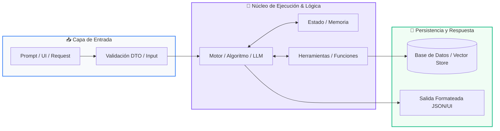

# 📖 Módulo 03: Construcción de Agentes Autónomos

> **Programa:** Curso 3: Creación y Desarrollo de Agentes de IA (Nivel 3 (Avanzado))  
> **Nivel de Dificultad:** Avanzado  
> **Metáfora Central:** *«El Ciclo Cognitivo ReAct y el Enjambre de Agentes»*  
> **Python Version:** 3.10+ | **Licencia:** MIT  

---

## 👤 Acerca del Autor y Mentor

### **William Rodríguez (Wisrovi)**
**AI Solutions Architect & Principal Software Engineer** &bull; *Badajoz, España*

Ingeniero y arquitecto de software especializado en Inteligencia Artificial Generativa, sistemas multi-agente, Visión por Computador e infraestructuras MLOps de alta disponibilidad. Creador y mantenedor de la suite de software libre <strong>wisrovi SUITE</strong> en PyPI con más de 26 bibliotecas enfocadas en orquestación de pipelines, caching distribuido y optimización de bases de datos.

*   🐙 **GitHub:** [github.com/wisrovi](https://github.com/wisrovi)
*   💼 **LinkedIn:** [www.linkedin.com/in/wisrovi-rodriguez/](https://www.linkedin.com/in/wisrovi-rodriguez/)
*   🐳 **DockerHub:** [hub.docker.com/u/wisrovi](https://hub.docker.com/u/wisrovi)
*   🌐 **Website:** [wisrovi.dev](https://wisrovi.dev)
*   📦 **PyPI:** [pypi.org/user/wisrovi/](https://pypi.org/user/wisrovi/)

---

### 🚲 Metodología de Aprendizaje: La Regla de la Bicicleta

> *"Nadie aprende a montar en bicicleta viendo tutoriales. El verdadero dominio de la programación surge cuando abres tu editor, escribes código con tus propias manos, resuelves errores y construyes proyectos reales."*

> [!TIP]
> **El Compromiso Activo del Estudiante:** Abre Visual Studio Code en cada sesión. Escribe cada ejemplo con tus propias manos. Cambia los números, rompe el código deliberadamente para ver el mensaje de error de Python, y luego arréglalo.

---

## 📑 Tabla de Contenidos

| Capítulo | Tema | Enfoque Principal |
| :--- | :--- | :--- |
| **01** | **Fundamentos & Metáfora** | El Paradigma ReAct: Razonar y Actuar en Ciclos |
| **02** | **Arquitectura de Flujo** | Grafo Cíclico de Razonamiento ReAct |
| **03** | **Implementación Práctica** | Motor de Agente ReAct en Python Puro |
| **04** | **Patrones & Debugging** | Gotchas en Desarrollo de Agentes |
| **05** | **Conclusiones & Cierre** | Resumen ejecutivo, notas del mentor y agradecimiento |
| **06** | **Bibliografía & Recursos** | Fuentes oficiales y retos de autoestudio |

### 🎯 Objetivos de Aprendizaje

*   **Competencia Conceptual:** Comprender la diferencia entre un script lineal y un bucle de razonamiento autónomo donde el agente decide su próximo paso.
*   **Competencia Práctica:** Construir un motor de agente ReAct en Python puro y orquestar flujos de trabajo multi-agente complejos.

---

## 1. 💡 El Paradigma ReAct: Razonar y Actuar en Ciclos

Un agente autónomo no ejecuta un camino fijo; observa su entorno, razona sobre el objetivo, decide qué herramienta usar y evalúa los resultados de forma iterativa.

> [!NOTE]
> ### 🌟 Metáfora Central: El Ciclo Cognitivo ReAct y el Enjambre de Agentes
> El ciclo ReAct es como un detective privado resolviendo un misterio: tiene un Pensamiento (Thought: 'Necesito ver la cámara de seguridad'), realiza una Acción (Action: busca el video con una herramienta), analiza la Observación (Observation: 'El sospechoso salió a las 10:00'), y repite el ciclo hasta llegar a la Respuesta Final.

### Principios Teóricos y Modelo Mental

Ciclo Cognitivo: Thought (Razonamiento interno) -> Action (Invocación de herramienta) -> Observation (Lectura del entorno) -> Evaluación.

Sistemas Multi-Agente: División de trabajo entre agentes especializados (Investigador, Programador, Auditor de Calidad) orquestados por un Supervisor.

> [!IMPORTANT]
> ### ⚡ Regla de Oro en Python
> Todo bucle de agente autónomo debe tener un límite estricto de pasos máximos (max_iterations) para evitar bucles infinitos y consumo desmedido de tokens.

---

## 2. 🗺️ Grafo Cíclico de Razonamiento ReAct

Flujo de control dinámico donde el agente decide autónomamente continuar investigando o emitir la solución final.

### Diagrama Visual del Flujo



### Desglose Paso a Paso del Flujo

| Fase del Flujo | Acción del Intérprete | Estado en Memoria |
| :--- | :--- | :--- |
| **1. Inicialización** | Recibe la misión del usuario y formula el primer pensamiento estratégico. | `Thought 1 formulado` |
| **2. Evaluación** | Emite una orden de acción hacia una herramienta específica. | `Action: Tool invocation` |
| **3. Transformación** | Recibe la observación del entorno con los datos reales generados. | `Observation incorporada al prompt` |
| **4. Retorno / Salida** | ¿Objetivo cumplido? Si no, repite ciclo; si sí, genera Final Answer. | `Solución entregada` |

> [!TIP]
> **Visualización Mental:** El agente mantiene un historial acumulativo de pensamientos y observaciones pasadas para no repetir errores.

---

## 3. 💻 Motor de Agente ReAct en Python Puro

Implementación minimalista y autónoma del ciclo de razonamiento y acción:

```python
# main.py - Python 3.10+ PEP 8 Compliant
class AgenteReAct:
    def __init__(self, herramientas: dict, max_pasos: int = 5):
        self.herramientas = herramientas
        self.max_pasos = max_pasos
        self.memoria: list[str] = []

    def ejecutar_mision(self, objetivo: str) -> str:
        self.memoria.append(f"Objetivo: {objetivo}")
        for paso in range(1, self.max_pasos + 1):
            print(f"
--- [Paso {paso}] Ciclo Cognitivo ---")
            # 1. Simulación de pensamiento y decisión del LLM
            pensamiento = "Consultar base de datos para extraer métricas"
            accion_tool = "consultar_db"
            
            print(f"💭 Thought: {pensamiento}")
            print(f"⚡ Action: {accion_tool}()")
            
            # 2. Ejecución de la herramienta y observación
            observacion = "Ventas del mes: $45,000 USD (Crecimiento +12%)"
            print(f"👁️ Observation: {observacion}")
            
            # 3. Condición de término
            return f"Respuesta Final: Las ventas crecieron un 12% alcanzando $45,000 USD."
        return "Límite de pasos alcanzado."
```

### Análisis del Código Fuente

Clase controladora que orquesta el bucle de ejecución de agentes, acumula contexto en memoria episódica y previene bloqueos.

---

## 4. 🛡️ Gotchas en Desarrollo de Agentes

Riesgos arquitectónicos en sistemas multi-agente autónomos:

> [!WARNING]
> ### ⚠️ Gotcha Frecuente (Trampa de Principiante)
> Permitir que un agente ejecute comandos en el sistema operativo o mutaciones destructivas en bases de datos sin una capa de confirmación humana (Human-in-the-loop).

### Comparativa: Antipatrón vs Patrón Recomendado

#### ❌ Antipatrón / Mal Código:
```python
# Agente ejecutando rm -rf o DROP TABLE sin validación
```

#### ✅ Patrón Pythonic / Correcto:
```python
# Validar permisos y requerir confirmación antes de acciones críticas
```

> [!TIP]
> **Consejo de Resiliencia en Producción:** Implementa timeouts y presupuestos de tokens por sesión para evitar costos imprevistos en APIs comerciales.

---

## 5. 🏆 Conclusiones y Resumen Ejecutivo

¡Has completado el Curso 3! Dominas el diseño, la memoria y la orquestación de Agentes de Inteligencia Artificial.

> [!NOTE]
> ### 🎖️ Logro Alcanzado
> Capacidad para construir agentes autónomos que resuelven problemas complejos combinando herramientas y razonamiento.

### 📝 Notas del Instructor
En el Curso 4 aplicarás todo lo aprendido en tu Proyecto Final: Aplicaciones Web, Chatbots de Producción o Sistemas de Gestión.

### 🤝 Mensaje de Agradecimiento
Muchas gracias por tu entusiasmo, disciplina y dedicación al participar en este programa formativo. La programación es un superpoder que transforma vidas cuando se ejerce con constancia y curiosidad. ¡Nos vemos en la próxima sesión para seguir construyendo juntos! 💻🚀

---

## 6. 📚 Bibliografía y Fuentes de Estudio

| Fuente / Recurso | Descripción Temática | Enlace Oficial |
| :--- | :--- | :--- |
| **Documentación Oficial de Python** | Referencia canónica del lenguaje y librería estándar | [docs.python.org/3/](https://docs.python.org/3/) |
| **PEP 8 — Style Guide for Python** | Guía oficial de estilo, formato e indentación | [peps.python.org/pep-0008/](https://peps.python.org/pep-0008/) |
| **Real Python Tutorials** | Artículos técnicos y patrones de desarrollo moderno | [realpython.com](https://realpython.com/) |
| **Python Type Checking (PEP 484)** | Anotaciones de tipo y análisis estático | [docs.python.org/typing](https://docs.python.org/3/library/typing.html) |
| **Suite Open Source wisrovi** | Paquetes Python para orquestación y rendimiento | [github.com/wisrovi](https://github.com/wisrovi) |

> [!TIP]
> ### 🏋️ Desafío de Autoestudio Recomendado
> Construye un sistema de dos agentes donde el primer agente genere un reporte y el segundo actúe como auditor crítico.
