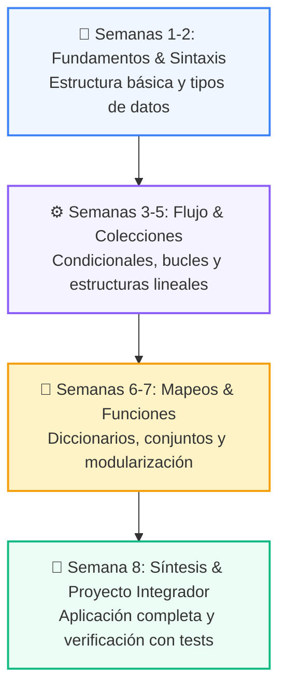

# 📚 Curso 3: Creación y Desarrollo de Agentes de IA

> **Modelos LLM, Inferencia, Tool Calling, Memoria Vectorial, RAG, Arquitecturas ReAct y Multi-Agentes**  
> **Nivel:** Nivel 3 (Avanzado) &bull; **Duración:** 8 Semanas Formativas  
> **Instructor:** **William Rodríguez (Wisrovi)** (AI Solutions Architect & Principal Software Engineer)  

---

## 🗺️ Mapa de Ruta del Curso (8 Semanas)

---

## 📑 Clases del Curso

| Semana | Directorio | Contenido Temático | Metáfora Didáctica |
| :---: | :--- | :--- | :--- |
| **CLASE 01** | [`clase-01-fundamentos-llm-tokenizacion/`](clase-01-fundamentos-llm-tokenizacion/) | Fundamentos de LLMs, Tokens y Arquitectura Transformer | *«Modelos de Lenguaje como Motores de Predicción Probabilística»* |
| **CLASE 02** | [`clase-02-prompt-engineering-avanzado/`](clase-02-prompt-engineering-avanzado/) | Prompt Engineering Avanzado y Few-Shot Learning | *«Prompts como Especificaciones Precisas para un Consultor Experto»* |
| **CLASE 03** | [`clase-03-salidas-estructuradas-pydantic/`](clase-03-salidas-estructuradas-pydantic/) | Salidas Estructuradas y Validación Tipada con Pydantic V2 | *«Pydantic como la Aduana Estricta de Datos para Respuestas de IA»* |
| **CLASE 04** | [`clase-04-tool-calling-funciones/`](clase-04-tool-calling-funciones/) | Tool Calling y Function Calling en Python | *«Dotando de Manos y Herramientas al Cerebro del LLM»* |
| **CLASE 05** | [`clase-05-embeddings-y-bases-vectoriales/`](clase-05-embeddings-y-bases-vectoriales/) | Embeddings y Representación Vectorial Semántica | *«Embeddings como Coordenadas GPS del Significado de las Palabras»* |
| **CLASE 06** | [`clase-06-arquitecturas-rag/`](clase-06-arquitecturas-rag/) | Arquitecturas RAG (Retrieval-Augmented Generation) | *«RAG como Darle al LLM un Libro Abierto con la Información Exacta»* |
| **CLASE 07** | [`clase-07-agentes-autonomos-react/`](clase-07-agentes-autonomos-react/) | Agentes Autónomos y el Ciclo Cognitivo ReAct | *«El Agente como un Detective que Piensa, Actúa y Observa hasta Resolver el Caso»* |
| **CLASE 08** | [`clase-08-sistemas-multi-agente/`](clase-08-sistemas-multi-agente/) | Sistemas Multi-Agente, Supervisión y Guardrails | *«Una Empresa de Agentes Especializados Coordinados por un Director»* |

---

## 📦 Materiales Oficiales del Curso

*   📄 [`curso-03-agentes-ia.pdf`](curso-03-agentes-ia.pdf): Manual completo oficial en PDF compilado con estética LaTeX.
*   📖 [`book.md`](book.md): Libro de estudio digital con explicaciones profundas y diagramas Mermaid.
*   🧪 Suite de Pruebas Automatizadas en [`tests/curso_03/`](../tests/curso_03/).
