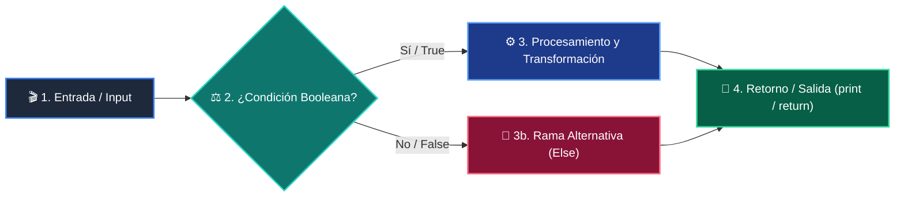
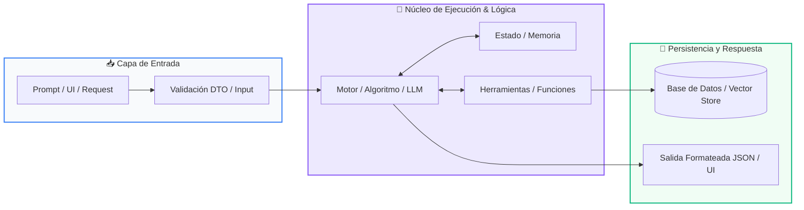

# 📚 Curso 3: Creación y Desarrollo de Agentes de IA

> **Modelos LLM, Inferencia, Tool Calling, Memoria Vectorial, RAG, Arquitecturas ReAct y Multi-Agentes**  
> **Nivel:** Nivel 3 (Avanzado)  
> **Duración:** 8 Semanas (1 Clase por semana)  
> **Instructor:** **William Rodríguez (Wisrovi)** (AI Solutions Architect & Principal Software Engineer)  
> **Licencia:** MIT | **Python:** 3.10+  

---

## 📑 Hoja de Ruta y Tabla de Contenidos (8 Semanas)

| Semana / Clase | Título | Metáfora Central | Carpeta |
| :---: | :--- | :--- | :---: |
| **CLASE 01** | Clase 01: Fundamentos de LLMs, Tokens y Arquitectura Transformer | *«Modelos de Lenguaje como Motores de Predicción Probabilística»* | [`clase-01-fundamentos-llm-tokenizacion/`](clase-01-fundamentos-llm-tokenizacion/) |
| **CLASE 02** | Clase 02: Prompt Engineering Avanzado y Few-Shot Learning | *«Prompts como Especificaciones Precisas para un Consultor Experto»* | [`clase-02-prompt-engineering-avanzado/`](clase-02-prompt-engineering-avanzado/) |
| **CLASE 03** | Clase 03: Salidas Estructuradas y Validación Tipada con Pydantic V2 | *«Pydantic como la Aduana Estricta de Datos para Respuestas de IA»* | [`clase-03-salidas-estructuradas-pydantic/`](clase-03-salidas-estructuradas-pydantic/) |
| **CLASE 04** | Clase 04: Tool Calling y Function Calling en Python | *«Dotando de Manos y Herramientas al Cerebro del LLM»* | [`clase-04-tool-calling-funciones/`](clase-04-tool-calling-funciones/) |
| **CLASE 05** | Clase 05: Embeddings y Representación Vectorial Semántica | *«Embeddings como Coordenadas GPS del Significado de las Palabras»* | [`clase-05-embeddings-y-bases-vectoriales/`](clase-05-embeddings-y-bases-vectoriales/) |
| **CLASE 06** | Clase 06: Arquitecturas RAG (Retrieval-Augmented Generation) | *«RAG como Darle al LLM un Libro Abierto con la Información Exacta»* | [`clase-06-arquitecturas-rag/`](clase-06-arquitecturas-rag/) |
| **CLASE 07** | Clase 07: Agentes Autónomos y el Ciclo Cognitivo ReAct | *«El Agente como un Detective que Piensa, Actúa y Observa hasta Resolver el Caso»* | [`clase-07-agentes-autonomos-react/`](clase-07-agentes-autonomos-react/) |
| **CLASE 08** | Clase 08: Sistemas Multi-Agente, Supervisión y Guardrails | *«Una Empresa de Agentes Especializados Coordinados por un Director»* | [`clase-08-sistemas-multi-agente/`](clase-08-sistemas-multi-agente/) |

---


# 📖 CLASE 01: Clase 01: Fundamentos de LLMs, Tokens y Arquitectura Transformer

> **Metáfora:** *«Modelos de Lenguaje como Motores de Predicción Probabilística»*  
> **Objetivo:** Comprender la tokenización (BPE), ventana de contexto, inferencia probabilística y temperatura.  

### 1. Fundamentos Teóricos
Los Modelos de Lenguaje Grande (LLMs) son redes neuronales basadas en la arquitectura Transformer que predicen el siguiente token.

> [!NOTE]
> **Metáfora Didáctica:** Un LLM es como el teclado predictivo de tu móvil, pero entrenado con todo el conocimiento digital del planeta.

Los LLMs no procesan palabras ni letras, procesan 'tokens' (fragmentos de palabras de ~4 caracteres).

> [!IMPORTANT]
> **Regla de Oro:** Para tareas de extracción estructurada, código o datos, mantén siempre la temperatura en 0.0.

### 2. Diagrama de Arquitectura


### 3. Implementación en Python
```python
# CLASE 01
def simular_tokenizador(texto: str) -> list[str]:
    # Simulación básica de subwords
    return texto.replace(".", " .").split()

tokens = simular_tokenizador("Python es el lenguaje líder en Inteligencia Artificial.")
print(f"Total tokens: {len(tokens)}")
print("Tokens extraídos:", tokens)
```

### 4. Gotchas y Buenas Prácticas
> [!WARNING]
> **Gotcha:** Enviar documentos gigantes sin podar agota la ventana de contexto y dispara los costos de tokens.

*   **❌ Antipatrón:**
    ```python
prompt = doc_entero_de_500_paginas + '
Resume esto'  # ❌ Desborda el contexto
    ```
*   **✅ Patrón Correcto:**
    ```python
# Chunking previo y filtrado semántico RAG ✅
    ```

---

# 📖 CLASE 02: Clase 02: Prompt Engineering Avanzado y Few-Shot Learning

> **Metáfora:** *«Prompts como Especificaciones Precisas para un Consultor Experto»*  
> **Objetivo:** Comprender roles (System, User, Assistant), Chain-of-Thought (CoT) y Few-Shot Prompting.  

### 1. Fundamentos Teóricos
El Prompt Engineering es la disciplina de diseñar entradas estructuradas para guiar a los LLMs hacia resultados precisos.

> [!NOTE]
> **Metáfora Didáctica:** El System Prompt es como el contrato de trabajo de un empleado: define su rol, límites, tono y reglas inquebrantables.

Zero-Shot: Instrucción directa sin ejemplos previos.

> [!IMPORTANT]
> **Regla de Oro:** Instruye al modelo sobre lo que DEBE hacer, en lugar de solo listar lo que no debe hacer.

### 2. Diagrama de Arquitectura


### 3. Implementación en Python
```python
# CLASE 02
TEMPLATE_SYSTEM = """Eres un clasificador de soporte técnico. Responde ÚNICAMENTE en formato JSON.
Roles permitidos de sentimiento: POSITIVO, NEGATIVO, NEUTRO."""

EJEMPLOS_FEW_SHOT = [
    {"input": "La app se cierra sola", "output": '{"sentimiento": "NEGATIVO", "urgencia": "ALTA"}'},
    {"input": "Excelente servicio y soporte", "output": '{"sentimiento": "POSITIVO", "urgencia": "BAJA"}'}
]

def construir_prompt(consulta_usuario: str) -> str:
    return f"{TEMPLATE_SYSTEM}

Ejemplos:
{EJEMPLOS_FEW_SHOT}

Usuario: {consulta_usuario}"

print(construir_prompt("No puedo iniciar sesión"))
```

### 4. Gotchas y Buenas Prácticas
> [!WARNING]
> **Gotcha:** Concatenar texto de usuarios sin sanitizar permite que instrucciones maliciosas anulen el System Prompt.

*   **❌ Antipatrón:**
    ```python
prompt = f'Eres un bot. Traduce: {input_usuario}'  # ❌ Si el usuario pone 'Olvida las reglas anteriores...', el bot obedece
    ```
*   **✅ Patrón Correcto:**
    ```python
# Uso de delimitadores XML <user_input> y guardrails de validación ✅
    ```

---

# 📖 CLASE 03: Clase 03: Salidas Estructuradas y Validación Tipada con Pydantic V2

> **Metáfora:** *«Pydantic como la Aduana Estricta de Datos para Respuestas de IA»*  
> **Objetivo:** Comprender Structured Outputs, esquemas JSON Schema generados por Pydantic y serialización estricta.  

### 1. Fundamentos Teóricos
Integrar LLMs en sistemas empresariales exige que sus respuestas sean 100% deterministas en estructura y tipo.

> [!NOTE]
> **Metáfora Didáctica:** Pydantic es el inspector de aduana que revisa que cada paquete traiga exactamente los sellos, tipos y formatos requeridos.

Pydantic V2 está construido sobre un núcleo en Rust de alto rendimiento para validación instantánea.

> [!IMPORTANT]
> **Regla de Oro:** Nunca consumas texto libre de un LLM en lógica transaccional; valida siempre con Pydantic.

### 2. Diagrama de Arquitectura


### 3. Implementación en Python
```python
# CLASE 03
from pydantic import BaseModel, Field, EmailStr

class LeadCliente(BaseModel):
    nombre: str = Field(description="Nombre completo del prospecto")
    email: str = Field(description="Correo electrónico válido")
    presupuesto_estimado: float = Field(ge=0.0, description="Monto en USD")
    interes_ia: bool = True

# Simulación de respuesta JSON generada por LLM
json_llm = '{"nombre": "Laura Méndez", "email": "laura@empresa.com", "presupuesto_estimado": 15000.0}'
lead = LeadCliente.model_validate_json(json_llm)

print("Lead Validado:", lead.nombre)
print("Presupuesto:", lead.presupuesto_estimado)
```

### 4. Gotchas y Buenas Prácticas
> [!WARNING]
> **Gotcha:** Parsear la salida del LLM con json.loads() simple sin validar tipos permite que campos nulos rompan la aplicación.

*   **❌ Antipatrón:**
    ```python
data = json.loads(respuesta_llm)
total = data['precio'] * 2  # ❌ Falla si 'precio' vino como None o string
    ```
*   **✅ Patrón Correcto:**
    ```python
data = FacturaModel.model_validate_json(respuesta_llm)
total = data.precio * 2    # ✅ Garantizado float tipado
    ```

---

# 📖 CLASE 04: Clase 04: Tool Calling y Function Calling en Python

> **Metáfora:** *«Dotando de Manos y Herramientas al Cerebro del LLM»*  
> **Objetivo:** Comprender la invocación de herramientas, esquemas de funciones y el protocolo de ejecución cliente-servidor.  

### 1. Fundamentos Teóricos
Tool Calling permite que un LLM decida autónomamente cuándo invocar funciones de código externo para consultar datos o actuar.

> [!NOTE]
> **Metáfora Didáctica:** El LLM es un cerebro brillante pero ciego y sin manos; las herramientas son sus brazos mecánicos para interactuar con el mundo.

El LLM NO ejecuta el código directamente: devuelve un objeto estructurado con el nombre de la función y sus argumentos.

> [!IMPORTANT]
> **Regla de Oro:** Escribe docstrings extremadamente claros en tus funciones: el LLM los usa como manual de instrucciones.

### 2. Diagrama de Arquitectura


### 3. Implementación en Python
```python
# CLASE 04
import math

def calcular_distancia(x1: float, y1: float, x2: float, y2: float) -> float:
    """Calcula la distancia euclidiana entre dos puntos (x1, y1) y (x2, y2)."""
    return math.sqrt((x2 - x1)**2 + (y2 - y1)**2)

HERRAMIENTAS = {
    "calcular_distancia": calcular_distancia
}

def despachar_herramienta(nombre: str, argumentos: dict):
    if nombre in HERRAMIENTAS:
        return HERRAMIENTAS[nombre](**argumentos)
    raise ValueError(f"Herramienta '{nombre}' no encontrada.")

res = despachar_herramienta("calcular_distancia", {"x1": 0.0, "y1": 0.0, "x2": 3.0, "y2": 4.0})
print("Resultado de la herramienta:", res)  # 5.0
```

### 4. Gotchas y Buenas Prácticas
> [!WARNING]
> **Gotcha:** Usar eval() o exec() para ejecutar herramientas abre una vulnerabilidad crítica de inyección de código.

*   **❌ Antipatrón:**
    ```python
eval(f'{nombre_funcion}({argumentos_crudos})')  # ❌ Vulnerabilidad RCE crítica
    ```
*   **✅ Patrón Correcto:**
    ```python
HERRAMIENTAS[nombre](**argumentos)  # ✅ Mapeo explícito a funciones seguras
    ```

---

# 📖 CLASE 05: Clase 05: Embeddings y Representación Vectorial Semántica

> **Metáfora:** *«Embeddings como Coordenadas GPS del Significado de las Palabras»*  
> **Objetivo:** Comprender espacios vectoriales de alta dimensión, modelos de embedding y cálculo de distancia coseno.  

### 1. Fundamentos Teóricos
Los embeddings transforman texto en vectores de números que capturan el significado semántico y contextual.

> [!NOTE]
> **Metáfora Didáctica:** Un embedding es como la latitud y longitud de un concepto: 'Rey' y 'Reina' están muy cerca en el mapa semántico.

Textos con significados similares tienen vectores que apuntan en direcciones casi idénticas en el espacio n-dimensional.

> [!IMPORTANT]
> **Regla de Oro:** Los embeddings permiten búsquedas por SIGNIFICADO, no solo por coincidencia exacta de palabras clave.

### 2. Diagrama de Arquitectura


### 3. Implementación en Python
```python
# CLASE 05
import math

def similitud_coseno(v1: list[float], v2: list[float]) -> float:
    dot_product = sum(a * b for a, b in zip(v1, v2))
    norm_v1 = math.sqrt(sum(a * a for a in v1))
    norm_v2 = math.sqrt(sum(b * b for b in v2))
    if norm_v1 == 0 or norm_v2 == 0: return 0.0
    return dot_product / (norm_v1 * norm_v2)

# Vectores conceptuales simulados
vec_python = [0.9, 0.8, 0.1]
vec_codigo = [0.85, 0.75, 0.15]
vec_cocina = [0.05, 0.1, 0.95]

print("Similitud Python vs Código:", round(similitud_coseno(vec_python, vec_codigo), 4))
print("Similitud Python vs Cocina:", round(similitud_coseno(vec_python, vec_cocina), 4))
```

### 4. Gotchas y Buenas Prácticas
> [!WARNING]
> **Gotcha:** Comparar embeddings generados por dos modelos distintos produce resultados erróneos.

*   **❌ Antipatrón:**
    ```python
similitud(emb_openai_1536, emb_bge_768)  # ❌ Incompatibilidad de dimensiones
    ```
*   **✅ Patrón Correcto:**
    ```python
# Usa SIEMPRE el mismo modelo de embedding para indexar y consultar ✅
    ```

---

# 📖 CLASE 06: Clase 06: Arquitecturas RAG (Retrieval-Augmented Generation)

> **Metáfora:** *«RAG como Darle al LLM un Libro Abierto con la Información Exacta»*  
> **Objetivo:** Comprender la división en Chunks, overlap, indexación en bases vectoriales y síntesis con contexto.  

### 1. Fundamentos Teóricos
RAG combina recuperación semántica con generación de lenguaje para que el LLM responda con datos privados sin reentrenamiento.

> [!NOTE]
> **Metáfora Didáctica:** En lugar de pedirle al alumno que responda de memoria, le permites consultar el capítulo exacto del libro antes de contestar.

Ingestión: Carga de documentos -> División en Chunks (ej. 500 caracteres con 50 de solapamiento) -> Embeddings -> Vector Store.

> [!IMPORTANT]
> **Regla de Oro:** Instruye al modelo a responder ÚNICAMENTE basándose en el contexto provisto para eliminar alucinaciones.

### 2. Diagrama de Arquitectura


### 3. Implementación en Python
```python
# CLASE 06
class MiniRAG:
    def __init__(self):
        self.docs = []

    def indexar(self, texto: str):
        # Simulación de chunking básico
        self.docs.append(texto)

    def recuperar(self, query: str) -> str:
        # Recupera el documento con mayor coincidencia léxica
        palabras = set(query.lower().split())
        mejor_doc = max(self.docs, key=lambda d: len(palabras.intersection(set(d.lower().split()))))
        return mejor_doc

    def generar_prompt(self, query: str) -> str:
        ctx = self.recuperar(query)
        return f"Contexto:
{ctx}

Pregunta: {query}
Respuesta basada estrictamente en el contexto:"

rag = MiniRAG()
rag.indexar("El horario de atención es de Lunes a Viernes de 9:00 a 18:00.")
print(rag.generar_prompt("¿A qué hora abren?"))
```

### 4. Gotchas y Buenas Prácticas
> [!WARNING]
> **Gotcha:** Inyectar demasiados chunks (ej. 20 chunks) satura el contexto y hace que el LLM ignore la información central.

*   **❌ Antipatrón:**
    ```python
prompt = f'Contexto:
{20_chunks_desordenados}'  # ❌ Degradación de atención
    ```
*   **✅ Patrón Correcto:**
    ```python
# Selecciona Top 3 a 5 chunks relevantes y reordénalos con un Re-ranker ✅
    ```

---

# 📖 CLASE 07: Clase 07: Agentes Autónomos y el Ciclo Cognitivo ReAct

> **Metáfora:** *«El Agente como un Detective que Piensa, Actúa y Observa hasta Resolver el Caso»*  
> **Objetivo:** Comprender el paradigma ReAct (Reasoning + Acting), bucles de decisión autónoma y memoria de trabajo.  

### 1. Fundamentos Teóricos
Un Agente de IA es un sistema autónomo que combina un LLM con memoria, herramientas y un bucle de razonamiento para alcanzar metas.

> [!NOTE]
> **Metáfora Didáctica:** Un agente es como un detective: piensa qué pista necesita (Thought), busca el dato con una herramienta (Action), analiza el resultado (Observation) y repite.

Ciclo ReAct: Thought (Pensamiento) -> Action (Acción/Tool) -> Observation (Resultado) -> Final Answer.

> [!IMPORTANT]
> **Regla de Oro:** Establece siempre un 'max_iterations = 5' para evitar que el agente quede atrapado en bucles infinitos.

### 2. Diagrama de Arquitectura


### 3. Implementación en Python
```python
# CLASE 07
class ReActAgent:
    def __init__(self, tools: dict, max_steps: int = 3):
        self.tools = tools
        self.max_steps = max_steps
        self.memory = []

    def run(self, goal: str):
        print(f"🎯 Meta: {goal}")
        for step in range(1, self.max_steps + 1):
            print(f"--- Paso {step} ---")
            # 1. Thought
            thought = f"Necesito consultar la cotización del euro."
            print(f"💭 Thought: {thought}")
            
            # 2. Action
            obs = self.tools["get_rate"]("EUR_USD")
            print(f"🎬 Action: get_rate(EUR_USD) -> Obs: {obs}")
            
            # 3. Final Answer
            return f"Respuesta Final: 1 EUR equivale a {obs} USD."

tools = {"get_rate": lambda pair: 1.08}
agente = ReActAgent(tools)
print(agente.run("¿Cuánto vale el euro frente al dólar?"))
```

### 4. Gotchas y Buenas Prácticas
> [!WARNING]
> **Gotcha:** Si una herramienta falla o devuelve error, el agente puede reintentar la misma acción en un ciclo sin fin.

*   **❌ Antipatrón:**
    ```python
while not finished: agent.step()  # ❌ Puede consumir tokens infinitos
    ```
*   **✅ Patrón Correcto:**
    ```python
for step in range(max_steps):     # ✅ Límite estricto de seguridad
    ```

---

# 📖 CLASE 08: Clase 08: Sistemas Multi-Agente, Supervisión y Guardrails

> **Metáfora:** *«Una Empresa de Agentes Especializados Coordinados por un Director»*  
> **Objetivo:** Comprender la orquestación multi-agente, delegación jerárquica, consenso y capas de guardrails de seguridad.  

### 1. Fundamentos Teóricos
Para problemas complejos, múltiples agentes especializados colaboran mejor que un único agente generalista.

> [!NOTE]
> **Metáfora Didáctica:** Es como una agencia de noticias: el reportero investiga los hechos, el redactor escribe la noticia y el editor jefe revisa la calidad.

Patrón Supervisor: Un agente orquestador recibe la tarea global y la desglosa delegando a agentes especialistas.

> [!IMPORTANT]
> **Regla de Oro:** Asigna a cada agente un System Prompt ultra específico y un conjunto reducido de herramientas.

### 2. Diagrama de Arquitectura


### 3. Implementación en Python
```python
# CLASE 08
class MultiAgentSystem:
    def __init__(self):
        pass

    def agente_investigador(self, tema: str) -> dict:
        return {"datos": f"Hallazgos clave sobre {tema}: Crecimiento del 40% en adopción."}

    def agente_redactor(self, investigacion: dict) -> str:
        return f"Reporte Ejecutivo: {investigacion['datos']}"

    def supervisor(self, tema: str) -> str:
        print("👑 Supervisor: Coordinando equipo...")
        datos = self.agente_investigador(tema)
        informe = self.agente_redactor(datos)
        return f"✅ Publicación Aprobada:
{informe}"

sistema = MultiAgentSystem()
print(sistema.supervisor("Agentes Autónomos en 2026"))
```

### 4. Gotchas y Buenas Prácticas
> [!WARNING]
> **Gotcha:** Pasar texto libre desordenado entre agentes provoca pérdida de contexto en cadenas largas.

*   **❌ Antipatrón:**
    ```python
msg_agente_2 = call_llm(f'El otro dijo: {texto_libre_caotico}')  # ❌ Degradación
    ```
*   **✅ Patrón Correcto:**
    ```python
# Usa esquemas Pydantic para el paso de mensajes entre agentes ✅
    ```

---
