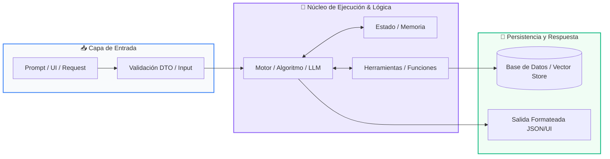

# 📚 Curso 3: Creación y Desarrollo de Agentes de IA

> **Nivel:** Nivel 3 (Avanzado)  
> **Enfoque:** Modelos LLM, Inferencia, Tool Calling, Memoria Vectorial, RAG y Arquitecturas ReAct  
> **Python Version:** 3.10+ | **Licencia:** MIT  
> **Instructor:** **William Rodríguez (Wisrovi)** (AI Solutions Architect & Principal Software Engineer)  

---

## 👤 Perfil del Instructor y Mentor

### **William Rodríguez (Wisrovi)**
*AI Solutions Architect & Principal Software Engineer &bull; Badajoz, España*

Ingeniero y arquitecto de software especializado en Inteligencia Artificial Generativa, sistemas multi-agente, Visión por Computador e infraestructuras MLOps de alta disponibilidad. Creador y mantenedor de la suite de software libre <strong>wisrovi SUITE</strong> en PyPI con más de 26 bibliotecas enfocadas en orquestación de pipelines, caching distribuido y optimización de bases de datos.

*   🐙 **GitHub:** [github.com/wisrovi](https://github.com/wisrovi)
*   💼 **LinkedIn:** [www.linkedin.com/in/wisrovi-rodriguez/](https://www.linkedin.com/in/wisrovi-rodriguez/)
*   🐳 **DockerHub:** [hub.docker.com/u/wisrovi](https://hub.docker.com/u/wisrovi)
*   🌐 **Website:** [wisrovi.dev](https://wisrovi.dev)
*   📦 **PyPI:** [pypi.org/user/wisrovi/](https://pypi.org/user/wisrovi/)

---

### 🚲 Filosofía de Aprendizaje: La Regla de la Bicicleta

> *"Nadie aprende a montar en bicicleta viendo tutoriales. El verdadero dominio de la programación surge cuando abres tu editor, escribes código con tus propias manos, resuelves errores y construyes proyectos reales."*

---

## 📑 Hoja de Ruta y Tabla de Contenidos del Curso

| Módulo / Clase | Título Temático | Metáfora Central | Enlace a Carpeta |
| :---: | :--- | :--- | :---: |
| **Módulo 01** | Módulo 01: Fundamentos de IA Generativa y LLMs | *El Cerebro Probabilístico y el Molde de Salida* | [`01-fundamentos-ia-llm/`](01-fundamentos-ia-llm/) |
| **Módulo 02** | Módulo 02: Herramientas, Memoria y RAG | *La Caja de Herramientas y el Bibliotecario con Memoria* | [`02-herramientas-y-memoria/`](02-herramientas-y-memoria/) |
| **Módulo 03** | Módulo 03: Construcción de Agentes Autónomos | *El Ciclo Cognitivo ReAct y el Enjambre de Agentes* | [`03-construccion-de-agentes/`](03-construccion-de-agentes/) |

---


# 📖 Módulo 01: Módulo 01: Fundamentos de IA Generativa y LLMs

> **Metáfora:** *«El Cerebro Probabilístico y el Molde de Salida»*  
> **Objetivo:** Comprender la naturaleza probabilística de los LLMs, el cálculo de tokens, la ventana de contexto y el control determinista de temperatura.  

### 1. Fundamentación y Modelo Mental

Los LLMs no 'piensan' como los humanos; son gigantescas redes neuronales que predicen la siguiente palabra más probable dado un contexto.

> [!NOTE]
> **Metáfora Didáctica:** Un LLM es como un erudito que ha leído toda la biblioteca de Alejandría: si le haces una pregunta abierta responderá con fluidez literaria, pero si le colocas un molde rígido (un esquema JSON con Pydantic), vertirá su conocimiento exclusivamente dentro de la forma exacta que necesitas.

Tokens y Contexto: Los textos se tokenizan en fragmentos sub-palabra; la ventana de contexto limita cuántos tokens puede procesar simultáneamente.

Parámetros Clave: Temperatura (0.0 para respuestas deterministas y código; 0.7+ para creatividad), Top-P y penalización de repetición.

> [!IMPORTANT]
> **Regla de Oro:** En entornos de producción nunca uses texto libre del LLM; fuerza siempre salidas tipadas estructuradas validadas con Pydantic.

### 2. Arquitectura de Flujo



| Fase | Acción del Intérprete | Estado en Memoria |
| :--- | :--- | :--- |
| **Inicialización** | Construcción del System Prompt con instrucciones de rol y Few-Shot examples. | `Tokenización del prompt` |
| **Evaluación** | Envío a la API del modelo (Gemini / OpenAI / Ollama) con schema JSON. | `Inferencia en la GPU` |
| **Transformación** | El modelo genera un payload JSON estricto cumpliendo la especificación. | `Payload JSON crudo` |
| **Salida / Retorno** | Pydantic parsea y valida los tipos de datos en un objeto Python listo. | `Instancia BaseModel validada` |

### 3. Implementación en Python

```python
# Módulo 01 - main.py
from pydantic import BaseModel, Field
from typing import List

# Esquema de validación estricta
class AnalisisSentimiento(BaseModel):
    sentimiento: str = Field(description="POSITIVO, NEGATIVO o NEUTRO")
    puntuacion_confianza: float = Field(ge=0.0, le=1.0)
    temas_clave: List[str] = Field(default_factory=list)
    resumen_ejecutivo: str

# Simulación de respuesta parseada por el motor
payload_llm = '''{
    "sentimiento": "POSITIVO",
    "puntuacion_confianza": 0.96,
    "temas_clave": ["soporte rápido", "calidad software", "precio justo"],
    "resumen_ejecutivo": "El cliente expresa gran satisfacción con la atención recibida."
}'''

analisis = AnalisisSentimiento.model_validate_json(payload_llm)
print(f"Sentimiento: {analisis.sentimiento} ({analisis.puntuacion_confianza*100:.1f}%)")
print(f"Temas: {', '.join(analisis.temas_clave)}")
```

*Uso de Pydantic V2 para validación robusta con límites de rango numérico (ge, le) y serialización JSON directa.*

### 4. Gotchas Comunes y Buenas Prácticas

> [!WARNING]
> **Trampa de Principiante:** Confiar ciegamente en que el LLM siempre responderá JSON válido sin capturar excepciones de parseo o alucinaciones.

*   **❌ Antipatrón:**
    ```python
    data = json.loads(llm_response) # Fallará si el LLM incluye texto extra
    ```
*   **✅ Patrón Correcto:**
    ```python
    try:
    data = Model.model_validate_json(llm_response)
except ValidationError as e:
    # Estrategia de reintento / corrección
    ```

> [!TIP]
> **Consejo Profesional:** Utiliza Temperature=0.0 para extracción de datos, clasificación y generación de código reproducible.

---


# 📖 Módulo 02: Módulo 02: Herramientas, Memoria y RAG

> **Metáfora:** *«La Caja de Herramientas y el Bibliotecario con Memoria»*  
> **Objetivo:** Comprender cómo un modelo utiliza herramientas externas para ejecutar código y cómo RAG elimina alucinaciones inyectando contexto verificado.  

### 1. Fundamentación y Modelo Mental

Un LLM aislado solo puede generar texto; cuando le otorgas herramientas y memoria, se transforma en un agente inteligente capaz de interactuar con el mundo.

> [!NOTE]
> **Metáfora Didáctica:** El LLM es como un consultor brillante pero encerrado en una habitación: Tool Calling es darle un teléfono para llamar a APIs o consultar bases de datos. RAG es ponerle al lado a un bibliotecario que busca en segundos los documentos exactos de tu empresa y se los pasa antes de que responda.

Tool Calling: El LLM decide qué función invocar y genera los argumentos exactos; tu código ejecuta la función y devuelve el resultado al LLM.

Embeddings Vectoriales: Representaciones numéricas de significado semántico; textos con significados similares tienen alta similitud de coseno en el espacio vectorial.

> [!IMPORTANT]
> **Regla de Oro:** RAG resuelve el problema del conocimiento desactualizado y las alucinaciones sin necesidad de reentrenar el modelo fundacional.

### 2. Arquitectura de Flujo


| Fase | Acción del Intérprete | Estado en Memoria |
| :--- | :--- | :--- |
| **Inicialización** | Los documentos se dividen en fragmentos (chunks) y se vectorizan con un modelo de embeddings. | `Vectores en Vector DB` |
| **Evaluación** | El usuario hace una pregunta; se vectoriza la consulta del usuario. | `Query vector` |
| **Transformación** | Se realiza búsqueda de similitud (k-Nearest Neighbors / Cosine Similarity) para extraer los chunks más relevantes. | `Contexto recuperado` |
| **Salida / Retorno** | Se ensambla el prompt enriquecido [Contexto + Pregunta] y el LLM formula la respuesta final respaldada en hechos. | `Respuesta precisa y sin alucinación` |

### 3. Implementación en Python

```python
# Módulo 02 - main.py
import json

# 1. Definición de la Herramienta en Python puro
def consultar_clima(ciudad: str) -> str:
    """Consulta la temperatura actual de una ciudad."""
    datos = {"Madrid": "24°C Despejado", "Bogotá": "18°C Lluvioso"}
    return datos.get(ciudad, "20°C Clima templado")

# 2. Registro de herramientas disponibles para el agente
HERRAMIENTAS_DISPONIBLES = {"consultar_clima": consultar_clima}

# 3. Simulación de orden de Tool Call emitida por el LLM
llamada_modelo = {
    "funcion": "consultar_clima",
    "argumentos": {"ciudad": "Madrid"}
}

# 4. Despachador de ejecución segura
nombre_fn = llamada_modelo["funcion"]
args = llamada_modelo["argumentos"]
resultado_tool = HERRAMIENTAS_DISPONIBLES[nombre_fn](**args)

print(f"Resultado de la herramienta para el LLM: {resultado_tool}")
```

*Mecanismo de despacho dinámico mediante desempaquetado de argumentos (**kwargs) para conectar funciones locales con el LLM.*

### 4. Gotchas Comunes y Buenas Prácticas

> [!WARNING]
> **Trampa de Principiante:** Fragmentar documentos en chunks demasiado grandes (que diluyen la relevancia semántica) o demasiado pequeños (que pierden contexto).

*   **❌ Antipatrón:**
    ```python
    # Chunks de 5000 tokens: el embedding pierde especificidad semántica
    ```
*   **✅ Patrón Correcto:**
    ```python
    # Chunks de 300-500 tokens con 50 tokens de solapamiento (overlap)
    ```

> [!TIP]
> **Consejo Profesional:** Incluye siempre docstrings claros y detallados en tus funciones Python; los LLMs leen esos docstrings para saber cuándo invocar la herramienta.

---


# 📖 Módulo 03: Módulo 03: Construcción de Agentes Autónomos

> **Metáfora:** *«El Ciclo Cognitivo ReAct y el Enjambre de Agentes»*  
> **Objetivo:** Comprender la diferencia entre un script lineal y un bucle de razonamiento autónomo donde el agente decide su próximo paso.  

### 1. Fundamentación y Modelo Mental

Un agente autónomo no ejecuta un camino fijo; observa su entorno, razona sobre el objetivo, decide qué herramienta usar y evalúa los resultados de forma iterativa.

> [!NOTE]
> **Metáfora Didáctica:** El ciclo ReAct es como un detective privado resolviendo un misterio: tiene un Pensamiento (Thought: 'Necesito ver la cámara de seguridad'), realiza una Acción (Action: busca el video con una herramienta), analiza la Observación (Observation: 'El sospechoso salió a las 10:00'), y repite el ciclo hasta llegar a la Respuesta Final.

Ciclo Cognitivo: Thought (Razonamiento interno) -> Action (Invocación de herramienta) -> Observation (Lectura del entorno) -> Evaluación.

Sistemas Multi-Agente: División de trabajo entre agentes especializados (Investigador, Programador, Auditor de Calidad) orquestados por un Supervisor.

> [!IMPORTANT]
> **Regla de Oro:** Todo bucle de agente autónomo debe tener un límite estricto de pasos máximos (max_iterations) para evitar bucles infinitos y consumo desmedido de tokens.

### 2. Arquitectura de Flujo


| Fase | Acción del Intérprete | Estado en Memoria |
| :--- | :--- | :--- |
| **Inicialización** | Recibe la misión del usuario y formula el primer pensamiento estratégico. | `Thought 1 formulado` |
| **Evaluación** | Emite una orden de acción hacia una herramienta específica. | `Action: Tool invocation` |
| **Transformación** | Recibe la observación del entorno con los datos reales generados. | `Observation incorporada al prompt` |
| **Salida / Retorno** | ¿Objetivo cumplido? Si no, repite ciclo; si sí, genera Final Answer. | `Solución entregada` |

### 3. Implementación en Python

```python
# Módulo 03 - main.py
class AgenteReAct:
    def __init__(self, herramientas: dict, max_pasos: int = 5):
        self.herramientas = herramientas
        self.max_pasos = max_pasos
        self.memoria: list[str] = []

    def ejecutar_mision(self, objetivo: str) -> str:
        self.memoria.append(f"Objetivo: {objetivo}")
        for paso in range(1, self.max_pasos + 1):
            print(f"
--- [Paso {paso}] Ciclo Cognitivo ---")
            # 1. Simulación de pensamiento y decisión del LLM
            pensamiento = "Consultar base de datos para extraer métricas"
            accion_tool = "consultar_db"
            
            print(f"💭 Thought: {pensamiento}")
            print(f"⚡ Action: {accion_tool}()")
            
            # 2. Ejecución de la herramienta y observación
            observacion = "Ventas del mes: $45,000 USD (Crecimiento +12%)"
            print(f"👁️ Observation: {observacion}")
            
            # 3. Condición de término
            return f"Respuesta Final: Las ventas crecieron un 12% alcanzando $45,000 USD."
        return "Límite de pasos alcanzado."
```

*Clase controladora que orquesta el bucle de ejecución de agentes, acumula contexto en memoria episódica y previene bloqueos.*

### 4. Gotchas Comunes y Buenas Prácticas

> [!WARNING]
> **Trampa de Principiante:** Permitir que un agente ejecute comandos en el sistema operativo o mutaciones destructivas en bases de datos sin una capa de confirmación humana (Human-in-the-loop).

*   **❌ Antipatrón:**
    ```python
    # Agente ejecutando rm -rf o DROP TABLE sin validación
    ```
*   **✅ Patrón Correcto:**
    ```python
    # Validar permisos y requerir confirmación antes de acciones críticas
    ```

> [!TIP]
> **Consejo Profesional:** Implementa timeouts y presupuestos de tokens por sesión para evitar costos imprevistos en APIs comerciales.

---


## 🏆 Conclusiones Generales de Curso 3: Creación y Desarrollo de Agentes de IA

Has completado el manual de referencia completo para este nivel. Continúa profundizando y aplicando estos conceptos en proyectos reales.

### 📚 Bibliografía Oficial y Enlaces Recomendados

| Recurso | Enfoque | Enlace |
| :--- | :--- | :--- |
| **Documentación Oficial de Python** | Referencia canónica del lenguaje | [docs.python.org/3/](https://docs.python.org/3/) |
| **PEP 8 — Style Guide for Python** | Estándar de formato y estilo | [peps.python.org/pep-0008/](https://peps.python.org/pep-0008/) |
| **Real Python Tutorials** | Artículos técnicos y buenas prácticas | [realpython.com](https://realpython.com/) |
| **Suite Open Source wisrovi** | Librerías de alto rendimiento | [github.com/wisrovi](https://github.com/wisrovi) |
