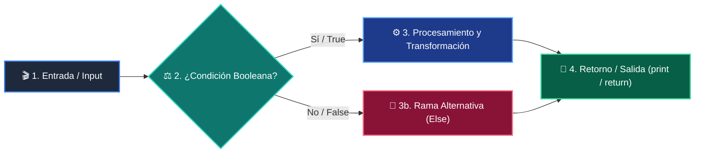

# 📚 Clase 01: Fundamentos de LLMs, Tokens y Arquitectura Transformer

> **Programa:** Curso 3: Creación y Desarrollo de Agentes de IA  
> **Nivel:** Nivel 3 - Avanzado  
> **Metáfora Central:** *«Modelos de Lenguaje como Motores de Predicción Probabilística»*  
> **Documento Oficial PDF:** [clase-01-fundamentos-llm-tokenizacion.pdf](clase-01-fundamentos-llm-tokenizacion.pdf)  
> **Instructor:** **William Rodríguez (Wisrovi)** (AI Solutions Architect & Principal Software Engineer)  

---

## 👤 Perfil del Autor y Mentor

### **William Rodríguez (Wisrovi)**
*AI Solutions Architect & Principal Software Engineer &bull; Badajoz, España*

Ingeniero y arquitecto de software especializado en Inteligencia Artificial Generativa, sistemas multi-agente, Visión por Computador e infraestructuras MLOps de alta disponibilidad. Creador y mantenedor de la suite de software libre wisrovi SUITE en PyPI con más de 26 bibliotecas enfocadas en orquestación de pipelines, caching distribuido y optimización de bases de datos.

*   🐙 **GitHub:** [github.com/wisrovi](https://github.com/wisrovi)
*   💼 **LinkedIn:** [www.linkedin.com/in/wisrovi-rodriguez/](https://www.linkedin.com/in/wisrovi-rodriguez/)
*   🐳 **DockerHub:** [hub.docker.com/u/wisrovi](https://hub.docker.com/u/wisrovi)
*   🌐 **Website:** [wisrovi.dev](https://wisrovi.dev)
*   📦 **PyPI:** [pypi.org/user/wisrovi/](https://pypi.org/user/wisrovi/)

---

### 🚲 La Regla de la Bicicleta

> *"Nadie aprende a montar en bicicleta viendo tutoriales. El verdadero dominio de la programación surge cuando abres tu editor, escribes código con tus propias manos, resuelves errores y construyes proyectos reales."*

---

## 📑 Tabla de Contenidos de la Sesión

1. [💡 Fundamentación Teórica y Modelo Mental](#1--fundamentación-teórica-y-modelo-mental)
2. [🗺️ Arquitectura y Diagrama de Flujo](#2-️-arquitectura-y-diagrama-de-flujo)
3. [💻 Implementación en Python 3.10+](#3--implementación-en-python-310)
4. [🛡️ Buenas Prácticas y Trampas Frecuentes](#4-️-buenas-prácticas-y-trampas-frecuentes)
5. [🏋️ Desafío de Práctica](#5-️-desafío-de-práctica)
6. [📚 Bibliografía y Enlaces Canónicos](#6--bibliografía-y-enlaces-canónicos)

---

## 1. 💡 Fundamentación Teórica y Modelo Mental

Los Modelos de Lenguaje Grande (LLMs) son redes neuronales basadas en la arquitectura Transformer que predicen el siguiente token.

> [!NOTE]
> **🌟 Metáfora Didáctica:** Un LLM es como el teclado predictivo de tu móvil, pero entrenado con todo el conocimiento digital del planeta.

### Principios Fundamentales

Los LLMs no procesan palabras ni letras, procesan 'tokens' (fragmentos de palabras de ~4 caracteres).

La temperatura controla la entropía de la distribución probabilística (0.0 = determinista, 1.0 = creativo).

> [!IMPORTANT]
> **⚡ Regla de Oro en Python:** Para tareas de extracción estructurada, código o datos, mantén siempre la temperatura en 0.0.

---

## 2. 🗺️ Arquitectura y Diagrama de Flujo

Ciclo de tokenización, atención Transformer y muestreo de salida.



### Desglose Paso a Paso del Flujo

| Fase | Acción del Intérprete | Estado en Memoria |
| :--- | :--- | :--- |
| **1. Inicialización** | Conversión de texto a lista de enteros (Token IDs). | `Vector de tokens de entrada.` |
| **2. Evaluación** | Paso hacia adelante en capas de auto-atención. | `Distribución de Logits calculada.` |
| **3. Transformación** | Aplicación de Softmax y Temperatura. | `Probabilidades normalizadas.` |
| **4. Retorno / Salida** | Decodificación de token a texto y streaming. | `Respuesta generada token por token.` |

> [!TIP]
> **🔍 Visualización Mental:** Cada llamada a un LLM es stateless (sin estado); no recuerda nada a menos que le envíes el historial.

---

## 3. 💻 Implementación en Python 3.10+

```python
# CLASE 01 - Código de Demostración
def simular_tokenizador(texto: str) -> list[str]:
    # Simulación básica de subwords
    return texto.replace(".", " .").split()

tokens = simular_tokenizador("Python es el lenguaje líder en Inteligencia Artificial.")
print(f"Total tokens: {len(tokens)}")
print("Tokens extraídos:", tokens)
```

*Demostración de descomposición léxica y cálculo de ventana de contexto.*

---

## 4. 🛡️ Buenas Prácticas y Trampas Frecuentes

> [!WARNING]
> **⚠️ Gotcha Frecuente (Trampa de Principiante):** Enviar documentos gigantes sin podar agota la ventana de contexto y dispara los costos de tokens.

*   **❌ Antipatrón:**
    ```python
prompt = doc_entero_de_500_paginas + '
Resume esto'  # ❌ Desborda el contexto
    ```

*   **✅ Patrón Correcto:**
    ```python
# Chunking previo y filtrado semántico RAG ✅
    ```

> [!TIP]
> **💡 Consejo Profesional:** Monitorea siempre el consumo de prompt_tokens y completion_tokens en producción.

---

## 5. 🏋️ Desafío de Práctica

> **Desafío:** Crea una función que estime el costo en USD de una llamada de inferencia dado un número de palabras.

Para ejecutar la verificación automática con pytest:
```bash
pytest ejercicios/
```

---

## 6. 📚 Bibliografía y Enlaces Canónicos

| Fuente / Recurso | Descripción | Enlace |
| :--- | :--- | :--- |
| **Documentación Oficial de Python** | Especificación y biblioteca estándar | [docs.python.org/3/](https://docs.python.org/3/) |
| **PEP 8 — Style Guide for Python** | Estándar oficial de formateo y estilo | [peps.python.org/pep-0008/](https://peps.python.org/pep-0008/) |
| **Real Python Tutorials** | Patrones de ingeniería y desarrollo | [realpython.com](https://realpython.com/) |
| **Suite Open Source wisrovi** | Librerías de alto rendimiento | [github.com/wisrovi](https://github.com/wisrovi) |
