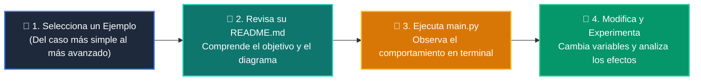

# 💻 Catálogo de Ejemplos Prácticos: Clase 01: Fundamentos de LLMs, Tokens y Arquitectura Transformer

> **Ubicación:** `curso/clase-01-fundamentos-llm-tokenizacion/ejemplos`  
> **Filosofía:** *Aprender programando mediante casos de uso aislados, legibles y comentados.*

---

## 🗺️ Flujo de Estudio Recomendado



---

## 📑 Ejemplos Disponibles en esta Clase

| Directorio | Caso de Uso Demostrado | Script Principal |
| :--- | :--- | :---: |
| [`ejemplo_01_tokenizador_subword/`](ejemplo_01_tokenizador_subword/) | 01 Tokenizador Subword | [`main.py`](ejemplo_01_tokenizador_subword/main.py) |
| [`ejemplo_02_calculador_costos/`](ejemplo_02_calculador_costos/) | 02 Calculador Costos | [`main.py`](ejemplo_02_calculador_costos/main.py) |
| [`ejemplo_03_temperatura_muestreo/`](ejemplo_03_temperatura_muestreo/) | 03 Temperatura Muestreo | [`main.py`](ejemplo_03_temperatura_muestreo/main.py) |
| [`ejemplo_04_cliente_mock_llm/`](ejemplo_04_cliente_mock_llm/) | 04 Cliente Mock Llm | [`main.py`](ejemplo_04_cliente_mock_llm/main.py) |


---

## 🚀 Cómo Ejecutar Cualquier Ejemplo
Abre tu terminal en la raíz del repositorio y ejecuta:
```bash
python 01-fundamentos-python/clase-01-fundamentos-llm-tokenizacion/ejemplos/<nombre_del_ejemplo>/main.py
```
