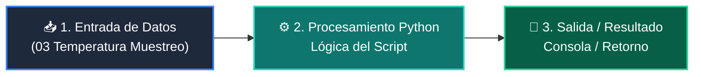

# 📖 03 Temperatura Muestreo

> **Clase:** Clase 01: Fundamentos de LLMs, Tokens y Arquitectura Transformer  
> **Script:** [`main.py`](main.py)  

Efecto de Temperatura (0.0 vs 1.0).

---

## 🗺️ Flujo de Ejecución del Ejemplo



---

## 💻 Ejecución desde Terminal

```bash
python 03-agentes-ia/clase-01-fundamentos-llm-tokenizacion/ejemplos/ejemplo_03_temperatura_muestreo/main.py
```
