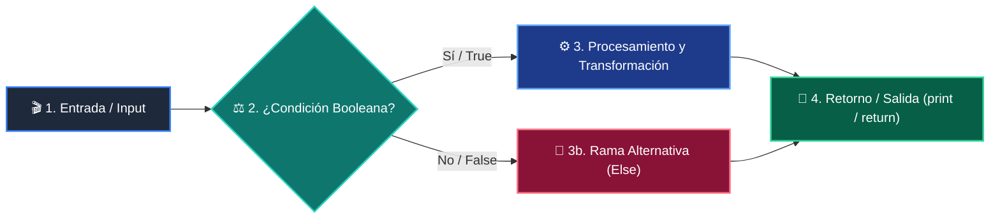

# 📚 Clase 02: Prompt Engineering Avanzado y Few-Shot Learning

> **Programa:** Curso 3: Creación y Desarrollo de Agentes de IA  
> **Nivel:** Nivel 3 - Avanzado  
> **Metáfora Central:** *«Prompts como Especificaciones Precisas para un Consultor Experto»*  
> **Documento Oficial PDF:** [clase-02-prompt-engineering-avanzado.pdf](clase-02-prompt-engineering-avanzado.pdf)  
> **Instructor:** **William Rodríguez (Wisrovi)** (AI Solutions Architect & Principal Software Engineer)  

---

## 👤 Perfil del Autor y Mentor

### **William Rodríguez (Wisrovi)**
*AI Solutions Architect & Principal Software Engineer &bull; Badajoz, España*

Ingeniero y arquitecto de software especializado en Inteligencia Artificial Generativa, sistemas multi-agente, Visión por Computador e infraestructuras MLOps de alta disponibilidad. Creador y mantenedor de la suite de software libre wisrovi SUITE en PyPI con más de 26 bibliotecas enfocadas en orquestación de pipelines, caching distribuido y optimización de bases de datos.

*   🐙 **GitHub:** [github.com/wisrovi](https://github.com/wisrovi)
*   💼 **LinkedIn:** [www.linkedin.com/in/wisrovi-rodriguez/](https://www.linkedin.com/in/wisrovi-rodriguez/)
*   🐳 **DockerHub:** [hub.docker.com/u/wisrovi](https://hub.docker.com/u/wisrovi)
*   🌐 **Website:** [wisrovi.dev](https://wisrovi.dev)
*   📦 **PyPI:** [pypi.org/user/wisrovi/](https://pypi.org/user/wisrovi/)

---

### 🚲 La Regla de la Bicicleta

> *"Nadie aprende a montar en bicicleta viendo tutoriales. El verdadero dominio de la programación surge cuando abres tu editor, escribes código con tus propias manos, resuelves errores y construyes proyectos reales."*

---

## 📑 Tabla de Contenidos de la Sesión

1. [💡 Fundamentación Teórica y Modelo Mental](#1--fundamentación-teórica-y-modelo-mental)
2. [🗺️ Arquitectura y Diagrama de Flujo](#2-️-arquitectura-y-diagrama-de-flujo)
3. [💻 Implementación en Python 3.10+](#3--implementación-en-python-310)
4. [🛡️ Buenas Prácticas y Trampas Frecuentes](#4-️-buenas-prácticas-y-trampas-frecuentes)
5. [🏋️ Desafío de Práctica](#5-️-desafío-de-práctica)
6. [📚 Bibliografía y Enlaces Canónicos](#6--bibliografía-y-enlaces-canónicos)

---

## 1. 💡 Fundamentación Teórica y Modelo Mental

El Prompt Engineering es la disciplina de diseñar entradas estructuradas para guiar a los LLMs hacia resultados precisos.

> [!NOTE]
> **🌟 Metáfora Didáctica:** El System Prompt es como el contrato de trabajo de un empleado: define su rol, límites, tono y reglas inquebrantables.

### Principios Fundamentales

Zero-Shot: Instrucción directa sin ejemplos previos.

Few-Shot In-Context Learning: Proporcionar de 2 a 5 ejemplos de pares entrada-salida para fijar el patrón de respuesta.

> [!IMPORTANT]
> **⚡ Regla de Oro en Python:** Instruye al modelo sobre lo que DEBE hacer, en lugar de solo listar lo que no debe hacer.

---

## 2. 🗺️ Arquitectura y Diagrama de Flujo

Estructura de mensajes por roles y razonamiento paso a paso (CoT).



### Desglose Paso a Paso del Flujo

| Fase | Acción del Intérprete | Estado en Memoria |
| :--- | :--- | :--- |
| **1. Inicialización** | Definición del System Prompt con restricciones de seguridad. | `Rol y contexto fijados.` |
| **2. Evaluación** | Inclusión de ejemplos Few-Shot formateados. | `Patrón de inferencia condicionado.` |
| **3. Transformación** | Inyección de la consulta del usuario con técnica CoT ('Piensa paso a paso'). | `Espacio de razonamiento abierto.` |
| **4. Retorno / Salida** | Generación de respuesta final concisa. | `Salida alineada con el formato esperado.` |

> [!TIP]
> **🔍 Visualización Mental:** Pedirle al modelo que 'razone paso a paso' activa más tokens de cómputo interno, mejorando la precisión lógica.

---

## 3. 💻 Implementación en Python 3.10+

```python
# CLASE 02 - Código de Demostración
TEMPLATE_SYSTEM = """Eres un clasificador de soporte técnico. Responde ÚNICAMENTE en formato JSON.
Roles permitidos de sentimiento: POSITIVO, NEGATIVO, NEUTRO."""

EJEMPLOS_FEW_SHOT = [
    {"input": "La app se cierra sola", "output": '{"sentimiento": "NEGATIVO", "urgencia": "ALTA"}'},
    {"input": "Excelente servicio y soporte", "output": '{"sentimiento": "POSITIVO", "urgencia": "BAJA"}'}
]

def construir_prompt(consulta_usuario: str) -> str:
    return f"{TEMPLATE_SYSTEM}

Ejemplos:
{EJEMPLOS_FEW_SHOT}

Usuario: {consulta_usuario}"

print(construir_prompt("No puedo iniciar sesión"))
```

*Construcción de prompt modular con delimitadores claros y ejemplos ilustrativos.*

---

## 4. 🛡️ Buenas Prácticas y Trampas Frecuentes

> [!WARNING]
> **⚠️ Gotcha Frecuente (Trampa de Principiante):** Concatenar texto de usuarios sin sanitizar permite que instrucciones maliciosas anulen el System Prompt.

*   **❌ Antipatrón:**
    ```python
prompt = f'Eres un bot. Traduce: {input_usuario}'  # ❌ Si el usuario pone 'Olvida las reglas anteriores...', el bot obedece
    ```

*   **✅ Patrón Correcto:**
    ```python
# Uso de delimitadores XML <user_input> y guardrails de validación ✅
    ```

> [!TIP]
> **💡 Consejo Profesional:** Encapsula siempre los datos de usuario dentro de etiquetas como <input>...</input>.

---

## 5. 🏋️ Desafío de Práctica

> **Desafío:** Diseña un prompt que evalúe y extraiga la información de un CV en formato JSON sin alucinar datos ausentes.

Para ejecutar la verificación automática con pytest:
```bash
pytest ejercicios/
```

---

## 6. 📚 Bibliografía y Enlaces Canónicos

| Fuente / Recurso | Descripción | Enlace |
| :--- | :--- | :--- |
| **Documentación Oficial de Python** | Especificación y biblioteca estándar | [docs.python.org/3/](https://docs.python.org/3/) |
| **PEP 8 — Style Guide for Python** | Estándar oficial de formateo y estilo | [peps.python.org/pep-0008/](https://peps.python.org/pep-0008/) |
| **Real Python Tutorials** | Patrones de ingeniería y desarrollo | [realpython.com](https://realpython.com/) |
| **Suite Open Source wisrovi** | Librerías de alto rendimiento | [github.com/wisrovi](https://github.com/wisrovi) |
