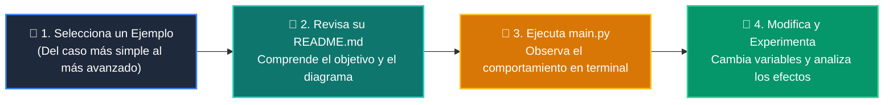

# 💻 Catálogo de Ejemplos Prácticos: Clase 02: Prompt Engineering Avanzado y Few-Shot Learning

> **Ubicación:** `curso/clase-02-prompt-engineering-avanzado/ejemplos`  
> **Filosofía:** *Aprender programando mediante casos de uso aislados, legibles y comentados.*

---

## 🗺️ Flujo de Estudio Recomendado



---

## 📑 Ejemplos Disponibles en esta Clase

| Directorio | Caso de Uso Demostrado | Script Principal |
| :--- | :--- | :---: |
| [`ejemplo_01_zero_shot/`](ejemplo_01_zero_shot/) | 01 Zero Shot | [`main.py`](ejemplo_01_zero_shot/main.py) |
| [`ejemplo_02_few_shot_prompting/`](ejemplo_02_few_shot_prompting/) | 02 Few Shot Prompting | [`main.py`](ejemplo_02_few_shot_prompting/main.py) |
| [`ejemplo_03_chain_of_thought/`](ejemplo_03_chain_of_thought/) | 03 Chain Of Thought | [`main.py`](ejemplo_03_chain_of_thought/main.py) |
| [`ejemplo_04_delimitadores_xml/`](ejemplo_04_delimitadores_xml/) | 04 Delimitadores Xml | [`main.py`](ejemplo_04_delimitadores_xml/main.py) |


---

## 🚀 Cómo Ejecutar Cualquier Ejemplo
Abre tu terminal en la raíz del repositorio y ejecuta:
```bash
python 01-fundamentos-python/clase-02-prompt-engineering-avanzado/ejemplos/<nombre_del_ejemplo>/main.py
```
