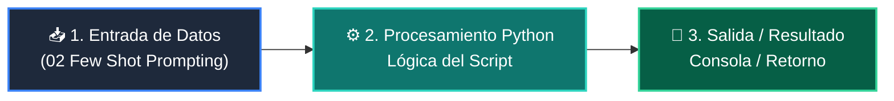

# 📖 02 Few Shot Prompting

> **Clase:** Clase 02: Prompt Engineering Avanzado y Few-Shot Learning  
> **Script:** [`main.py`](main.py)  

Few-Shot In-Context Learning.

---

## 🗺️ Flujo de Ejecución del Ejemplo



---

## 💻 Ejecución desde Terminal

```bash
python 03-agentes-ia/clase-02-prompt-engineering-avanzado/ejemplos/ejemplo_02_few_shot_prompting/main.py
```
