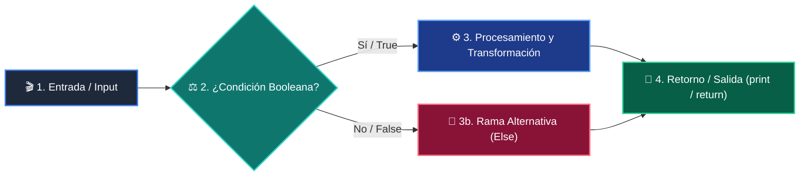

# 📚 Clase 03: Salidas Estructuradas y Validación Tipada con Pydantic V2

> **Programa:** Curso 3: Creación y Desarrollo de Agentes de IA  
> **Nivel:** Nivel 3 - Avanzado  
> **Metáfora Central:** *«Pydantic como la Aduana Estricta de Datos para Respuestas de IA»*  
> **Documento Oficial PDF:** [clase-03-salidas-estructuradas-pydantic.pdf](clase-03-salidas-estructuradas-pydantic.pdf)  
> **Instructor:** **William Rodríguez (Wisrovi)** (AI Solutions Architect & Principal Software Engineer)  

---

## 👤 Perfil del Autor y Mentor

### **William Rodríguez (Wisrovi)**
*AI Solutions Architect & Principal Software Engineer &bull; Badajoz, España*

Ingeniero y arquitecto de software especializado en Inteligencia Artificial Generativa, sistemas multi-agente, Visión por Computador e infraestructuras MLOps de alta disponibilidad. Creador y mantenedor de la suite de software libre wisrovi SUITE en PyPI con más de 26 bibliotecas enfocadas en orquestación de pipelines, caching distribuido y optimización de bases de datos.

*   🐙 **GitHub:** [github.com/wisrovi](https://github.com/wisrovi)
*   💼 **LinkedIn:** [www.linkedin.com/in/wisrovi-rodriguez/](https://www.linkedin.com/in/wisrovi-rodriguez/)
*   🐳 **DockerHub:** [hub.docker.com/u/wisrovi](https://hub.docker.com/u/wisrovi)
*   🌐 **Website:** [wisrovi.dev](https://wisrovi.dev)
*   📦 **PyPI:** [pypi.org/user/wisrovi/](https://pypi.org/user/wisrovi/)

---

### 🚲 La Regla de la Bicicleta

> *"Nadie aprende a montar en bicicleta viendo tutoriales. El verdadero dominio de la programación surge cuando abres tu editor, escribes código con tus propias manos, resuelves errores y construyes proyectos reales."*

---

## 📑 Tabla de Contenidos de la Sesión

1. [💡 Fundamentación Teórica y Modelo Mental](#1--fundamentación-teórica-y-modelo-mental)
2. [🗺️ Arquitectura y Diagrama de Flujo](#2-️-arquitectura-y-diagrama-de-flujo)
3. [💻 Implementación en Python 3.10+](#3--implementación-en-python-310)
4. [🛡️ Buenas Prácticas y Trampas Frecuentes](#4-️-buenas-prácticas-y-trampas-frecuentes)
5. [🏋️ Desafío de Práctica](#5-️-desafío-de-práctica)
6. [📚 Bibliografía y Enlaces Canónicos](#6--bibliografía-y-enlaces-canónicos)

---

## 1. 💡 Fundamentación Teórica y Modelo Mental

Integrar LLMs en sistemas empresariales exige que sus respuestas sean 100% deterministas en estructura y tipo.

> [!NOTE]
> **🌟 Metáfora Didáctica:** Pydantic es el inspector de aduana que revisa que cada paquete traiga exactamente los sellos, tipos y formatos requeridos.

### Principios Fundamentales

Pydantic V2 está construido sobre un núcleo en Rust de alto rendimiento para validación instantánea.

Structured Outputs obliga al LLM a seguir la gramática JSON Schema del modelo BaseModel.

> [!IMPORTANT]
> **⚡ Regla de Oro en Python:** Nunca consumas texto libre de un LLM en lógica transaccional; valida siempre con Pydantic.

---

## 2. 🗺️ Arquitectura y Diagrama de Flujo

Flujo de inferencia con esquema JSON y validación Pydantic.



### Desglose Paso a Paso del Flujo

| Fase | Acción del Intérprete | Estado en Memoria |
| :--- | :--- | :--- |
| **1. Inicialización** | Definición del modelo BaseModel con campos y validadores Field(). | `Esquema JSON Schema exportado.` |
| **2. Evaluación** | Inyección del esquema en la llamada de API del LLM. | `Inferencia restringida por gramática.` |
| **3. Transformación** | Recepción del payload JSON crudo. | `String JSON recibido.` |
| **4. Retorno / Salida** | Validación con Modelo.model_validate_json(). | `Objeto Python fuertemente tipado instanciado.` |

> [!TIP]
> **🔍 Visualización Mental:** Si el JSON del LLM tiene un campo faltante o tipo incorrecto, Pydantic lanza ValidationError inmediatamente.

---

## 3. 💻 Implementación en Python 3.10+

```python
# CLASE 03 - Código de Demostración
from pydantic import BaseModel, Field, EmailStr

class LeadCliente(BaseModel):
    nombre: str = Field(description="Nombre completo del prospecto")
    email: str = Field(description="Correo electrónico válido")
    presupuesto_estimado: float = Field(ge=0.0, description="Monto en USD")
    interes_ia: bool = True

# Simulación de respuesta JSON generada por LLM
json_llm = '{"nombre": "Laura Méndez", "email": "laura@empresa.com", "presupuesto_estimado": 15000.0}'
lead = LeadCliente.model_validate_json(json_llm)

print("Lead Validado:", lead.nombre)
print("Presupuesto:", lead.presupuesto_estimado)
```

*Uso de Field con descripciones semánticas y restricciones numéricas ge=0.0.*

---

## 4. 🛡️ Buenas Prácticas y Trampas Frecuentes

> [!WARNING]
> **⚠️ Gotcha Frecuente (Trampa de Principiante):** Parsear la salida del LLM con json.loads() simple sin validar tipos permite que campos nulos rompan la aplicación.

*   **❌ Antipatrón:**
    ```python
data = json.loads(respuesta_llm)
total = data['precio'] * 2  # ❌ Falla si 'precio' vino como None o string
    ```

*   **✅ Patrón Correcto:**
    ```python
data = FacturaModel.model_validate_json(respuesta_llm)
total = data.precio * 2    # ✅ Garantizado float tipado
    ```

> [!TIP]
> **💡 Consejo Profesional:** Pydantic permite definir validadores personalizados con el decorador @field_validator.

---

## 5. 🏋️ Desafío de Práctica

> **Desafío:** Crea un modelo Pydantic para validar órdenes de compra con lista de productos, impuestos y total.

Para ejecutar la verificación automática con pytest:
```bash
pytest ejercicios/
```

---

## 6. 📚 Bibliografía y Enlaces Canónicos

| Fuente / Recurso | Descripción | Enlace |
| :--- | :--- | :--- |
| **Documentación Oficial de Python** | Especificación y biblioteca estándar | [docs.python.org/3/](https://docs.python.org/3/) |
| **PEP 8 — Style Guide for Python** | Estándar oficial de formateo y estilo | [peps.python.org/pep-0008/](https://peps.python.org/pep-0008/) |
| **Real Python Tutorials** | Patrones de ingeniería y desarrollo | [realpython.com](https://realpython.com/) |
| **Suite Open Source wisrovi** | Librerías de alto rendimiento | [github.com/wisrovi](https://github.com/wisrovi) |
