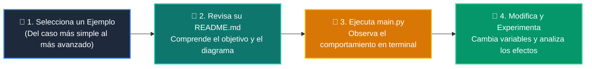

# 💻 Catálogo de Ejemplos Prácticos: Clase 03: Salidas Estructuradas y Validación Tipada con Pydantic V2

> **Ubicación:** `curso/clase-03-salidas-estructuradas-pydantic/ejemplos`  
> **Filosofía:** *Aprender programando mediante casos de uso aislados, legibles y comentados.*

---

## 🗺️ Flujo de Estudio Recomendado



---

## 📑 Ejemplos Disponibles en esta Clase

| Directorio | Caso de Uso Demostrado | Script Principal |
| :--- | :--- | :---: |
| [`ejemplo_01_basemodel_pydantic/`](ejemplo_01_basemodel_pydantic/) | 01 Basemodel Pydantic | [`main.py`](ejemplo_01_basemodel_pydantic/main.py) |
| [`ejemplo_02_field_restricciones/`](ejemplo_02_field_restricciones/) | 02 Field Restricciones | [`main.py`](ejemplo_02_field_restricciones/main.py) |
| [`ejemplo_03_exportar_json_schema/`](ejemplo_03_exportar_json_schema/) | 03 Exportar Json Schema | [`main.py`](ejemplo_03_exportar_json_schema/main.py) |
| [`ejemplo_04_captura_validation_error/`](ejemplo_04_captura_validation_error/) | 04 Captura Validation Error | [`main.py`](ejemplo_04_captura_validation_error/main.py) |


---

## 🚀 Cómo Ejecutar Cualquier Ejemplo
Abre tu terminal en la raíz del repositorio y ejecuta:
```bash
python 01-fundamentos-python/clase-03-salidas-estructuradas-pydantic/ejemplos/<nombre_del_ejemplo>/main.py
```
