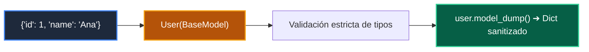

# 📖 01 Basemodel Pydantic

> **Clase:** Clase 03: Salidas Estructuradas y Validación Tipada con Pydantic V2  
> **Script:** [`main.py`](main.py)  

Modelo BaseModel de Pydantic.

---

## 🗺️ Flujo de Ejecución del Ejemplo



---

## 💻 Ejecución desde Terminal

```bash
python 03-agentes-ia/clase-03-salidas-estructuradas-pydantic/ejemplos/ejemplo_01_basemodel_pydantic/main.py
```
