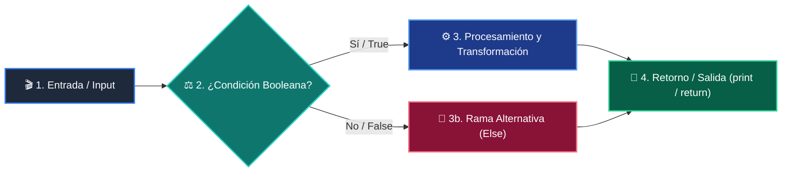

# 📚 Clase 04: Tool Calling y Function Calling en Python

> **Programa:** Curso 3: Creación y Desarrollo de Agentes de IA  
> **Nivel:** Nivel 3 - Avanzado  
> **Metáfora Central:** *«Dotando de Manos y Herramientas al Cerebro del LLM»*  
> **Documento Oficial PDF:** [clase-04-tool-calling-funciones.pdf](clase-04-tool-calling-funciones.pdf)  
> **Instructor:** **William Rodríguez (Wisrovi)** (AI Solutions Architect & Principal Software Engineer)  

---

## 👤 Perfil del Autor y Mentor

### **William Rodríguez (Wisrovi)**
*AI Solutions Architect & Principal Software Engineer &bull; Badajoz, España*

Ingeniero y arquitecto de software especializado en Inteligencia Artificial Generativa, sistemas multi-agente, Visión por Computador e infraestructuras MLOps de alta disponibilidad. Creador y mantenedor de la suite de software libre wisrovi SUITE en PyPI con más de 26 bibliotecas enfocadas en orquestación de pipelines, caching distribuido y optimización de bases de datos.

*   🐙 **GitHub:** [github.com/wisrovi](https://github.com/wisrovi)
*   💼 **LinkedIn:** [www.linkedin.com/in/wisrovi-rodriguez/](https://www.linkedin.com/in/wisrovi-rodriguez/)
*   🐳 **DockerHub:** [hub.docker.com/u/wisrovi](https://hub.docker.com/u/wisrovi)
*   🌐 **Website:** [wisrovi.dev](https://wisrovi.dev)
*   📦 **PyPI:** [pypi.org/user/wisrovi/](https://pypi.org/user/wisrovi/)

---

### 🚲 La Regla de la Bicicleta

> *"Nadie aprende a montar en bicicleta viendo tutoriales. El verdadero dominio de la programación surge cuando abres tu editor, escribes código con tus propias manos, resuelves errores y construyes proyectos reales."*

---

## 📑 Tabla de Contenidos de la Sesión

1. [💡 Fundamentación Teórica y Modelo Mental](#1--fundamentación-teórica-y-modelo-mental)
2. [🗺️ Arquitectura y Diagrama de Flujo](#2-️-arquitectura-y-diagrama-de-flujo)
3. [💻 Implementación en Python 3.10+](#3--implementación-en-python-310)
4. [🛡️ Buenas Prácticas y Trampas Frecuentes](#4-️-buenas-prácticas-y-trampas-frecuentes)
5. [🏋️ Desafío de Práctica](#5-️-desafío-de-práctica)
6. [📚 Bibliografía y Enlaces Canónicos](#6--bibliografía-y-enlaces-canónicos)

---

## 1. 💡 Fundamentación Teórica y Modelo Mental

Tool Calling permite que un LLM decida autónomamente cuándo invocar funciones de código externo para consultar datos o actuar.

> [!NOTE]
> **🌟 Metáfora Didáctica:** El LLM es un cerebro brillante pero ciego y sin manos; las herramientas son sus brazos mecánicos para interactuar con el mundo.

### Principios Fundamentales

El LLM NO ejecuta el código directamente: devuelve un objeto estructurado con el nombre de la función y sus argumentos.

Tu backend intercepta la solicitud, ejecuta la función real en Python y le devuelve el resultado al LLM.

> [!IMPORTANT]
> **⚡ Regla de Oro en Python:** Escribe docstrings extremadamente claros en tus funciones: el LLM los usa como manual de instrucciones.

---

## 2. 🗺️ Arquitectura y Diagrama de Flujo

Ciclo completo de Tool Calling: Solicitud -> Despacho -> Ejecución -> Respuesta.



### Desglose Paso a Paso del Flujo

| Fase | Acción del Intérprete | Estado en Memoria |
| :--- | :--- | :--- |
| **1. Inicialización** | Registro de funciones en el catálogo de herramientas. | `Definiciones de herramientas cargadas.` |
| **2. Evaluación** | El LLM analiza el prompt y genera un ToolCall con argumentos. | `Llamada pausada esperando ejecución.` |
| **3. Transformación** | Despachador local ejecuta func(**args) en Python. | `Resultado calculado en backend.` |
| **4. Retorno / Salida** | Envío del resultado de vuelta al LLM para formular la respuesta final. | `Respuesta natural entregada al usuario.` |

> [!TIP]
> **🔍 Visualización Mental:** El LLM solo decide QUÉ herramienta usar y con QUÉ argumentos; tú tienes el control de la ejecución.

---

## 3. 💻 Implementación en Python 3.10+

```python
# CLASE 04 - Código de Demostración
import math

def calcular_distancia(x1: float, y1: float, x2: float, y2: float) -> float:
    """Calcula la distancia euclidiana entre dos puntos (x1, y1) y (x2, y2)."""
    return math.sqrt((x2 - x1)**2 + (y2 - y1)**2)

HERRAMIENTAS = {
    "calcular_distancia": calcular_distancia
}

def despachar_herramienta(nombre: str, argumentos: dict):
    if nombre in HERRAMIENTAS:
        return HERRAMIENTAS[nombre](**argumentos)
    raise ValueError(f"Herramienta '{nombre}' no encontrada.")

res = despachar_herramienta("calcular_distancia", {"x1": 0.0, "y1": 0.0, "x2": 3.0, "y2": 4.0})
print("Resultado de la herramienta:", res)  # 5.0
```

*Registro centralizado de funciones con type hints y ejecución segura por desempaquetado de diccionario.*

---

## 4. 🛡️ Buenas Prácticas y Trampas Frecuentes

> [!WARNING]
> **⚠️ Gotcha Frecuente (Trampa de Principiante):** Usar eval() o exec() para ejecutar herramientas abre una vulnerabilidad crítica de inyección de código.

*   **❌ Antipatrón:**
    ```python
eval(f'{nombre_funcion}({argumentos_crudos})')  # ❌ Vulnerabilidad RCE crítica
    ```

*   **✅ Patrón Correcto:**
    ```python
HERRAMIENTAS[nombre](**argumentos)  # ✅ Mapeo explícito a funciones seguras
    ```

> [!TIP]
> **💡 Consejo Profesional:** Implementa validaciones con Pydantic para los argumentos de cada herramienta antes de ejecutarla.

---

## 5. 🏋️ Desafío de Práctica

> **Desafío:** Crea una herramienta que consulte el clima simulado de una ciudad y conéctala a un despachador.

Para ejecutar la verificación automática con pytest:
```bash
pytest ejercicios/
```

---

## 6. 📚 Bibliografía y Enlaces Canónicos

| Fuente / Recurso | Descripción | Enlace |
| :--- | :--- | :--- |
| **Documentación Oficial de Python** | Especificación y biblioteca estándar | [docs.python.org/3/](https://docs.python.org/3/) |
| **PEP 8 — Style Guide for Python** | Estándar oficial de formateo y estilo | [peps.python.org/pep-0008/](https://peps.python.org/pep-0008/) |
| **Real Python Tutorials** | Patrones de ingeniería y desarrollo | [realpython.com](https://realpython.com/) |
| **Suite Open Source wisrovi** | Librerías de alto rendimiento | [github.com/wisrovi](https://github.com/wisrovi) |
