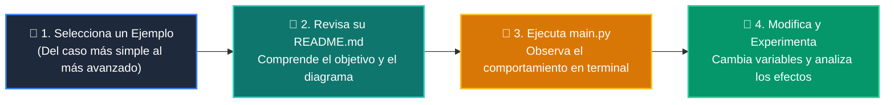

# 💻 Catálogo de Ejemplos Prácticos: Clase 04: Tool Calling y Function Calling en Python

> **Ubicación:** `curso/clase-04-tool-calling-funciones/ejemplos`  
> **Filosofía:** *Aprender programando mediante casos de uso aislados, legibles y comentados.*

---

## 🗺️ Flujo de Estudio Recomendado



---

## 📑 Ejemplos Disponibles en esta Clase

| Directorio | Caso de Uso Demostrado | Script Principal |
| :--- | :--- | :---: |
| [`ejemplo_01_herramientas_tipadas/`](ejemplo_01_herramientas_tipadas/) | 01 Herramientas Tipadas | [`main.py`](ejemplo_01_herramientas_tipadas/main.py) |
| [`ejemplo_02_registro_despachador/`](ejemplo_02_registro_despachador/) | 02 Registro Despachador | [`main.py`](ejemplo_02_registro_despachador/main.py) |
| [`ejemplo_03_despacho_kwargs/`](ejemplo_03_despacho_kwargs/) | 03 Despacho Kwargs | [`main.py`](ejemplo_03_despacho_kwargs/main.py) |
| [`ejemplo_04_herramienta_clima_mock/`](ejemplo_04_herramienta_clima_mock/) | 04 Herramienta Clima Mock | [`main.py`](ejemplo_04_herramienta_clima_mock/main.py) |


---

## 🚀 Cómo Ejecutar Cualquier Ejemplo
Abre tu terminal en la raíz del repositorio y ejecuta:
```bash
python 01-fundamentos-python/clase-04-tool-calling-funciones/ejemplos/<nombre_del_ejemplo>/main.py
```
