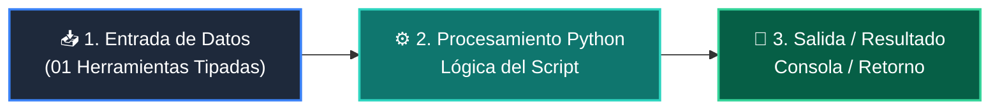

# 📖 01 Herramientas Tipadas

> **Clase:** Clase 04: Tool Calling y Function Calling en Python  
> **Script:** [`main.py`](main.py)  

Funciones Python con Docstrings.

---

## 🗺️ Flujo de Ejecución del Ejemplo



---

## 💻 Ejecución desde Terminal

```bash
python 03-agentes-ia/clase-04-tool-calling-funciones/ejemplos/ejemplo_01_herramientas_tipadas/main.py
```
