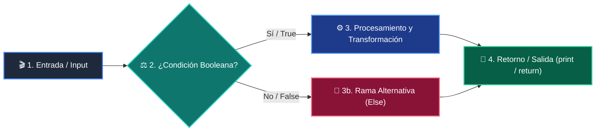

# 📚 Clase 05: Embeddings y Representación Vectorial Semántica

> **Programa:** Curso 3: Creación y Desarrollo de Agentes de IA  
> **Nivel:** Nivel 3 - Avanzado  
> **Metáfora Central:** *«Embeddings como Coordenadas GPS del Significado de las Palabras»*  
> **Documento Oficial PDF:** [clase-05-embeddings-y-bases-vectoriales.pdf](clase-05-embeddings-y-bases-vectoriales.pdf)  
> **Instructor:** **William Rodríguez (Wisrovi)** (AI Solutions Architect & Principal Software Engineer)  

---

## 👤 Perfil del Autor y Mentor

### **William Rodríguez (Wisrovi)**
*AI Solutions Architect & Principal Software Engineer &bull; Badajoz, España*

Ingeniero y arquitecto de software especializado en Inteligencia Artificial Generativa, sistemas multi-agente, Visión por Computador e infraestructuras MLOps de alta disponibilidad. Creador y mantenedor de la suite de software libre wisrovi SUITE en PyPI con más de 26 bibliotecas enfocadas en orquestación de pipelines, caching distribuido y optimización de bases de datos.

*   🐙 **GitHub:** [github.com/wisrovi](https://github.com/wisrovi)
*   💼 **LinkedIn:** [www.linkedin.com/in/wisrovi-rodriguez/](https://www.linkedin.com/in/wisrovi-rodriguez/)
*   🐳 **DockerHub:** [hub.docker.com/u/wisrovi](https://hub.docker.com/u/wisrovi)
*   🌐 **Website:** [wisrovi.dev](https://wisrovi.dev)
*   📦 **PyPI:** [pypi.org/user/wisrovi/](https://pypi.org/user/wisrovi/)

---

### 🚲 La Regla de la Bicicleta

> *"Nadie aprende a montar en bicicleta viendo tutoriales. El verdadero dominio de la programación surge cuando abres tu editor, escribes código con tus propias manos, resuelves errores y construyes proyectos reales."*

---

## 📑 Tabla de Contenidos de la Sesión

1. [💡 Fundamentación Teórica y Modelo Mental](#1--fundamentación-teórica-y-modelo-mental)
2. [🗺️ Arquitectura y Diagrama de Flujo](#2-️-arquitectura-y-diagrama-de-flujo)
3. [💻 Implementación en Python 3.10+](#3--implementación-en-python-310)
4. [🛡️ Buenas Prácticas y Trampas Frecuentes](#4-️-buenas-prácticas-y-trampas-frecuentes)
5. [🏋️ Desafío de Práctica](#5-️-desafío-de-práctica)
6. [📚 Bibliografía y Enlaces Canónicos](#6--bibliografía-y-enlaces-canónicos)

---

## 1. 💡 Fundamentación Teórica y Modelo Mental

Los embeddings transforman texto en vectores de números que capturan el significado semántico y contextual.

> [!NOTE]
> **🌟 Metáfora Didáctica:** Un embedding es como la latitud y longitud de un concepto: 'Rey' y 'Reina' están muy cerca en el mapa semántico.

### Principios Fundamentales

Textos con significados similares tienen vectores que apuntan en direcciones casi idénticas en el espacio n-dimensional.

La Similitud de Coseno mide el coseno del ángulo entre dos vectores (1.0 = idénticos, 0.0 = ortogonales).

> [!IMPORTANT]
> **⚡ Regla de Oro en Python:** Los embeddings permiten búsquedas por SIGNIFICADO, no solo por coincidencia exacta de palabras clave.

---

## 2. 🗺️ Arquitectura y Diagrama de Flujo

Transformación de texto a vector y cálculo de similitud espacial.



### Desglose Paso a Paso del Flujo

| Fase | Acción del Intérprete | Estado en Memoria |
| :--- | :--- | :--- |
| **1. Inicialización** | Paso del texto por el modelo de embedding. | `Vector denso de floats (ej. 768 dimensiones).` |
| **2. Evaluación** | Almacenamiento del vector e indexación. | `Espacio vectorial poblado.` |
| **3. Transformación** | Cálculo del producto punto y normas. | `Similitud de coseno calculada.` |
| **4. Retorno / Salida** | Ordenamiento por ranking de relevancia. | `Top K documentos más cercanos.` |

> [!TIP]
> **🔍 Visualización Mental:** Imagina una nube de puntos 3D donde los conceptos relacionados flotan juntos.

---

## 3. 💻 Implementación en Python 3.10+

```python
# CLASE 05 - Código de Demostración
import math

def similitud_coseno(v1: list[float], v2: list[float]) -> float:
    dot_product = sum(a * b for a, b in zip(v1, v2))
    norm_v1 = math.sqrt(sum(a * a for a in v1))
    norm_v2 = math.sqrt(sum(b * b for b in v2))
    if norm_v1 == 0 or norm_v2 == 0: return 0.0
    return dot_product / (norm_v1 * norm_v2)

# Vectores conceptuales simulados
vec_python = [0.9, 0.8, 0.1]
vec_codigo = [0.85, 0.75, 0.15]
vec_cocina = [0.05, 0.1, 0.95]

print("Similitud Python vs Código:", round(similitud_coseno(vec_python, vec_codigo), 4))
print("Similitud Python vs Cocina:", round(similitud_coseno(vec_python, vec_cocina), 4))
```

*Fórmula matemática de coseno implementada con funciones nativas y zip().*

---

## 4. 🛡️ Buenas Prácticas y Trampas Frecuentes

> [!WARNING]
> **⚠️ Gotcha Frecuente (Trampa de Principiante):** Comparar embeddings generados por dos modelos distintos produce resultados erróneos.

*   **❌ Antipatrón:**
    ```python
similitud(emb_openai_1536, emb_bge_768)  # ❌ Incompatibilidad de dimensiones
    ```

*   **✅ Patrón Correcto:**
    ```python
# Usa SIEMPRE el mismo modelo de embedding para indexar y consultar ✅
    ```

> [!TIP]
> **💡 Consejo Profesional:** Normaliza tus vectores a longitud 1 para que el producto punto sea equivalente al coseno.

---

## 5. 🏋️ Desafío de Práctica

> **Desafío:** Crea un buscador semántico que ordene una lista de 5 frases según su parecido con una consulta.

Para ejecutar la verificación automática con pytest:
```bash
pytest ejercicios/
```

---

## 6. 📚 Bibliografía y Enlaces Canónicos

| Fuente / Recurso | Descripción | Enlace |
| :--- | :--- | :--- |
| **Documentación Oficial de Python** | Especificación y biblioteca estándar | [docs.python.org/3/](https://docs.python.org/3/) |
| **PEP 8 — Style Guide for Python** | Estándar oficial de formateo y estilo | [peps.python.org/pep-0008/](https://peps.python.org/pep-0008/) |
| **Real Python Tutorials** | Patrones de ingeniería y desarrollo | [realpython.com](https://realpython.com/) |
| **Suite Open Source wisrovi** | Librerías de alto rendimiento | [github.com/wisrovi](https://github.com/wisrovi) |
