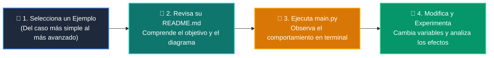

# 💻 Catálogo de Ejemplos Prácticos: Clase 05: Embeddings y Representación Vectorial Semántica

> **Ubicación:** `curso/clase-05-embeddings-y-bases-vectoriales/ejemplos`  
> **Filosofía:** *Aprender programando mediante casos de uso aislados, legibles y comentados.*

---

## 🗺️ Flujo de Estudio Recomendado



---

## 📑 Ejemplos Disponibles en esta Clase

| Directorio | Caso de Uso Demostrado | Script Principal |
| :--- | :--- | :---: |
| [`ejemplo_01_vectores_flotantes/`](ejemplo_01_vectores_flotantes/) | 01 Vectores Flotantes | [`main.py`](ejemplo_01_vectores_flotantes/main.py) |
| [`ejemplo_02_similitud_coseno/`](ejemplo_02_similitud_coseno/) | 02 Similitud Coseno | [`main.py`](ejemplo_02_similitud_coseno/main.py) |
| [`ejemplo_03_ranking_documentos/`](ejemplo_03_ranking_documentos/) | 03 Ranking Documentos | [`main.py`](ejemplo_03_ranking_documentos/main.py) |
| [`ejemplo_04_mini_vector_store/`](ejemplo_04_mini_vector_store/) | 04 Mini Vector Store | [`main.py`](ejemplo_04_mini_vector_store/main.py) |


---

## 🚀 Cómo Ejecutar Cualquier Ejemplo
Abre tu terminal en la raíz del repositorio y ejecuta:
```bash
python 01-fundamentos-python/clase-05-embeddings-y-bases-vectoriales/ejemplos/<nombre_del_ejemplo>/main.py
```
