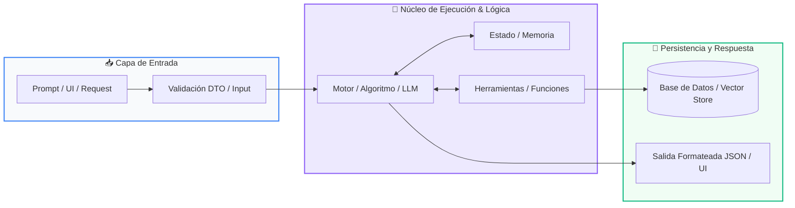

# 📚 Clase 06: Arquitecturas RAG (Retrieval-Augmented Generation)

> **Programa:** Curso 3: Creación y Desarrollo de Agentes de IA  
> **Nivel:** Nivel 3 - Avanzado  
> **Metáfora Central:** *«RAG como Darle al LLM un Libro Abierto con la Información Exacta»*  
> **Documento Oficial PDF:** [clase-06-arquitecturas-rag.pdf](clase-06-arquitecturas-rag.pdf)  
> **Instructor:** **William Rodríguez (Wisrovi)** (AI Solutions Architect & Principal Software Engineer)  

---

## 👤 Perfil del Autor y Mentor

### **William Rodríguez (Wisrovi)**
*AI Solutions Architect & Principal Software Engineer &bull; Badajoz, España*

Ingeniero y arquitecto de software especializado en Inteligencia Artificial Generativa, sistemas multi-agente, Visión por Computador e infraestructuras MLOps de alta disponibilidad. Creador y mantenedor de la suite de software libre wisrovi SUITE en PyPI con más de 26 bibliotecas enfocadas en orquestación de pipelines, caching distribuido y optimización de bases de datos.

*   🐙 **GitHub:** [github.com/wisrovi](https://github.com/wisrovi)
*   💼 **LinkedIn:** [www.linkedin.com/in/wisrovi-rodriguez/](https://www.linkedin.com/in/wisrovi-rodriguez/)
*   🐳 **DockerHub:** [hub.docker.com/u/wisrovi](https://hub.docker.com/u/wisrovi)
*   🌐 **Website:** [wisrovi.dev](https://wisrovi.dev)
*   📦 **PyPI:** [pypi.org/user/wisrovi/](https://pypi.org/user/wisrovi/)

---

### 🚲 La Regla de la Bicicleta

> *"Nadie aprende a montar en bicicleta viendo tutoriales. El verdadero dominio de la programación surge cuando abres tu editor, escribes código con tus propias manos, resuelves errores y construyes proyectos reales."*

---

## 📑 Tabla de Contenidos de la Sesión

1. [💡 Fundamentación Teórica y Modelo Mental](#1--fundamentación-teórica-y-modelo-mental)
2. [🗺️ Arquitectura y Diagrama de Flujo](#2-️-arquitectura-y-diagrama-de-flujo)
3. [💻 Implementación en Python 3.10+](#3--implementación-en-python-310)
4. [🛡️ Buenas Prácticas y Trampas Frecuentes](#4-️-buenas-prácticas-y-trampas-frecuentes)
5. [🏋️ Desafío de Práctica](#5-️-desafío-de-práctica)
6. [📚 Bibliografía y Enlaces Canónicos](#6--bibliografía-y-enlaces-canónicos)

---

## 1. 💡 Fundamentación Teórica y Modelo Mental

RAG combina recuperación semántica con generación de lenguaje para que el LLM responda con datos privados sin reentrenamiento.

> [!NOTE]
> **🌟 Metáfora Didáctica:** En lugar de pedirle al alumno que responda de memoria, le permites consultar el capítulo exacto del libro antes de contestar.

### Principios Fundamentales

Ingestión: Carga de documentos -> División en Chunks (ej. 500 caracteres con 50 de solapamiento) -> Embeddings -> Vector Store.

Recuperación y Aumento: Consulta de usuario -> Búsqueda vectorial Top-K -> Inyección en el System Prompt.

> [!IMPORTANT]
> **⚡ Regla de Oro en Python:** Instruye al modelo a responder ÚNICAMENTE basándose en el contexto provisto para eliminar alucinaciones.

---

## 2. 🗺️ Arquitectura y Diagrama de Flujo

Pipeline RAG de 2 fases: Ingestión Indexada y Consulta en Tiempo Real.



### Desglose Paso a Paso del Flujo

| Fase | Acción del Intérprete | Estado en Memoria |
| :--- | :--- | :--- |
| **1. Inicialización** | Chunking de documentos y generación de embeddings. | `Vectores almacenados en el Vector Store.` |
| **2. Evaluación** | Recepción de pregunta del usuario y embedding de la query. | `Vector de consulta generado.` |
| **3. Transformación** | Búsqueda de vecinos más cercanos (Top-3 Chunks). | `Contexto relevante recuperado.` |
| **4. Retorno / Salida** | Construcción del prompt aumentado y generación final del LLM. | `Respuesta precisa con citas de fuentes.` |

> [!TIP]
> **🔍 Visualización Mental:** La calidad de un sistema RAG depende en un 80% de la calidad del chunking y la recuperación.

---

## 3. 💻 Implementación en Python 3.10+

```python
# CLASE 06 - Código de Demostración
class MiniRAG:
    def __init__(self):
        self.docs = []

    def indexar(self, texto: str):
        # Simulación de chunking básico
        self.docs.append(texto)

    def recuperar(self, query: str) -> str:
        # Recupera el documento con mayor coincidencia léxica
        palabras = set(query.lower().split())
        mejor_doc = max(self.docs, key=lambda d: len(palabras.intersection(set(d.lower().split()))))
        return mejor_doc

    def generar_prompt(self, query: str) -> str:
        ctx = self.recuperar(query)
        return f"Contexto:
{ctx}

Pregunta: {query}
Respuesta basada estrictamente en el contexto:"

rag = MiniRAG()
rag.indexar("El horario de atención es de Lunes a Viernes de 9:00 a 18:00.")
print(rag.generar_prompt("¿A qué hora abren?"))
```

*Indexación modular, recuperación por coincidencia y construcción de prompt enriquecido.*

---

## 4. 🛡️ Buenas Prácticas y Trampas Frecuentes

> [!WARNING]
> **⚠️ Gotcha Frecuente (Trampa de Principiante):** Inyectar demasiados chunks (ej. 20 chunks) satura el contexto y hace que el LLM ignore la información central.

*   **❌ Antipatrón:**
    ```python
prompt = f'Contexto:
{20_chunks_desordenados}'  # ❌ Degradación de atención
    ```

*   **✅ Patrón Correcto:**
    ```python
# Selecciona Top 3 a 5 chunks relevantes y reordénalos con un Re-ranker ✅
    ```

> [!TIP]
> **💡 Consejo Profesional:** Usa técnicas de Hybrid Search (búsqueda léxica BM25 + búsqueda vectorial) para máxima precisión.

---

## 5. 🏋️ Desafío de Práctica

> **Desafío:** Crea una función de chunking con solapamiento configurable que no corte palabras por la mitad.

Para ejecutar la verificación automática con pytest:
```bash
pytest ejercicios/
```

---

## 6. 📚 Bibliografía y Enlaces Canónicos

| Fuente / Recurso | Descripción | Enlace |
| :--- | :--- | :--- |
| **Documentación Oficial de Python** | Especificación y biblioteca estándar | [docs.python.org/3/](https://docs.python.org/3/) |
| **PEP 8 — Style Guide for Python** | Estándar oficial de formateo y estilo | [peps.python.org/pep-0008/](https://peps.python.org/pep-0008/) |
| **Real Python Tutorials** | Patrones de ingeniería y desarrollo | [realpython.com](https://realpython.com/) |
| **Suite Open Source wisrovi** | Librerías de alto rendimiento | [github.com/wisrovi](https://github.com/wisrovi) |
