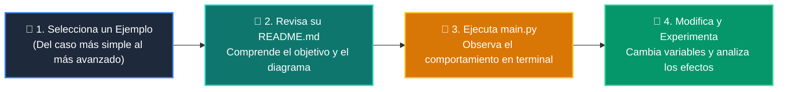

# 💻 Catálogo de Ejemplos Prácticos: Clase 06: Arquitecturas RAG (Retrieval-Augmented Generation)

> **Ubicación:** `curso/clase-06-arquitecturas-rag/ejemplos`  
> **Filosofía:** *Aprender programando mediante casos de uso aislados, legibles y comentados.*

---

## 🗺️ Flujo de Estudio Recomendado



---

## 📑 Ejemplos Disponibles en esta Clase

| Directorio | Caso de Uso Demostrado | Script Principal |
| :--- | :--- | :---: |
| [`ejemplo_01_chunking_overlap/`](ejemplo_01_chunking_overlap/) | 01 Chunking Overlap | [`main.py`](ejemplo_01_chunking_overlap/main.py) |
| [`ejemplo_02_vector_store_retrieval/`](ejemplo_02_vector_store_retrieval/) | 02 Vector Store Retrieval | [`main.py`](ejemplo_02_vector_store_retrieval/main.py) |
| [`ejemplo_03_prompt_aumentado_rag/`](ejemplo_03_prompt_aumentado_rag/) | 03 Prompt Aumentado Rag | [`main.py`](ejemplo_03_prompt_aumentado_rag/main.py) |
| [`ejemplo_04_guardrail_fuentes/`](ejemplo_04_guardrail_fuentes/) | 04 Guardrail Fuentes | [`main.py`](ejemplo_04_guardrail_fuentes/main.py) |


---

## 🚀 Cómo Ejecutar Cualquier Ejemplo
Abre tu terminal en la raíz del repositorio y ejecuta:
```bash
python 01-fundamentos-python/clase-06-arquitecturas-rag/ejemplos/<nombre_del_ejemplo>/main.py
```
