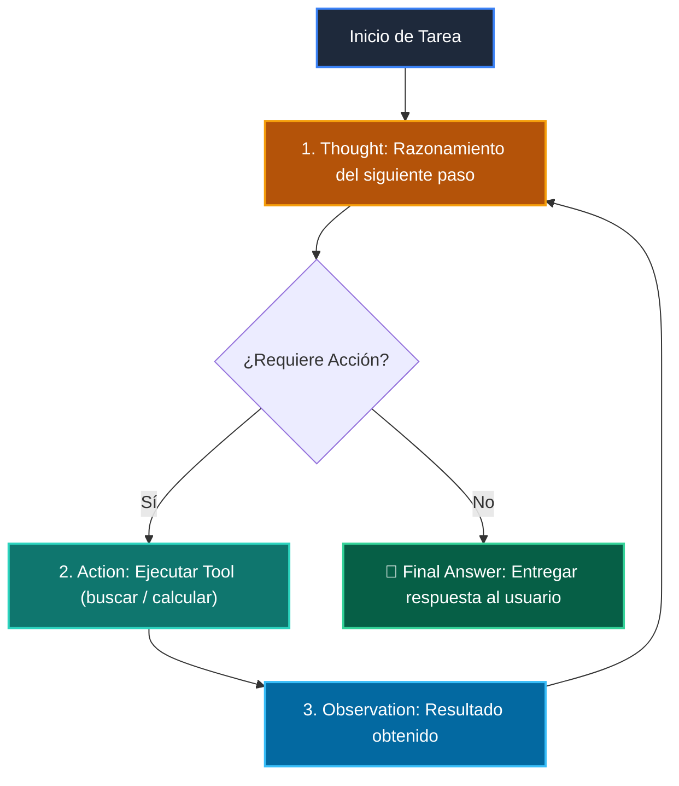

# 📘 Clase 07: Agentes Autónomos y el Ciclo Cognitivo ReAct

> **Curso:** Curso 3: Creación y Desarrollo de Agentes de IA (CLASE 07)  
> **Nivel:** Nivel 3 - Avanzado &bull; **Metáfora:** *«El Agente como un Detective que Piensa, Actúa y Observa hasta Resolver el Caso»*  

---

## 🗺️ Diagrama de Arquitectura y Flujo de la Clase

---

## 📑 Recursos Disponibles en esta Clase

*   📄 [`clase-07-agentes-autonomos-react.pdf`](clase-07-agentes-autonomos-react.pdf): Manual técnico oficial en PDF (9 páginas).
*   📖 [`book.md`](book.md): Libro de estudio digital con teoría profunda y diagramas Mermaid.
*   📁 [`notebook/`](notebook/): Cuaderno interactivo Jupyter ejecutable en local y en Google Colab.
*   📁 [`ejemplos/`](ejemplos/): Carpetas de código funcional con casos prácticos comentados.
*   📁 [`ejercicios/`](ejercicios/): Reto práctico para afianzar conceptos.
