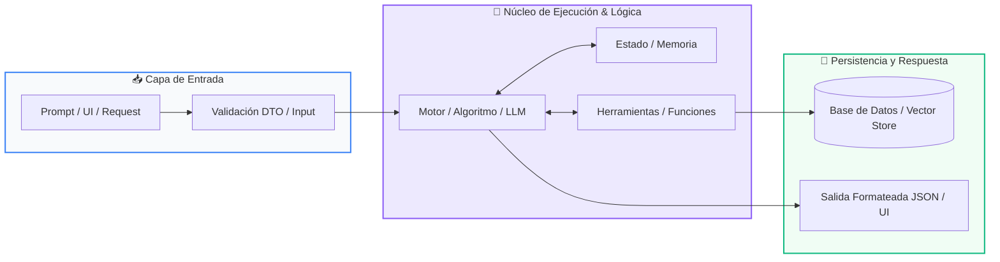

# 📚 Clase 07: Agentes Autónomos y el Ciclo Cognitivo ReAct

> **Programa:** Curso 3: Creación y Desarrollo de Agentes de IA  
> **Nivel:** Nivel 3 - Avanzado  
> **Metáfora Central:** *«El Agente como un Detective que Piensa, Actúa y Observa hasta Resolver el Caso»*  
> **Documento Oficial PDF:** [clase-07-agentes-autonomos-react.pdf](clase-07-agentes-autonomos-react.pdf)  
> **Instructor:** **William Rodríguez (Wisrovi)** (AI Solutions Architect & Principal Software Engineer)  

---

## 👤 Perfil del Autor y Mentor

### **William Rodríguez (Wisrovi)**
*AI Solutions Architect & Principal Software Engineer &bull; Badajoz, España*

Ingeniero y arquitecto de software especializado en Inteligencia Artificial Generativa, sistemas multi-agente, Visión por Computador e infraestructuras MLOps de alta disponibilidad. Creador y mantenedor de la suite de software libre wisrovi SUITE en PyPI con más de 26 bibliotecas enfocadas en orquestación de pipelines, caching distribuido y optimización de bases de datos.

*   🐙 **GitHub:** [github.com/wisrovi](https://github.com/wisrovi)
*   💼 **LinkedIn:** [www.linkedin.com/in/wisrovi-rodriguez/](https://www.linkedin.com/in/wisrovi-rodriguez/)
*   🐳 **DockerHub:** [hub.docker.com/u/wisrovi](https://hub.docker.com/u/wisrovi)
*   🌐 **Website:** [wisrovi.dev](https://wisrovi.dev)
*   📦 **PyPI:** [pypi.org/user/wisrovi/](https://pypi.org/user/wisrovi/)

---

### 🚲 La Regla de la Bicicleta

> *"Nadie aprende a montar en bicicleta viendo tutoriales. El verdadero dominio de la programación surge cuando abres tu editor, escribes código con tus propias manos, resuelves errores y construyes proyectos reales."*

---

## 📑 Tabla de Contenidos de la Sesión

1. [💡 Fundamentación Teórica y Modelo Mental](#1--fundamentación-teórica-y-modelo-mental)
2. [🗺️ Arquitectura y Diagrama de Flujo](#2-️-arquitectura-y-diagrama-de-flujo)
3. [💻 Implementación en Python 3.10+](#3--implementación-en-python-310)
4. [🛡️ Buenas Prácticas y Trampas Frecuentes](#4-️-buenas-prácticas-y-trampas-frecuentes)
5. [🏋️ Desafío de Práctica](#5-️-desafío-de-práctica)
6. [📚 Bibliografía y Enlaces Canónicos](#6--bibliografía-y-enlaces-canónicos)

---

## 1. 💡 Fundamentación Teórica y Modelo Mental

Un Agente de IA es un sistema autónomo que combina un LLM con memoria, herramientas y un bucle de razonamiento para alcanzar metas.

> [!NOTE]
> **🌟 Metáfora Didáctica:** Un agente es como un detective: piensa qué pista necesita (Thought), busca el dato con una herramienta (Action), analiza el resultado (Observation) y repite.

### Principios Fundamentales

Ciclo ReAct: Thought (Pensamiento) -> Action (Acción/Tool) -> Observation (Resultado) -> Final Answer.

El agente evalúa si la observación resuelve el objetivo o si requiere ejecutar acciones adicionales.

> [!IMPORTANT]
> **⚡ Regla de Oro en Python:** Establece siempre un 'max_iterations = 5' para evitar que el agente quede atrapado en bucles infinitos.

---

## 2. 🗺️ Arquitectura y Diagrama de Flujo

Bucle autónomo de decisión ReAct con parada por condición de meta.



### Desglose Paso a Paso del Flujo

| Fase | Acción del Intérprete | Estado en Memoria |
| :--- | :--- | :--- |
| **1. Inicialización** | Recepción de la meta del usuario. | `Objetivo fijado en memoria de trabajo.` |
| **2. Evaluación** | Generación de Thought y selección de Action. | `Herramienta elegida con parámetros.` |
| **3. Transformación** | Ejecución de la herramienta y captura de Observation. | `Nuevo dato agregado al historial.` |
| **4. Retorno / Salida** | ¿Meta alcanzada? Sí -> Final Answer / No -> Siguiente ciclo. | `Respuesta final entregada.` |

> [!TIP]
> **🔍 Visualización Mental:** El bucle ReAct le da al modelo tiempo para pensar y verificar antes de responder.

---

## 3. 💻 Implementación en Python 3.10+

```python
# CLASE 07 - Código de Demostración
class ReActAgent:
    def __init__(self, tools: dict, max_steps: int = 3):
        self.tools = tools
        self.max_steps = max_steps
        self.memory = []

    def run(self, goal: str):
        print(f"🎯 Meta: {goal}")
        for step in range(1, self.max_steps + 1):
            print(f"--- Paso {step} ---")
            # 1. Thought
            thought = f"Necesito consultar la cotización del euro."
            print(f"💭 Thought: {thought}")
            
            # 2. Action
            obs = self.tools["get_rate"]("EUR_USD")
            print(f"🎬 Action: get_rate(EUR_USD) -> Obs: {obs}")
            
            # 3. Final Answer
            return f"Respuesta Final: 1 EUR equivale a {obs} USD."

tools = {"get_rate": lambda pair: 1.08}
agente = ReActAgent(tools)
print(agente.run("¿Cuánto vale el euro frente al dólar?"))
```

*Arquitectura de agente con inyección de herramientas, bucle de ejecución y memoria de observaciones.*

---

## 4. 🛡️ Buenas Prácticas y Trampas Frecuentes

> [!WARNING]
> **⚠️ Gotcha Frecuente (Trampa de Principiante):** Si una herramienta falla o devuelve error, el agente puede reintentar la misma acción en un ciclo sin fin.

*   **❌ Antipatrón:**
    ```python
while not finished: agent.step()  # ❌ Puede consumir tokens infinitos
    ```

*   **✅ Patrón Correcto:**
    ```python
for step in range(max_steps):     # ✅ Límite estricto de seguridad
    ```

> [!TIP]
> **💡 Consejo Profesional:** Guarda trazas completas de las decisiones del agente para auditoría y observabilidad.

---

## 5. 🏋️ Desafío de Práctica

> **Desafío:** Añade una herramienta de calculadora matemática al agente y haz que resuelva una ecuación paso a paso.

Para ejecutar la verificación automática con pytest:
```bash
pytest ejercicios/
```

---

## 6. 📚 Bibliografía y Enlaces Canónicos

| Fuente / Recurso | Descripción | Enlace |
| :--- | :--- | :--- |
| **Documentación Oficial de Python** | Especificación y biblioteca estándar | [docs.python.org/3/](https://docs.python.org/3/) |
| **PEP 8 — Style Guide for Python** | Estándar oficial de formateo y estilo | [peps.python.org/pep-0008/](https://peps.python.org/pep-0008/) |
| **Real Python Tutorials** | Patrones de ingeniería y desarrollo | [realpython.com](https://realpython.com/) |
| **Suite Open Source wisrovi** | Librerías de alto rendimiento | [github.com/wisrovi](https://github.com/wisrovi) |
