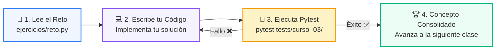

# 🏋️ Reto Práctico: Clase 07: Agentes Autónomos y el Ciclo Cognitivo ReAct

> **Curso:** 03-agentes-ia &bull; **Semana:** CLASE 07  
> **Ubicación:** `03-agentes-ia/clase-07-agentes-autonomos-react/ejercicios`  

---

## 🌀 Ciclo de Resolución y Validación



---

## 🎯 Desafío de la Sesión
> **Enunciado:** Añade una herramienta de calculadora matemática al agente y haz que resuelva una ecuación paso a paso.

---

## 🚀 Pasos para Resolverlo
1. Abre el archivo [`reto.py`](reto.py).
2. Escribe tu lógica de solución.
3. Valida tus resultados ejecutando las pruebas unitarias:
   ```bash
   pytest tests/curso_03/
   ```
