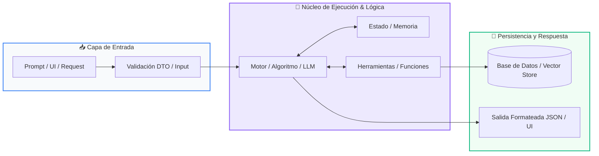

# 📚 Clase 08: Sistemas Multi-Agente, Supervisión y Guardrails

> **Programa:** Curso 3: Creación y Desarrollo de Agentes de IA  
> **Nivel:** Nivel 3 - Avanzado  
> **Metáfora Central:** *«Una Empresa de Agentes Especializados Coordinados por un Director»*  
> **Documento Oficial PDF:** [clase-08-sistemas-multi-agente.pdf](clase-08-sistemas-multi-agente.pdf)  
> **Instructor:** **William Rodríguez (Wisrovi)** (AI Solutions Architect & Principal Software Engineer)  

---

## 👤 Perfil del Autor y Mentor

### **William Rodríguez (Wisrovi)**
*AI Solutions Architect & Principal Software Engineer &bull; Badajoz, España*

Ingeniero y arquitecto de software especializado en Inteligencia Artificial Generativa, sistemas multi-agente, Visión por Computador e infraestructuras MLOps de alta disponibilidad. Creador y mantenedor de la suite de software libre wisrovi SUITE en PyPI con más de 26 bibliotecas enfocadas en orquestación de pipelines, caching distribuido y optimización de bases de datos.

*   🐙 **GitHub:** [github.com/wisrovi](https://github.com/wisrovi)
*   💼 **LinkedIn:** [www.linkedin.com/in/wisrovi-rodriguez/](https://www.linkedin.com/in/wisrovi-rodriguez/)
*   🐳 **DockerHub:** [hub.docker.com/u/wisrovi](https://hub.docker.com/u/wisrovi)
*   🌐 **Website:** [wisrovi.dev](https://wisrovi.dev)
*   📦 **PyPI:** [pypi.org/user/wisrovi/](https://pypi.org/user/wisrovi/)

---

### 🚲 La Regla de la Bicicleta

> *"Nadie aprende a montar en bicicleta viendo tutoriales. El verdadero dominio de la programación surge cuando abres tu editor, escribes código con tus propias manos, resuelves errores y construyes proyectos reales."*

---

## 📑 Tabla de Contenidos de la Sesión

1. [💡 Fundamentación Teórica y Modelo Mental](#1--fundamentación-teórica-y-modelo-mental)
2. [🗺️ Arquitectura y Diagrama de Flujo](#2-️-arquitectura-y-diagrama-de-flujo)
3. [💻 Implementación en Python 3.10+](#3--implementación-en-python-310)
4. [🛡️ Buenas Prácticas y Trampas Frecuentes](#4-️-buenas-prácticas-y-trampas-frecuentes)
5. [🏋️ Desafío de Práctica](#5-️-desafío-de-práctica)
6. [📚 Bibliografía y Enlaces Canónicos](#6--bibliografía-y-enlaces-canónicos)

---

## 1. 💡 Fundamentación Teórica y Modelo Mental

Para problemas complejos, múltiples agentes especializados colaboran mejor que un único agente generalista.

> [!NOTE]
> **🌟 Metáfora Didáctica:** Es como una agencia de noticias: el reportero investiga los hechos, el redactor escribe la noticia y el editor jefe revisa la calidad.

### Principios Fundamentales

Patrón Supervisor: Un agente orquestador recibe la tarea global y la desglosa delegando a agentes especialistas.

Guardrails: Filtros deterministas que validan entradas y salidas para prevenir toxicidad, fugas de datos (PII) y alucinaciones.

> [!IMPORTANT]
> **⚡ Regla de Oro en Python:** Asigna a cada agente un System Prompt ultra específico y un conjunto reducido de herramientas.

---

## 2. 🗺️ Arquitectura y Diagrama de Flujo

Orquestación multi-agente con supervisor y validación por guardrails.



### Desglose Paso a Paso del Flujo

| Fase | Acción del Intérprete | Estado en Memoria |
| :--- | :--- | :--- |
| **1. Inicialización** | Recepción de solicitud y análisis del Supervisor. | `Plan de tareas desglosado.` |
| **2. Evaluación** | Delegación al Agente Investigador (Tool Calling). | `Datos crudos recolectados.` |
| **3. Transformación** | Paso de datos al Agente Redactor para síntesis. | `Borrador de reporte generado.` |
| **4. Retorno / Salida** | Filtro por Guardrails de seguridad y aprobación final. | `Entrega final aprobada.` |

> [!TIP]
> **🔍 Visualización Mental:** Divide y vencerás: agentes pequeños y especializados son más confiables que uno monolítico.

---

## 3. 💻 Implementación en Python 3.10+

```python
# CLASE 08 - Código de Demostración
class MultiAgentSystem:
    def __init__(self):
        pass

    def agente_investigador(self, tema: str) -> dict:
        return {"datos": f"Hallazgos clave sobre {tema}: Crecimiento del 40% en adopción."}

    def agente_redactor(self, investigacion: dict) -> str:
        return f"Reporte Ejecutivo: {investigacion['datos']}"

    def supervisor(self, tema: str) -> str:
        print("👑 Supervisor: Coordinando equipo...")
        datos = self.agente_investigador(tema)
        informe = self.agente_redactor(datos)
        return f"✅ Publicación Aprobada:
{informe}"

sistema = MultiAgentSystem()
print(sistema.supervisor("Agentes Autónomos en 2026"))
```

*Separación de roles en métodos independientes y flujo orquestado por el supervisor.*

---

## 4. 🛡️ Buenas Prácticas y Trampas Frecuentes

> [!WARNING]
> **⚠️ Gotcha Frecuente (Trampa de Principiante):** Pasar texto libre desordenado entre agentes provoca pérdida de contexto en cadenas largas.

*   **❌ Antipatrón:**
    ```python
msg_agente_2 = call_llm(f'El otro dijo: {texto_libre_caotico}')  # ❌ Degradación
    ```

*   **✅ Patrón Correcto:**
    ```python
# Usa esquemas Pydantic para el paso de mensajes entre agentes ✅
    ```

> [!TIP]
> **💡 Consejo Profesional:** Implementa un historial de mensajes estructurado compartido en el estado del grafo.

---

## 5. 🏋️ Desafío de Práctica

> **Desafío:** Diseña un sistema con un Agente Programador y un Agente Revisor de Código que valide pruebas unitarias.

Para ejecutar la verificación automática con pytest:
```bash
pytest ejercicios/
```

---

## 6. 📚 Bibliografía y Enlaces Canónicos

| Fuente / Recurso | Descripción | Enlace |
| :--- | :--- | :--- |
| **Documentación Oficial de Python** | Especificación y biblioteca estándar | [docs.python.org/3/](https://docs.python.org/3/) |
| **PEP 8 — Style Guide for Python** | Estándar oficial de formateo y estilo | [peps.python.org/pep-0008/](https://peps.python.org/pep-0008/) |
| **Real Python Tutorials** | Patrones de ingeniería y desarrollo | [realpython.com](https://realpython.com/) |
| **Suite Open Source wisrovi** | Librerías de alto rendimiento | [github.com/wisrovi](https://github.com/wisrovi) |
