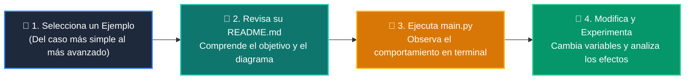

# 💻 Catálogo de Ejemplos Prácticos: Clase 08: Sistemas Multi-Agente, Supervisión y Guardrails

> **Ubicación:** `curso/clase-08-sistemas-multi-agente/ejemplos`  
> **Filosofía:** *Aprender programando mediante casos de uso aislados, legibles y comentados.*

---

## 🗺️ Flujo de Estudio Recomendado



---

## 📑 Ejemplos Disponibles en esta Clase

| Directorio | Caso de Uso Demostrado | Script Principal |
| :--- | :--- | :---: |
| [`ejemplo_01_agentes_especialistas/`](ejemplo_01_agentes_especialistas/) | 01 Agentes Especialistas | [`main.py`](ejemplo_01_agentes_especialistas/main.py) |
| [`ejemplo_02_supervisor_orquestador/`](ejemplo_02_supervisor_orquestador/) | 02 Supervisor Orquestador | [`main.py`](ejemplo_02_supervisor_orquestador/main.py) |
| [`ejemplo_03_mensajes_pydantic_grafo/`](ejemplo_03_mensajes_pydantic_grafo/) | 03 Mensajes Pydantic Grafo | [`main.py`](ejemplo_03_mensajes_pydantic_grafo/main.py) |
| [`ejemplo_04_guardrails_evaluador/`](ejemplo_04_guardrails_evaluador/) | 04 Guardrails Evaluador | [`main.py`](ejemplo_04_guardrails_evaluador/main.py) |


---

## 🚀 Cómo Ejecutar Cualquier Ejemplo
Abre tu terminal en la raíz del repositorio y ejecuta:
```bash
python 01-fundamentos-python/clase-08-sistemas-multi-agente/ejemplos/<nombre_del_ejemplo>/main.py
```
