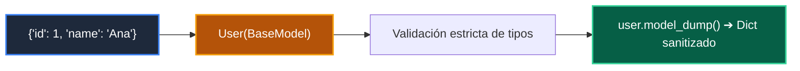

# 📖 03 Mensajes Pydantic Grafo

> **Clase:** Clase 08: Sistemas Multi-Agente, Supervisión y Guardrails  
> **Script:** [`main.py`](main.py)  

Paso de Mensajes Tipado.

---

## 🗺️ Flujo de Ejecución del Ejemplo



---

## 💻 Ejecución desde Terminal

```bash
python 03-agentes-ia/clase-08-sistemas-multi-agente/ejemplos/ejemplo_03_mensajes_pydantic_grafo/main.py
```
