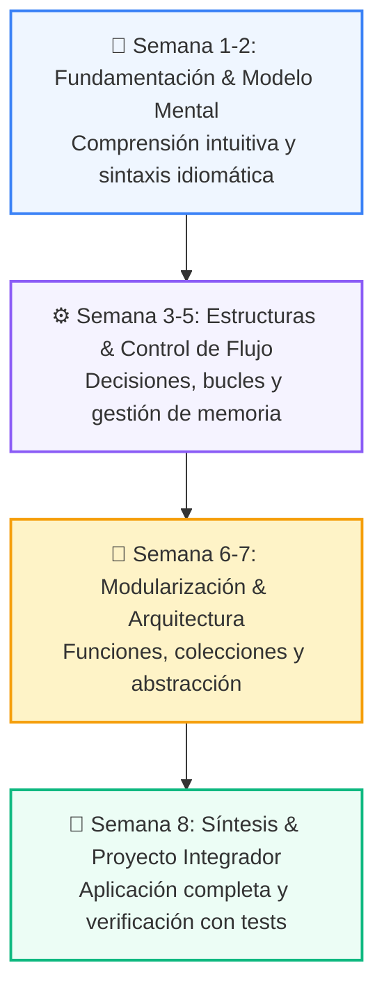

# 📚 Curso 4: Taller Práctico & Proyecto Final Integrador

> **Construcción de Soluciones Reales: Full-Stack Web con FastAPI + Streamlit, Chatbot Inteligente y BD SQL ACID**  
> **Nivel:** Nivel 4 (Integrador / Profesional) &bull; **Duración:** 8 Semanas Formativas  
> **Instructor:** **William Rodríguez (Wisrovi)** (AI Solutions Architect & Principal Software Engineer)  

---

## 🌀 Progresión de Aprendizaje en Espiral (8 Semanas)

Este curso aplica la metodología de **Aprendizaje en Espiral**, donde cada semana construye sobre la anterior, incrementando la profundidad técnica y el rigor de ingeniería:

---

## 📑 Hoja de Ruta de las 8 Clases Semanales

| Semana | Carpeta | Unidad Temática | Metáfora Didáctica |
| :---: | :--- | :--- | :--- |
| **CLASE 01** | [`clase-01-arquitectura-y-planificacion/`](clase-01-arquitectura-y-planificacion/) | Arquitectura de Software y Planificación del Proyecto | *«Diseñar los Planos de un Edificio Antes de Poner el Primer Ladrillo»* |
| **CLASE 02** | [`clase-02-backend-fastapi/`](clase-02-backend-fastapi/) | APIs RESTful con FastAPI | *«FastAPI como un Centro Logístico de Alta Velocidad para Peticiones HTTP»* |
| **CLASE 03** | [`clase-03-persistencia-sql-transacciones/`](clase-03-persistencia-sql-transacciones/) | Modelado SQL y Transacciones ACID | *«La Base de Datos como una Bóveda Acorazada para la Información»* |
| **CLASE 04** | [`clase-04-frontend-streamlit/`](clase-04-frontend-streamlit/) | Dashboards con Streamlit | *«Streamlit como el Salón de Control Visual para tu Backend de Python»* |
| **CLASE 05** | [`clase-05-integracion-agente-ia/`](clase-05-integracion-agente-ia/) | Integración del Motor de IA y Agentes en la App | *«Conectar el Cerebro del Agente al Sistema Nervioso de la Aplicación»* |
| **CLASE 06** | [`clase-06-testing-y-calidad/`](clase-06-testing-y-calidad/) | Testing Riguroso con Pytest, Mocks y Calidad | *«Los Tests como el Control de Calidad y Pruebas de Choque de un Vehículo»* |
| **CLASE 07** | [`clase-07-docker-y-compose/`](clase-07-docker-y-compose/) | Containerización Profesional con Docker y Compose | *«Docker como Contenedores Estándar de Carga Marítima para Software»* |
| **CLASE 08** | [`clase-08-despliegue-cicd-portafolio/`](clase-08-despliegue-cicd-portafolio/) | Despliegue en la Nube, CI/CD y Portafolio Final | *«Lanzamiento a Producción y Presentación de tu Proyecto ante el Mundo»* |

---

## 📦 Materiales Disponibles en este Curso

*   📄 [`curso-04-proyecto-final.pdf`](curso-04-proyecto-final.pdf): Manual completo oficial en PDF compilado con estética LaTeX.
*   📖 [`book.md`](book.md): Libro de estudio digital con explicaciones profundas y diagramas Mermaid.
*   🧪 Suite de Pruebas Automatizadas en [`tests/curso_04/`](../tests/curso_04/).

---

## 🚲 La Regla de la Bicicleta

> *"Nadie aprende a programar leyendo código ajeno. Abre cada clase, ejecuta los ejemplos en tu editor y resuelve los retos con tus propias manos."*
