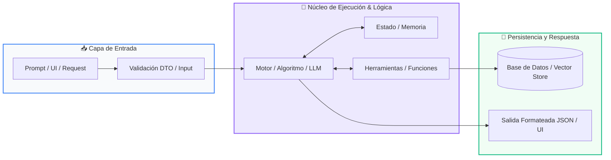
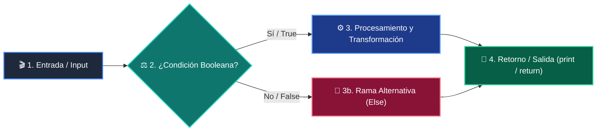

# 📚 Curso 4: Taller Práctico & Proyecto Final Integrador

> **Construcción de Soluciones Reales: Full-Stack Web con FastAPI + Streamlit, Chatbot Inteligente y BD SQL ACID**  
> **Nivel:** Nivel 4 (Integrador / Profesional)  
> **Duración:** 8 Semanas (1 Clase por semana)  
> **Instructor:** **William Rodríguez (Wisrovi)** (AI Solutions Architect & Principal Software Engineer)  
> **Licencia:** MIT | **Python:** 3.10+  

---

## 📑 Hoja de Ruta y Tabla de Contenidos (8 Semanas)

| Semana / Clase | Título | Metáfora Central | Carpeta |
| :---: | :--- | :--- | :---: |
| **CLASE 01** | Clase 01: Arquitectura de Software y Planificación del Proyecto | *«Diseñar los Planos de un Edificio Antes de Poner el Primer Ladrillo»* | [`clase-01-arquitectura-y-planificacion/`](clase-01-arquitectura-y-planificacion/) |
| **CLASE 02** | Clase 02: Desarrollo del Backend: APIs RESTful con FastAPI | *«FastAPI como un Centro Logístico de Alta Velocidad para Peticiones HTTP»* | [`clase-02-backend-fastapi/`](clase-02-backend-fastapi/) |
| **CLASE 03** | Clase 03: Persistencia de Datos: Modelado SQL y Transacciones ACID | *«La Base de Datos como una Bóveda Acorazada para la Información»* | [`clase-03-persistencia-sql-transacciones/`](clase-03-persistencia-sql-transacciones/) |
| **CLASE 04** | Clase 04: Desarrollo del Frontend: Dashboards con Streamlit | *«Streamlit como el Salón de Control Visual para tu Backend de Python»* | [`clase-04-frontend-streamlit/`](clase-04-frontend-streamlit/) |
| **CLASE 05** | Clase 05: Integración del Motor de IA y Agentes en la App | *«Conectar el Cerebro del Agente al Sistema Nervioso de la Aplicación»* | [`clase-05-integracion-agente-ia/`](clase-05-integracion-agente-ia/) |
| **CLASE 06** | Clase 06: Testing Riguroso con Pytest, Mocks y Calidad | *«Los Tests como el Control de Calidad y Pruebas de Choque de un Vehículo»* | [`clase-06-testing-y-calidad/`](clase-06-testing-y-calidad/) |
| **CLASE 07** | Clase 07: Containerización Profesional con Docker y Compose | *«Docker como Contenedores Estándar de Carga Marítima para Software»* | [`clase-07-docker-y-compose/`](clase-07-docker-y-compose/) |
| **CLASE 08** | Clase 08: Despliegue en la Nube, CI/CD y Portafolio Final | *«Lanzamiento a Producción y Presentación de tu Proyecto ante el Mundo»* | [`clase-08-despliegue-cicd-portafolio/`](clase-08-despliegue-cicd-portafolio/) |

---


# 📖 CLASE 01: Clase 01: Arquitectura de Software y Planificación del Proyecto

> **Metáfora:** *«Diseñar los Planos de un Edificio Antes de Poner el Primer Ladrillo»*  
> **Objetivo:** Comprender la arquitectura en capas (Clean Architecture / MVC), contratos de API y selección de Track.  

### 1. Fundamentos Teóricos
Un proyecto de software profesional comienza con una arquitectura sólida que garantiza escalabilidad y mantenimiento.

> [!NOTE]
> **Metáfora Didáctica:** Diseñar el software es como dibujar los planos estructurales de una casa: define dónde irán las tuberías (APIs) y los cimientos (BD).

Separación de responsabilidades: Frontend (Presentación), Backend (Lógica de Negocio) y Base de Datos (Persistencia).

> [!IMPORTANT]
> **Regla de Oro:** Nunca empieces a codificar sin tener un diagrama de arquitectura y las entidades de datos definidas.

### 2. Diagrama de Arquitectura


### 3. Implementación en Python
```python
# CLASE 01
from pydantic import BaseModel
from typing import Optional
from datetime import datetime

class ProyectoConfig(BaseModel):
    nombre_app: str = "Wisrovi Enterprise App"
    version: str = "1.0.0"
    debug: bool = False

class ItemDTO(BaseModel):
    id: Optional[int] = None
    titulo: str
    creado_en: datetime = datetime.now()

config = ProyectoConfig()
print(f"Iniciando arquitectura para: {config.nombre_app} v{config.version}")
```

### 4. Gotchas y Buenas Prácticas
> [!WARNING]
> **Gotcha:** Colocar consultas SQL directamente dentro de los componentes visuales del frontend destruye la mantenibilidad.

*   **❌ Antipatrón:**
    ```python
# En archivo del frontend:
# cursor.execute('INSERT INTO...') ❌ Acoplamiento peligroso
    ```
*   **✅ Patrón Correcto:**
    ```python
# Frontend -> Llama a API REST -> API invoca Repositorio -> BD ✅
    ```

---

# 📖 CLASE 02: Clase 02: Desarrollo del Backend: APIs RESTful con FastAPI

> **Metáfora:** *«FastAPI como un Centro Logístico de Alta Velocidad para Peticiones HTTP»*  
> **Objetivo:** Comprender el protocolo HTTP (GET, POST, PUT, DELETE), códigos de estado (200, 201, 404, 500) y asincronía (async/await).  

### 1. Fundamentos Teóricos
FastAPI es el framework web moderno de Python más rápido, diseñado para construir microservicios y APIs con tipado estricto.

> [!NOTE]
> **Metáfora Didáctica:** FastAPI es una ventanilla de atención ultra rápida: valida tu formulario antes de atenderte y te entrega un recibo oficial.

Validación automática de requests y responses gracias a la integración profunda con Pydantic.

> [!IMPORTANT]
> **Regla de Oro:** Retorna siempre códigos de estado HTTP semánticos (ej. 201 Created tras un POST exitoso).

### 2. Diagrama de Arquitectura


### 3. Implementación en Python
```python
# CLASE 02
from fastapi import FastAPI, HTTPException
from pydantic import BaseModel

app = FastAPI(title="Servicio de Productos API", version="1.0.0")

class Producto(BaseModel):
    id: int
    nombre: str
    precio: float

DB_ITEMS = {}

@app.post("/productos", status_code=201)
def crear_producto(prod: Producto):
    if prod.id in DB_ITEMS:
        raise HTTPException(status_code=400, detail="El producto ya existe.")
    DB_ITEMS[prod.id] = prod
    return {"mensaje": "Creado con éxito", "producto": prod}

@app.get("/productos/{item_id}")
def obtener_producto(item_id: int):
    if item_id not in DB_ITEMS:
        raise HTTPException(status_code=404, detail="No encontrado")
    return DB_ITEMS[item_id]
```

### 4. Gotchas y Buenas Prácticas
> [!WARNING]
> **Gotcha:** Usar funciones síncronas bloqueantes (como time.sleep) dentro de funciones async def congela todo el servidor.

*   **❌ Antipatrón:**
    ```python
async def endpoint():
    time.sleep(5)  # ❌ Bloquea el event loop para todos los usuarios
    ```
*   **✅ Patrón Correcto:**
    ```python
async def endpoint():
    await asyncio.sleep(5)  # ✅ No bloqueante
    ```

---

# 📖 CLASE 03: Clase 03: Persistencia de Datos: Modelado SQL y Transacciones ACID

> **Metáfora:** *«La Base de Datos como una Bóveda Acorazada para la Información»*  
> **Objetivo:** Comprender propiedades ACID (Atomicidad, Consistencia, Aislamiento, Durabilidad), SQL parametrizado y migraciones.  

### 1. Fundamentos Teóricos
La persistencia de datos garantiza que la información de los usuarios permanezca intacta tras apagar o reiniciar el servidor.

> [!NOTE]
> **Metáfora Didáctica:** Una transacción ACID es como una transferencia bancaria: o se descuenta de una cuenta y se acredita en la otra, o se cancela todo.

Inyección SQL: La vulnerabilidad #1 de bases de datos. Ocurre al concatenar strings en consultas.

> [!IMPORTANT]
> **Regla de Oro:** NUNCA concatenes variables en consultas SQL; usa siempre placeholders (?, %s o :val).

### 2. Diagrama de Arquitectura


### 3. Implementación en Python
```python
# CLASE 03
import sqlite3

class RepositorioUsuarios:
    def __init__(self, db_path: str = "app.db"):
        self.db_path = db_path
        self._crear_tabla()

    def _crear_tabla(self):
        with sqlite3.connect(self.db_path) as conn:
            conn.execute("""
                CREATE TABLE IF NOT EXISTS usuarios (
                    id INTEGER PRIMARY KEY AUTOINCREMENT,
                    nombre TEXT NOT NULL,
                    email TEXT UNIQUE NOT NULL
                )
            """)

    def insertar(self, nombre: str, email: str) -> int:
        with sqlite3.connect(self.db_path) as conn:
            cursor = conn.cursor()
            cursor.execute("INSERT INTO usuarios (nombre, email) VALUES (?, ?)", (nombre, email))
            return cursor.lastrowid

repo = RepositorioUsuarios(":memory:")
uid = repo.insertar("Wisrovi Developer", "wisrovi@dev.com")
print(f"Usuario insertado con ID: {uid}")
```

### 4. Gotchas y Buenas Prácticas
> [!WARNING]
> **Gotcha:** Formatear strings con f-strings en SQL permite a atacantes ejecutar comandos destructivos (ej. ' OR 1=1; DROP TABLE...).

*   **❌ Antipatrón:**
    ```python
cursor.execute(f'SELECT * FROM users WHERE email = '{email}'')  # ❌ Vulnerable a SQL Injection
    ```
*   **✅ Patrón Correcto:**
    ```python
cursor.execute('SELECT * FROM users WHERE email = ?', (email,))    # ✅ 100% Seguro
    ```

---

# 📖 CLASE 04: Clase 04: Desarrollo del Frontend: Dashboards con Streamlit

> **Metáfora:** *«Streamlit como el Salón de Control Visual para tu Backend de Python»*  
> **Objetivo:** Comprender el modelo de ejecución reactiva de Streamlit, gestión de estado con st.session_state y conexión a APIs.  

### 1. Fundamentos Teóricos
Streamlit permite transformar scripts de Python en aplicaciones web interactivas para ciencia de datos e Inteligencia Artificial.

> [!NOTE]
> **Metáfora Didáctica:** Es como un tablero de mandos de automóvil donde cada botón y pantalla se conecta directamente al motor de tu backend.

Modelo Reactivo: Cada vez que el usuario interactúa con un control (botón, slider), Streamlit reejecuta el script de arriba a abajo.

> [!IMPORTANT]
> **Regla de Oro:** Usa st.session_state para almacenar sesiones de chat o datos de formularios sin perderlos al hacer clic.

### 2. Diagrama de Arquitectura


### 3. Implementación en Python
```python
# CLASE 04
import streamlit as st

st.set_page_config(page_title="Panel de Control", page_icon="🚀")
st.title("🚀 Panel de Gestión de Leads")

if "leads" not in st.session_state:
    st.session_state.leads = []

with st.form("form_lead"):
    nombre = st.text_input("Nombre completo")
    email = st.text_input("Correo electrónico")
    enviado = st.form_submit_button("Guardar Lead")
    
    if enviado and nombre:
        st.session_state.leads.append({"nombre": nombre, "email": email})
        st.success(f"Lead {nombre} registrado con éxito.")

st.write(f"Total registrados: {len(st.session_state.leads)}")
```

### 4. Gotchas y Buenas Prácticas
> [!WARNING]
> **Gotcha:** Cargar modelos pesados o archivos grandes en cada interacción ralentiza la aplicación.

*   **❌ Antipatrón:**
    ```python
modelo = cargar_modelo_pesado_2gb()  # ❌ Se recarga en cada clic
    ```
*   **✅ Patrón Correcto:**
    ```python
@st.cache_resource
def get_model(): return cargar_modelo()  # ✅ Se ejecuta una sola vez en caché
    ```

---

# 📖 CLASE 05: Clase 05: Integración del Motor de IA y Agentes en la App

> **Metáfora:** *«Conectar el Cerebro del Agente al Sistema Nervioso de la Aplicación»*  
> **Objetivo:** Comprender la integración asíncrona de LLMs, streaming de tokens (SSE) y persistencia de memoria conversacional.  

### 1. Fundamentos Teóricos
Integrar un agente en una aplicación web requiere gestionar latencias, streaming de texto y manejo de errores de API.

> [!NOTE]
> **Metáfora Didáctica:** Es como conectar un motor híbrido a un automóvil: debe responder con potencia suave sin tirones para el conductor.

Streaming de respuestas: Enviar token por token al frontend para que el usuario no espere 10 segundos en blanco.

> [!IMPORTANT]
> **Regla de Oro:** Muestra siempre indicadores visuales de carga (spinners) mientras el agente razona.

### 2. Diagrama de Arquitectura


### 3. Implementación en Python
```python
# CLASE 05
class AgenteService:
    def __init__(self, nombre_bot: str = "WisroviAssistant"):
        self.nombre_bot = nombre_bot

    def procesar_consulta(self, usuario_id: str, prompt: str) -> dict:
        # Lógica de agente con memoria y guardrails
        respuesta = f"[{self.nombre_bot}] He analizado tu solicitud: '{prompt}'. Todo en orden."
        return {
            "usuario_id": usuario_id,
            "respuesta": respuesta,
            "tokens_usados": 42
        }

servicio = AgenteService()
print(servicio.procesar_consulta("usr_1", "Generar balance"))
```

### 4. Gotchas y Buenas Prácticas
> [!WARNING]
> **Gotcha:** Escribir las claves de API (OPENAI_API_KEY, GEMINI_API_KEY) en el código del frontend expone tu cuenta.

*   **❌ Antipatrón:**
    ```python
API_KEY = 'sk-123456789'  # ❌ Expuesto en el repositorio
    ```
*   **✅ Patrón Correcto:**
    ```python
API_KEY = os.environ.get('GEMINI_API_KEY')  # ✅ Variable de entorno segura
    ```

---

# 📖 CLASE 06: Clase 06: Testing Riguroso con Pytest, Mocks y Calidad

> **Metáfora:** *«Los Tests como el Control de Calidad y Pruebas de Choque de un Vehículo»*  
> **Objetivo:** Comprender la pirámide de testing (Unitarios, Integración, End-to-End), fixtures y mocks con unittest.mock.  

### 1. Fundamentos Teóricos
El testing automatizado es la única garantía de que los cambios nuevos no rompan funcionalidades existentes en producción.

> [!NOTE]
> **Metáfora Didáctica:** Hacer tests es como las pruebas de choque de los coches: verificas que los frenos funcionan antes de salir a la autopista.

Mocks y Stubs: Simulan respuestas de servicios externos (como APIs de pago o LLMs) para tests rápidos y gratuitos.

> [!IMPORTANT]
> **Regla de Oro:** Tus tests nunca deben depender de servicios externos reales ni requerir conexión a internet.

### 2. Diagrama de Arquitectura


### 3. Implementación en Python
```python
# CLASE 06
def calcular_subtotal(items: list[dict]) -> float:
    return sum(i["precio"] * i["cantidad"] for i in items)

def test_calculo_subtotal():
    carrito = [
        {"precio": 10.0, "cantidad": 2},
        {"precio": 5.0, "cantidad": 1}
    ]
    assert calcular_subtotal(carrito) == 25.0

def test_carrito_vacio():
    assert calcular_subtotal([]) == 0.0

print("Ejecutando tests...")
test_calculo_subtotal()
test_carrito_vacio()
print("✅ Todos los tests pasaron exitosamente.")
```

### 4. Gotchas y Buenas Prácticas
> [!WARNING]
> **Gotcha:** Hacer que los tests llamen a APIs reales falla si no hay internet y consume cuota de pago.

*   **❌ Antipatrón:**
    ```python
def test_llm():
    res = llamar_api_real_openai()  # ❌ Lento, frágil y cuesta dinero
    ```
*   **✅ Patrón Correcto:**
    ```python
def test_llm(mocker):
    mocker.patch('llm.call', return_value='Respuesta Mock')  # ✅ Rápido y determinista
    ```

---

# 📖 CLASE 07: Clase 07: Containerización Profesional con Docker y Compose

> **Metáfora:** *«Docker como Contenedores Estándar de Carga Marítima para Software»*  
> **Objetivo:** Comprender imágenes, contenedores, capas, Dockerfile multi-stage, redes y volúmenes de Docker Compose.  

### 1. Fundamentos Teóricos
Docker elimina el famoso problema de 'en mi máquina sí funciona' empaquetando el código con todas sus dependencias.

> [!NOTE]
> **Metáfora Didáctica:** Un contenedor Docker es como un contenedor de barco: no importa si va en tren o camión, su contenido viaja aislado y seguro.

Dockerfile: La receta paso a paso para construir la imagen del contenedor.

> [!IMPORTANT]
> **Regla de Oro:** Usa imágenes base ligeras (ej. python:3.11-slim) para reducir el tamaño y vulnerabilidades.

### 2. Diagrama de Arquitectura


### 3. Implementación en Python
```python
# CLASE 07
DOCKERFILE_EXAMPLE = """FROM python:3.11-slim
WORKDIR /app
COPY requirements.txt .
RUN pip install --no-cache-dir -r requirements.txt
COPY . .
EXPOSE 8000
CMD ["uvicorn", "main:app", "--host", "0.0.0.0", "--port", "8000"]"""

print("Dockerfile de producción configurado:")
print(DOCKERFILE_EXAMPLE)
```

### 4. Gotchas y Buenas Prácticas
> [!WARNING]
> **Gotcha:** Usar imágenes completas basadas en Ubuntu instala compiladores innecesarios generando imágenes de más de 2 GB.

*   **❌ Antipatrón:**
    ```python
FROM ubuntu:latest  # ❌ Imagen pesada y lenta de descargar
    ```
*   **✅ Patrón Correcto:**
    ```python
FROM python:3.11-slim  # ✅ Ligera (~150 MB) y rápida
    ```

---

# 📖 CLASE 08: Clase 08: Despliegue en la Nube, CI/CD y Portafolio Final

> **Metáfora:** *«Lanzamiento a Producción y Presentación de tu Proyecto ante el Mundo»*  
> **Objetivo:** Comprender integración continua (CI), despliegue continuo (CD), variables de entorno en la nube y documentación.  

### 1. Fundamentos Teóricos
La graduación del programa culmina con el despliegue de tu solución y la consolidación de tu portafolio profesional.

> [!NOTE]
> **Metáfora Didáctica:** Es el corte de cinta inaugural de tu edificio de software: listo para recibir usuarios reales en todo el mundo.

Pipelines de CI/CD: Automatizan la ejecución de tests y el despliegue automático tras cada git push.

> [!IMPORTANT]
> **Regla de Oro:** Un proyecto sin README ni tests no está terminado; la excelencia de ingeniería se demuestra en los detalles.

### 2. Diagrama de Arquitectura


### 3. Implementación en Python
```python
# CLASE 08
class ChecklistGraduacion:
    def __init__(self, autor: str, proyecto: str):
        self.autor = autor
        self.proyecto = proyecto
        self.items = {
            "1. Codigo modular y PEP 8": True,
            "2. Suite de pruebas con Pytest": True,
            "3. Dockerfile y Docker Compose": True,
            "4. Documentacion README completa": True,
            "5. Video demo o capturas": True
        }

    def verificar(self) -> bool:
        return all(self.items.values())

grad = ChecklistGraduacion("Wisrovi Student", "AI Support Hub")
print(f"Estado de Graduación para {grad.autor}:")
for k, v in grad.items.items():
    print(f"  [{'X' if v else ' '}] {k}")
print(f"🏆 ¿Aprobado para Certificación?: {grad.verificar()}")
```

### 4. Gotchas y Buenas Prácticas
> [!WARNING]
> **Gotcha:** Subir archivos temporales (__pycache__, .env, .venv) por no configurar un .gitignore limpio.

*   **❌ Antipatrón:**
    ```python
# Repositorio con 100 archivos .pyc y credenciales secretas ❌
    ```
*   **✅ Patrón Correcto:**
    ```python
# Repositorio con .gitignore estándar de Python y variables en secretos de GitHub ✅
    ```

---
