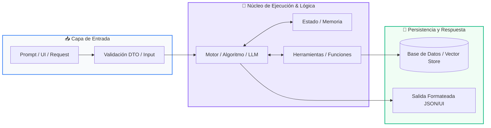

# 📚 Curso 4: Taller Práctico & Proyecto Final Personalizado

> **Nivel:** Nivel 4 (Integrador / Profesional)  
> **Enfoque:** Construcción de Soluciones Reales: Full-Stack Web, Chatbots de Atención y Sistemas de Gestión ACID  
> **Python Version:** 3.10+ | **Licencia:** MIT  
> **Instructor:** **William Rodríguez (Wisrovi)** (AI Solutions Architect & Principal Software Engineer)  

---

## 👤 Perfil del Instructor y Mentor

### **William Rodríguez (Wisrovi)**
*AI Solutions Architect & Principal Software Engineer &bull; Badajoz, España*

Ingeniero y arquitecto de software especializado en Inteligencia Artificial Generativa, sistemas multi-agente, Visión por Computador e infraestructuras MLOps de alta disponibilidad. Creador y mantenedor de la suite de software libre <strong>wisrovi SUITE</strong> en PyPI con más de 26 bibliotecas enfocadas en orquestación de pipelines, caching distribuido y optimización de bases de datos.

*   🐙 **GitHub:** [github.com/wisrovi](https://github.com/wisrovi)
*   💼 **LinkedIn:** [www.linkedin.com/in/wisrovi-rodriguez/](https://www.linkedin.com/in/wisrovi-rodriguez/)
*   🐳 **DockerHub:** [hub.docker.com/u/wisrovi](https://hub.docker.com/u/wisrovi)
*   🌐 **Website:** [wisrovi.dev](https://wisrovi.dev)
*   📦 **PyPI:** [pypi.org/user/wisrovi/](https://pypi.org/user/wisrovi/)

---

### 🚲 Filosofía de Aprendizaje: La Regla de la Bicicleta

> *"Nadie aprende a montar en bicicleta viendo tutoriales. El verdadero dominio de la programación surge cuando abres tu editor, escribes código con tus propias manos, resuelves errores y construyes proyectos reales."*

---

## 📑 Hoja de Ruta y Tabla de Contenidos del Curso

| Módulo / Clase | Título Temático | Metáfora Central | Enlace a Carpeta |
| :---: | :--- | :--- | :---: |
| **Track 01** | Track 01: Aplicaciones Web con Python (FastAPI & Streamlit) | *El Restaurante: La Carta (Frontend) y la Cocina de Alta Eficiencia (Backend)* | [`01-aplicacion-web/`](01-aplicacion-web/) |
| **Track 02** | Track 02: Chatbot Inteligente para Atención al Cliente | *El Recepcionista Omnicanal y el Manual de Operaciones* | [`02-chatbot-inteligente/`](02-chatbot-inteligente/) |
| **Track 03** | Track 03: Sistema de Gestión con Base de Datos Relacional | *El Archivo Notarial y la Bóveda de Datos ACID* | [`03-sistema-gestion-bd/`](03-sistema-gestion-bd/) |

---


# 📖 Track 01: Track 01: Aplicaciones Web con Python (FastAPI & Streamlit)

> **Metáfora:** *«El Restaurante: La Carta (Frontend) y la Cocina de Alta Eficiencia (Backend)»*  
> **Objetivo:** Comprender la separación de responsabilidades Cliente-Servidor, APIs RESTful y el paradigma asíncrono async/await.  

### 1. Fundamentación y Modelo Mental

Una aplicación web desacoplada divide la presentación visual del procesamiento central de datos mediante contratos de comunicación HTTP (APIs REST).

> [!NOTE]
> **Metáfora Didáctica:** El frontend (Streamlit) es la carta elegante y el mozo que atiende al comensal en la mesa. El backend (FastAPI) es la cocina profesional donde los chefs procesan las comandas con máxima higiene, rapidez y orden, entregando los platos listos en formato JSON.

FastAPI: Framework moderno, basado en Starlette y Pydantic, con soporte nativo de asincronía (ASGI) y tipado estático.

Verbos HTTP Semánticos: GET (consultar datos), POST (crear nuevos registros), PUT (actualizar), DELETE (eliminar).

> [!IMPORTANT]
> **Regla de Oro:** Nunca mezcles lógica pesada de base de datos en el cliente visual; el cliente solo consume y renderiza.

### 2. Arquitectura de Flujo



| Fase | Acción del Intérprete | Estado en Memoria |
| :--- | :--- | :--- |
| **Inicialización** | El usuario interactúa con widgets en Streamlit y presiona un botón. | `Evento en UI` |
| **Evaluación** | Streamlit envía una petición HTTP POST /api/v1/recurso con payload JSON. | `Request sobre HTTP` |
| **Transformación** | FastAPI valida los datos con Pydantic, ejecuta la lógica y persiste en DB. | `Validación & Persistencia` |
| **Salida / Retorno** | FastAPI responde HTTP 201 Created y Streamlit actualiza la vista reactivamente. | `UI actualizada` |

### 3. Implementación en Python

```python
# Track 01 - main.py
from fastapi import FastAPI, HTTPException, status
from pydantic import BaseModel

app = FastAPI(title="API de Gestión de Productos", version="1.0.0")

class ProductoDTO(BaseModel):
    nombre: str
    precio: float
    categoria: str

db_productos: list[dict] = []

@app.post("/productos", status_code=status.HTTP_201_CREATED)
async def crear_producto(prod: ProductoDTO):
    nuevo = {"id": len(db_productos) + 1, **prod.model_dump()}
    db_productos.append(nuevo)
    return {"mensaje": "Producto creado", "data": nuevo}

@app.get("/productos")
async def listar_productos():
    return {"total": len(db_productos), "productos": db_productos}
```

*Endpoints asíncronos decorados con FastAPI, validación automática mediante Pydantic DTO y códigos de estado HTTP semánticos.*

### 4. Gotchas Comunes y Buenas Prácticas

> [!WARNING]
> **Trampa de Principiante:** Olvidar configurar el middleware CORS (Cross-Origin Resource Sharing), bloqueando las peticiones del frontend.

*   **❌ Antipatrón:**
    ```python
    # Sin configuración CORS: Streamlit o React no podrán consumir la API
    ```
*   **✅ Patrón Correcto:**
    ```python
    from fastapi.middleware.cors import CORSMiddleware
app.add_middleware(CORSMiddleware, allow_origins=['*'])
    ```

> [!TIP]
> **Consejo Profesional:** Utiliza uvicorn main:app --reload durante desarrollo y despliega con contenedores Docker en producción.

---


# 📖 Track 02: Track 02: Chatbot Inteligente para Atención al Cliente

> **Metáfora:** *«El Recepcionista Omnicanal y el Manual de Operaciones»*  
> **Objetivo:** Comprender la gestión del estado conversacional, el enrutamiento de intenciones y la prevención de alucinaciones corporativas.  

### 1. Fundamentación y Modelo Mental

Un chatbot empresarial no solo charla: responde preguntas frecuentes con precisión quirúrgica, consulta el estado de pedidos y transfiere a humanos cuando es necesario.

> [!NOTE]
> **Metáfora Didáctica:** El chatbot es como el recepcionista estrella de una empresa: saluda cordialmente, recuerda todo lo que le dijiste en la conversación actual (memoria de sesión) y consulta de inmediato el manual de operaciones antes de dar una respuesta oficial.

Gestión de Sesión: Cada usuario tiene un session_id único asociado a su buffer de historial en memoria (o en Redis).

Guardrails y System Prompt: Delimitan estrictamente las fronteras temáticas del bot para evitar que hable de temas ajenos a la empresa.

> [!IMPORTANT]
> **Regla de Oro:** Instruye siempre al chatbot en su System Prompt para que admita honestamente si no conoce una respuesta en lugar de inventar información.

### 2. Arquitectura de Flujo


| Fase | Acción del Intérprete | Estado en Memoria |
| :--- | :--- | :--- |
| **Inicialización** | El usuario envía un mensaje en Telegram/WhatsApp; la plataforma emite un Webhook HTTP. | `Mensaje entrante` |
| **Evaluación** | El Session Manager recupera el historial previo del usuario desde la memoria caché. | `Historial de diálogo cargado` |
| **Transformación** | Se inyecta el contexto RAG de la empresa y el LLM formula la respuesta corporativa. | `Inferencia contextualizada` |
| **Salida / Retorno** | Se guarda el nuevo turno en el historial y se envía el mensaje al canal del usuario. | `Respuesta entregada al chat` |

### 3. Implementación en Python

```python
# Track 02 - main.py
class ChatbotAtencionCliente:
    def __init__(self, nombre_empresa: str):
        self.nombre_empresa = nombre_empresa
        self.sesiones: dict[str, list] = {}
        self.system_prompt = f"Eres el asistente virtual de {nombre_empresa}. Sé conciso y formal."

    def responder_usuario(self, user_id: str, mensaje: str) -> str:
        if user_id not in self.sesiones:
            self.sesiones[user_id] = [{"role": "system", "content": self.system_prompt}]
        
        # Agregar turno del usuario
        self.sesiones[user_id].append({"role": "user", "content": mensaje})
        
        # Simulación de respuesta del LLM contextualizada
        respuesta = f"Hola, gracias por contactar a {self.nombre_empresa}. ¿En qué puedo ayudarte?"
        self.sesiones[user_id].append({"role": "assistant", "content": respuesta})
        
        return respuesta
```

*Clase que gestiona sesiones independientes por usuario, acumulando el historial en el formato canónico de roles de los LLMs.*

### 4. Gotchas Comunes y Buenas Prácticas

> [!WARNING]
> **Trampa de Principiante:** No limitar el tamaño del historial acumulado; con el tiempo la conversación agota la ventana de contexto y eleva los costes innecesariamente.

*   **❌ Antipatrón:**
    ```python
    # Acumular cientos de mensajes sin podar el historial
    ```
*   **✅ Patrón Correcto:**
    ```python
    # Mantener solo los últimos K mensajes (Sliding Window Memory)
    ```

> [!TIP]
> **Consejo Profesional:** Usa una ventana deslizante (ej: últimos 10 mensajes) o resume periódicamente los turnos anteriores.

---


# 📖 Track 03: Track 03: Sistema de Gestión con Base de Datos Relacional

> **Metáfora:** *«El Archivo Notarial y la Bóveda de Datos ACID»*  
> **Objetivo:** Comprender el modelo relacional de datos, las claves primarias/foráneas y la integridad transaccional ACID.  

### 1. Fundamentación y Modelo Mental

La memoria RAM se borra al apagar la computadora; una base de datos relacional garantiza que la información de tus clientes y finanzas persista para siempre de forma atómica e íntegra.

> [!NOTE]
> **Metáfora Didáctica:** Una base de datos relacional es como una bóveda notarial de alta seguridad: cada tabla es un libro de registros con columnas estrictas, y cada transacción es un contrato firmado. O se realizan todos los pasos de la operación o se cancela por completo sin dejar inconsistencias a medias.

Propiedades ACID: Atomicidad (todo o nada), Consistencia (cumple reglas), Aislamiento (concurrencia segura), Durabilidad (persiste en disco).

Inyección SQL: La vulnerabilidad #1 en bases de datos; ocurre al concatenar texto crudo en queries. Se previene siempre con consultas parametrizadas (?) o (%s).

> [!IMPORTANT]
> **Regla de Oro:** NUNCA uses f-strings para construir sentencias SQL (ej: f'SELECT * FROM u WHERE id={id}'); usa siempre queries parametrizadas con tuplas.

### 2. Arquitectura de Flujo


| Fase | Acción del Intérprete | Estado en Memoria |
| :--- | :--- | :--- |
| **Inicialización** | La capa de negocio solicita guardar o consultar una entidad. | `Llamada a método del Repositorio` |
| **Evaluación** | El Repositorio abre una conexión/cursor y prepara la sentencia parametrizada. | `Preparación de la query` |
| **Transformación** | El motor de base de datos ejecuta la transacción y valida claves únicas. | `Ejecución ACID en disco` |
| **Salida / Retorno** | Se realiza commit() para asegurar los cambios y se cierra la conexión de forma segura. | `Datos persistidos permanentemente` |

### 3. Implementación en Python

```python
# Track 03 - main.py
import sqlite3

class RepositorioUsuarios:
    def __init__(self, db_path: str = "app.db"):
        self.db_path = db_path
        self._crear_tabla()

    def _crear_tabla(self) -> None:
        with sqlite3.connect(self.db_path) as conn:
            cursor = conn.cursor()
            cursor.execute('''
                CREATE TABLE IF NOT EXISTS usuarios (
                    id INTEGER PRIMARY KEY AUTOINCREMENT,
                    nombre TEXT NOT NULL,
                    email TEXT UNIQUE NOT NULL,
                    saldo REAL DEFAULT 0.0
                )
            ''')
            conn.commit()

    def insertar_usuario(self, nombre: str, email: str, saldo: float) -> int:
        with sqlite3.connect(self.db_path) as conn:
            cursor = conn.cursor()
            # Consulta parametrizada segura contra Inyección SQL
            cursor.execute(
                "INSERT INTO usuarios (nombre, email, saldo) VALUES (?, ?, ?)",
                (nombre, email, saldo)
            )
            conn.commit()
            return cursor.lastrowid
```

*Clase Repository que encapsula la lógica SQL, maneja el ciclo de vida de conexiones y previene vulnerabilidades de inyección SQL.*

### 4. Gotchas Comunes y Buenas Prácticas

> [!WARNING]
> **Trampa de Principiante:** Concatenar variables de usuario directamente dentro de sentencias SQL, permitiendo ataques de Inyección SQL.

*   **❌ Antipatrón:**
    ```python
    cursor.execute(f"SELECT * FROM users WHERE user = '{user}'") # ¡Vulnerable!
    ```
*   **✅ Patrón Correcto:**
    ```python
    cursor.execute("SELECT * FROM users WHERE user = ?", (user,)) # Inmune a inyección
    ```

> [!TIP]
> **Consejo Profesional:** Crea siempre índices (CREATE INDEX) sobre las columnas que uses frecuentemente en cláusulas WHERE o JOIN.

---


## 🏆 Conclusiones Generales de Curso 4: Taller Práctico & Proyecto Final Personalizado

Has completado el manual de referencia completo para este nivel. Continúa profundizando y aplicando estos conceptos en proyectos reales.

### 📚 Bibliografía Oficial y Enlaces Recomendados

| Recurso | Enfoque | Enlace |
| :--- | :--- | :--- |
| **Documentación Oficial de Python** | Referencia canónica del lenguaje | [docs.python.org/3/](https://docs.python.org/3/) |
| **PEP 8 — Style Guide for Python** | Estándar de formato y estilo | [peps.python.org/pep-0008/](https://peps.python.org/pep-0008/) |
| **Real Python Tutorials** | Artículos técnicos y buenas prácticas | [realpython.com](https://realpython.com/) |
| **Suite Open Source wisrovi** | Librerías de alto rendimiento | [github.com/wisrovi](https://github.com/wisrovi) |
