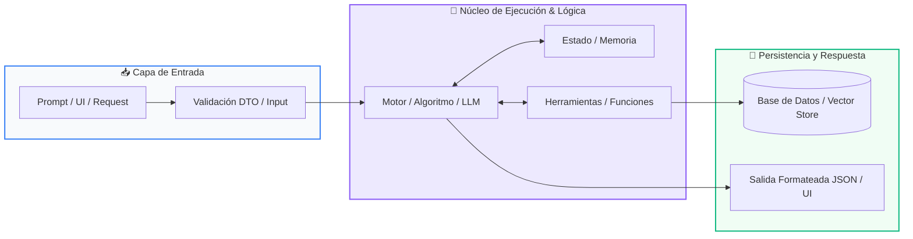

# 📚 Clase 01: Arquitectura de Software y Planificación del Proyecto

> **Programa:** Curso 4: Taller Práctico & Proyecto Final Integrador  
> **Nivel:** Nivel 4 - Integrador  
> **Metáfora Central:** *«Diseñar los Planos de un Edificio Antes de Poner el Primer Ladrillo»*  
> **Documento Oficial PDF:** [clase-01-arquitectura-y-planificacion.pdf](clase-01-arquitectura-y-planificacion.pdf)  
> **Instructor:** **William Rodríguez (Wisrovi)** (AI Solutions Architect & Principal Software Engineer)  

---

## 👤 Perfil del Autor y Mentor

### **William Rodríguez (Wisrovi)**
*AI Solutions Architect & Principal Software Engineer &bull; Badajoz, España*

Ingeniero y arquitecto de software especializado en Inteligencia Artificial Generativa, sistemas multi-agente, Visión por Computador e infraestructuras MLOps de alta disponibilidad. Creador y mantenedor de la suite de software libre wisrovi SUITE en PyPI con más de 26 bibliotecas enfocadas en orquestación de pipelines, caching distribuido y optimización de bases de datos.

*   🐙 **GitHub:** [github.com/wisrovi](https://github.com/wisrovi)
*   💼 **LinkedIn:** [www.linkedin.com/in/wisrovi-rodriguez/](https://www.linkedin.com/in/wisrovi-rodriguez/)
*   🐳 **DockerHub:** [hub.docker.com/u/wisrovi](https://hub.docker.com/u/wisrovi)
*   🌐 **Website:** [wisrovi.dev](https://wisrovi.dev)
*   📦 **PyPI:** [pypi.org/user/wisrovi/](https://pypi.org/user/wisrovi/)

---

### 🚲 La Regla de la Bicicleta

> *"Nadie aprende a montar en bicicleta viendo tutoriales. El verdadero dominio de la programación surge cuando abres tu editor, escribes código con tus propias manos, resuelves errores y construyes proyectos reales."*

---

## 📑 Tabla de Contenidos de la Sesión

1. [💡 Fundamentación Teórica y Modelo Mental](#1--fundamentación-teórica-y-modelo-mental)
2. [🗺️ Arquitectura y Diagrama de Flujo](#2-️-arquitectura-y-diagrama-de-flujo)
3. [💻 Implementación en Python 3.10+](#3--implementación-en-python-310)
4. [🛡️ Buenas Prácticas y Trampas Frecuentes](#4-️-buenas-prácticas-y-trampas-frecuentes)
5. [🏋️ Desafío de Práctica](#5-️-desafío-de-práctica)
6. [📚 Bibliografía y Enlaces Canónicos](#6--bibliografía-y-enlaces-canónicos)

---

## 1. 💡 Fundamentación Teórica y Modelo Mental

Un proyecto de software profesional comienza con una arquitectura sólida que garantiza escalabilidad y mantenimiento.

> [!NOTE]
> **🌟 Metáfora Didáctica:** Diseñar el software es como dibujar los planos estructurales de una casa: define dónde irán las tuberías (APIs) y los cimientos (BD).

### Principios Fundamentales

Separación de responsabilidades: Frontend (Presentación), Backend (Lógica de Negocio) y Base de Datos (Persistencia).

Definición de contratos API-First mediante esquemas OpenAPI y modelos Pydantic.

> [!IMPORTANT]
> **⚡ Regla de Oro en Python:** Nunca empieces a codificar sin tener un diagrama de arquitectura y las entidades de datos definidas.

---

## 2. 🗺️ Arquitectura y Diagrama de Flujo

Arquitectura general del sistema distribuido cliente-servidor.



### Desglose Paso a Paso del Flujo

| Fase | Acción del Intérprete | Estado en Memoria |
| :--- | :--- | :--- |
| **1. Inicialización** | Diseño de la capa de presentación (Streamlit UI / Web). | `Vistas y componentes maquetados.` |
| **2. Evaluación** | Especificación de endpoints REST en FastAPI. | `Contratos DTO / Pydantic listos.` |
| **3. Transformación** | Modelado de base de datos relacional y transacciones. | `Esquema de tablas DDL.` |
| **4. Retorno / Salida** | Integración del motor de Inteligencia Artificial. | `Pipeline de agentes conectado.` |

> [!TIP]
> **🔍 Visualización Mental:** Cada capa solo debe comunicarse con sus capas adyacentes a través de interfaces bien definidas.

---

## 3. 💻 Implementación en Python 3.10+

```python
# CLASE 01 - Código de Demostración
from pydantic import BaseModel
from typing import Optional
from datetime import datetime

class ProyectoConfig(BaseModel):
    nombre_app: str = "Wisrovi Enterprise App"
    version: str = "1.0.0"
    debug: bool = False

class ItemDTO(BaseModel):
    id: Optional[int] = None
    titulo: str
    creado_en: datetime = datetime.now()

config = ProyectoConfig()
print(f"Iniciando arquitectura para: {config.nombre_app} v{config.version}")
```

*Uso de configuración fuertemente tipada y Data Transfer Objects (DTO) con Pydantic.*

---

## 4. 🛡️ Buenas Prácticas y Trampas Frecuentes

> [!WARNING]
> **⚠️ Gotcha Frecuente (Trampa de Principiante):** Colocar consultas SQL directamente dentro de los componentes visuales del frontend destruye la mantenibilidad.

*   **❌ Antipatrón:**
    ```python
# En archivo del frontend:
# cursor.execute('INSERT INTO...') ❌ Acoplamiento peligroso
    ```

*   **✅ Patrón Correcto:**
    ```python
# Frontend -> Llama a API REST -> API invoca Repositorio -> BD ✅
    ```

> [!TIP]
> **💡 Consejo Profesional:** Organiza tu código en carpetas 'domain', 'services', 'repositories' y 'api'.

---

## 5. 🏋️ Desafío de Práctica

> **Desafío:** Dibuja el diagrama de arquitectura y redacta las 5 rutas principales de tu API.

Para ejecutar la verificación automática con pytest:
```bash
pytest ejercicios/
```

---

## 6. 📚 Bibliografía y Enlaces Canónicos

| Fuente / Recurso | Descripción | Enlace |
| :--- | :--- | :--- |
| **Documentación Oficial de Python** | Especificación y biblioteca estándar | [docs.python.org/3/](https://docs.python.org/3/) |
| **PEP 8 — Style Guide for Python** | Estándar oficial de formateo y estilo | [peps.python.org/pep-0008/](https://peps.python.org/pep-0008/) |
| **Real Python Tutorials** | Patrones de ingeniería y desarrollo | [realpython.com](https://realpython.com/) |
| **Suite Open Source wisrovi** | Librerías de alto rendimiento | [github.com/wisrovi](https://github.com/wisrovi) |
