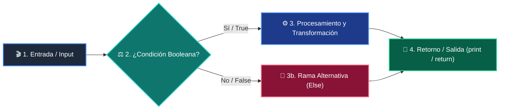

# 📚 Clase 02: Desarrollo del Backend: APIs RESTful con FastAPI

> **Programa:** Curso 4: Taller Práctico & Proyecto Final Integrador  
> **Nivel:** Nivel 4 - Integrador  
> **Metáfora Central:** *«FastAPI como un Centro Logístico de Alta Velocidad para Peticiones HTTP»*  
> **Documento Oficial PDF:** [clase-02-backend-fastapi.pdf](clase-02-backend-fastapi.pdf)  
> **Instructor:** **William Rodríguez (Wisrovi)** (AI Solutions Architect & Principal Software Engineer)  

---

## 👤 Perfil del Autor y Mentor

### **William Rodríguez (Wisrovi)**
*AI Solutions Architect & Principal Software Engineer &bull; Badajoz, España*

Ingeniero y arquitecto de software especializado en Inteligencia Artificial Generativa, sistemas multi-agente, Visión por Computador e infraestructuras MLOps de alta disponibilidad. Creador y mantenedor de la suite de software libre wisrovi SUITE en PyPI con más de 26 bibliotecas enfocadas en orquestación de pipelines, caching distribuido y optimización de bases de datos.

*   🐙 **GitHub:** [github.com/wisrovi](https://github.com/wisrovi)
*   💼 **LinkedIn:** [www.linkedin.com/in/wisrovi-rodriguez/](https://www.linkedin.com/in/wisrovi-rodriguez/)
*   🐳 **DockerHub:** [hub.docker.com/u/wisrovi](https://hub.docker.com/u/wisrovi)
*   🌐 **Website:** [wisrovi.dev](https://wisrovi.dev)
*   📦 **PyPI:** [pypi.org/user/wisrovi/](https://pypi.org/user/wisrovi/)

---

### 🚲 La Regla de la Bicicleta

> *"Nadie aprende a montar en bicicleta viendo tutoriales. El verdadero dominio de la programación surge cuando abres tu editor, escribes código con tus propias manos, resuelves errores y construyes proyectos reales."*

---

## 📑 Tabla de Contenidos de la Sesión

1. [💡 Fundamentación Teórica y Modelo Mental](#1--fundamentación-teórica-y-modelo-mental)
2. [🗺️ Arquitectura y Diagrama de Flujo](#2-️-arquitectura-y-diagrama-de-flujo)
3. [💻 Implementación en Python 3.10+](#3--implementación-en-python-310)
4. [🛡️ Buenas Prácticas y Trampas Frecuentes](#4-️-buenas-prácticas-y-trampas-frecuentes)
5. [🏋️ Desafío de Práctica](#5-️-desafío-de-práctica)
6. [📚 Bibliografía y Enlaces Canónicos](#6--bibliografía-y-enlaces-canónicos)

---

## 1. 💡 Fundamentación Teórica y Modelo Mental

FastAPI es el framework web moderno de Python más rápido, diseñado para construir microservicios y APIs con tipado estricto.

> [!NOTE]
> **🌟 Metáfora Didáctica:** FastAPI es una ventanilla de atención ultra rápida: valida tu formulario antes de atenderte y te entrega un recibo oficial.

### Principios Fundamentales

Validación automática de requests y responses gracias a la integración profunda con Pydantic.

Generación automática de documentación interactiva en /docs (Swagger UI) y /redoc.

> [!IMPORTANT]
> **⚡ Regla de Oro en Python:** Retorna siempre códigos de estado HTTP semánticos (ej. 201 Created tras un POST exitoso).

---

## 2. 🗺️ Arquitectura y Diagrama de Flujo

Flujo de una petición HTTP en FastAPI desde el router hasta la respuesta JSON.



### Desglose Paso a Paso del Flujo

| Fase | Acción del Intérprete | Estado en Memoria |
| :--- | :--- | :--- |
| **1. Inicialización** | Cliente envía HTTP Request (JSON body + headers). | `Petición recibida en puerto 8000.` |
| **2. Evaluación** | Validación automática del esquema Pydantic. | `DTO validado o 422 Unprocessable Entity.` |
| **3. Transformación** | Ejecución de la función de ruta (Endpoint). | `Lógica de negocio ejecutada.` |
| **4. Retorno / Salida** | Serialización del resultado y retorno de HTTP Response. | `JSON emitido con código 200/201.` |

> [!TIP]
> **🔍 Visualización Mental:** Cada función decorada con @app.get o @app.post representa un punto de entrada para clientes.

---

## 3. 💻 Implementación en Python 3.10+

```python
# CLASE 02 - Código de Demostración
from fastapi import FastAPI, HTTPException
from pydantic import BaseModel

app = FastAPI(title="Servicio de Productos API", version="1.0.0")

class Producto(BaseModel):
    id: int
    nombre: str
    precio: float

DB_ITEMS = {}

@app.post("/productos", status_code=201)
def crear_producto(prod: Producto):
    if prod.id in DB_ITEMS:
        raise HTTPException(status_code=400, detail="El producto ya existe.")
    DB_ITEMS[prod.id] = prod
    return {"mensaje": "Creado con éxito", "producto": prod}

@app.get("/productos/{item_id}")
def obtener_producto(item_id: int):
    if item_id not in DB_ITEMS:
        raise HTTPException(status_code=404, detail="No encontrado")
    return DB_ITEMS[item_id]
```

*Manejo explícito de códigos 201 y 404, validación automática y documentación interactiva.*

---

## 4. 🛡️ Buenas Prácticas y Trampas Frecuentes

> [!WARNING]
> **⚠️ Gotcha Frecuente (Trampa de Principiante):** Usar funciones síncronas bloqueantes (como time.sleep) dentro de funciones async def congela todo el servidor.

*   **❌ Antipatrón:**
    ```python
async def endpoint():
    time.sleep(5)  # ❌ Bloquea el event loop para todos los usuarios
    ```

*   **✅ Patrón Correcto:**
    ```python
async def endpoint():
    await asyncio.sleep(5)  # ✅ No bloqueante
    ```

> [!TIP]
> **💡 Consejo Profesional:** Utiliza Depends() para inyectar conexiones de base de datos y autenticación limpia.

---

## 5. 🏋️ Desafío de Práctica

> **Desafío:** Añade endpoints PUT (actualizar) y DELETE a la API de productos con validación de existencia.

Para ejecutar la verificación automática con pytest:
```bash
pytest ejercicios/
```

---

## 6. 📚 Bibliografía y Enlaces Canónicos

| Fuente / Recurso | Descripción | Enlace |
| :--- | :--- | :--- |
| **Documentación Oficial de Python** | Especificación y biblioteca estándar | [docs.python.org/3/](https://docs.python.org/3/) |
| **PEP 8 — Style Guide for Python** | Estándar oficial de formateo y estilo | [peps.python.org/pep-0008/](https://peps.python.org/pep-0008/) |
| **Real Python Tutorials** | Patrones de ingeniería y desarrollo | [realpython.com](https://realpython.com/) |
| **Suite Open Source wisrovi** | Librerías de alto rendimiento | [github.com/wisrovi](https://github.com/wisrovi) |
